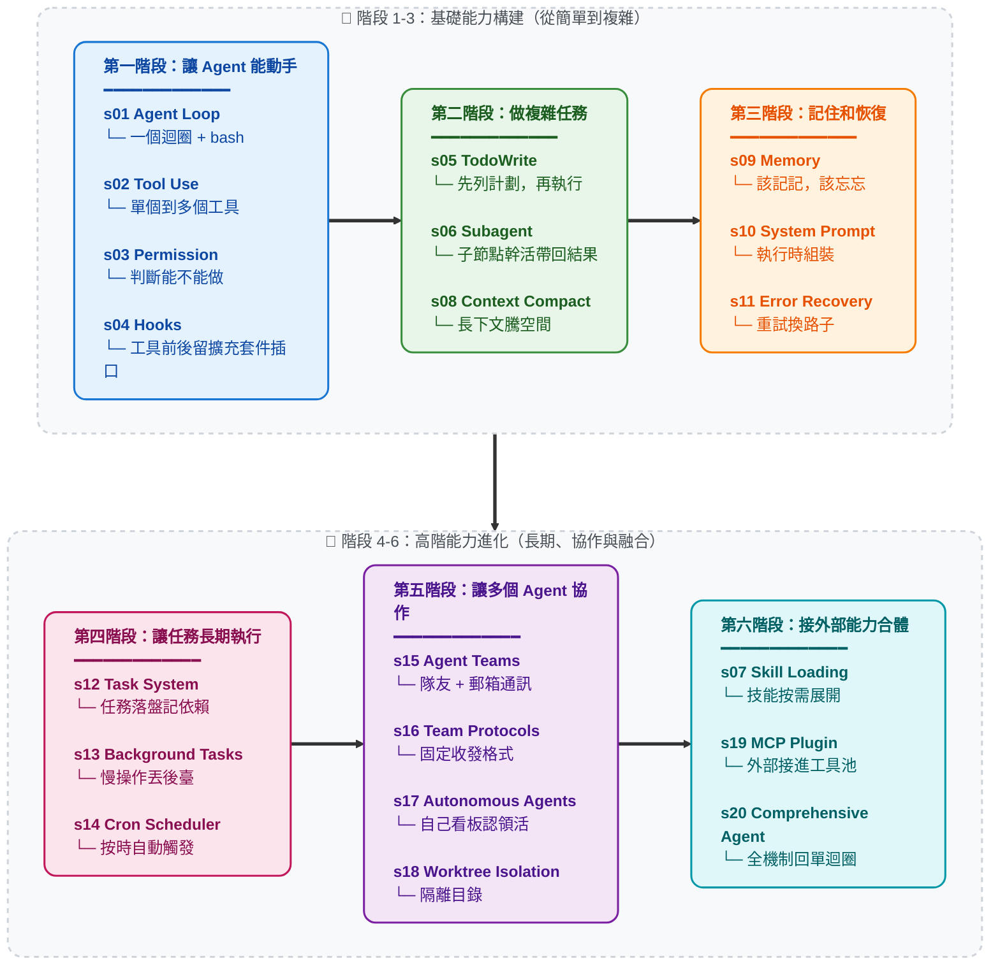

# Learn Claude Code -- 真正的 Agent Harness 工程

[English](./README.md) | [中文](./README-zh.md) · [繁中](./README-zh-tw.md) | [日本語](./README-ja.md)

## Agency 來自模型，Agent 產品 = 模型 + Harness

在討論程式碼之前，先把一件事說清楚。

**Agency -- 感知、推理、行動的能力 -- 來自模型訓練，不是來自外部程式碼的編排。** 但一個能幹活的 agent 產品，需要模型和 harness 缺一不可。模型是駕駛者，harness 是載具。本倉庫教你造載具。

### Agency 從哪來

Agent 的核心是一個神經網路 -- Transformer、RNN、一個被訓練出來的函式 -- 經過數十億次梯度更新，在行動序列資料上學會了感知環境、推理目標、採取行動。Agency 這個東西從來不是外面那層程式碼賦予的，而是模型在訓練中學到的。

人類就是最好的例子。一個由數百萬年進化訓練出來的生物神經網路，透過感官感知世界，透過大腦推理，透過身體行動。當 DeepMind、OpenAI 或 Anthropic 說 "agent" 時，他們說的核心都是同一件事：**一個透過訓練學會了行動的模型，加上讓它能在特定環境中工作的基礎設施。**

歷史已經寫好了鐵證：

- **2013 -- DeepMind DQN 玩 Atari。** 一個神經網路，只接收原始畫素和遊戲分數，學會了 7 款 Atari 2600 遊戲 -- 超越所有先前演算法，在其中 3 款上擊敗人類專家。到 2015 年，同一架構擴充套件到 [49 款遊戲，達到職業人類測試員水平](https://www.nature.com/articles/nature14236)，論文發表在 *Nature*。沒有遊戲專屬規則。沒有決策樹。一個模型，從經驗中學習。那個模型就是 agent。

- **2019 -- OpenAI Five 征服 Dota 2。** 五個神經網路，在 10 個月內與自己對戰了 [45,000 年的 Dota 2](https://openai.com/index/openai-five-defeats-dota-2-world-champions/)，在舊金山直播賽上 2-0 擊敗了 **OG** -- TI8 世界冠軍。隨後的公開競技場中，AI 在 42,729 場比賽中勝率 99.4%。沒有指令碼化的策略。沒有超程式設計的團隊協調邏輯。模型完全透過自我對弈學會了團隊協作、戰術和即時適應。

- **2019 -- DeepMind AlphaStar 制霸星際爭霸 II。** AlphaStar 在閉門賽中 [10-1 擊敗職業選手](https://deepmind.google/blog/alphastar-mastering-the-real-time-strategy-game-starcraft-ii/)，隨後在歐洲伺服器上達到[宗師段位](https://www.nature.com/articles/d41586-019-03298-6) -- 90,000 名玩家中的前 0.15%。一個資訊不完全、即時決策、組合動作空間遠超國際象棋和圍棋的遊戲。Agent 是什麼？是模型。訓練出來的。不是編出來的。

- **2019 -- 騰訊絕悟統治王者榮耀。** 騰訊 AI Lab 的 "絕悟" 於 2019 年 8 月 2 日世冠杯半決賽上[以 5v5 擊敗 KPL 職業選手](https://www.jiemian.com/article/3371171.html)。在 1v1 模式下，職業選手 [15 場只贏 1 場，最多堅持不到 8 分鐘](https://developer.aliyun.com/article/851058)。訓練強度：一天等於人類 440 年。到 2021 年，絕悟在全英雄池 BO5 上全面超越 KPL 職業選手水準。沒有手工編寫的英雄剋制表。沒有指令碼化的陣容編排。一個從零開始透過自我對弈學習整個遊戲的模型。

- **2024-2025 -- LLM Agent 重塑軟體工程。** Claude、GPT、Gemini -- 在人類全部程式碼和推理上訓練的大語言模型 -- 被部署為程式設計 agent。它們閱讀程式碼庫，編寫實現，除錯故障，團隊協作。架構與之前每一個 agent 完全相同：一個訓練好的模型，放入一個環境，給予感知和行動的工具。唯一的不同是它們學到的東西的規模和解決任務的通用性。

每一個里程碑都指向同一個事實：**Agency -- 那個感知、推理、行動的能力 -- 是訓練出來的，不是編出來的。** 但每一個 agent 同時也需要一個環境才能工作：Atari 模擬器、Dota 2 客戶端、星際爭霸 II 引擎、IDE 和終端。模型提供智慧，環境提供行動空間。兩者合在一起才是一個完整的 agent。

### Agent 不是什麼

"Agent" 這個詞已經被一整個提示詞水管工產業劫持了。

拖拽式工作流構建器。無程式碼 "AI Agent" 平臺。提示詞鏈編排庫。它們共享同一個幻覺：把 LLM API 呼叫用 if-else 分支、節點圖、硬編碼路由邏輯串在一起就算是 "構建 Agent" 了。

不是的。它們做出來的東西是魯布·戈德堡機械 -- 一個過度工程化的、脆弱的過程式規則流水線，LLM 被楔在裡面當一個美化了的文字補全節點。那不是 Agent。那是一個有著宏大妄想的 shell 指令碼。

**提示詞水管工式 "Agent" 是不做模型的程式設計師的意淫。** 他們試圖透過堆疊過程式邏輯來暴力模擬智慧 -- 龐大的規則樹、節點圖、鏈式提示詞瀑布流 -- 然後祈禱足夠多的膠水程式碼能湧現出自主行為。不會的。你不可能透過工程手段編碼出 agency。Agency 是學出來的，不是編出來的。

那些系統從誕生之日起就已經死了：脆弱、不可擴充套件、根本不具備泛化能力。它們是 GOFAI（Good Old-Fashioned AI，經典符號 AI）的現代還魂 -- 幾十年前就被學界拋棄的符號規則系統，現在噴了一層 LLM 的漆又登場了。換了個包裝，同一條死路。

### 心智轉換：從 "開發 Agent" 到開發 Harness

當一個人說 "我在開發 Agent" 時，他只可能是兩個意思之一：

**1. 訓練模型。** 透過強化學習、微調、RLHF 或其他基於梯度的方法調整權重。收集任務過程資料 -- 真實領域中感知、推理、行動的實際序列 -- 用它們來塑造模型的行為。這是 DeepMind、OpenAI、騰訊 AI Lab、Anthropic 在做的事。這是最本義的 Agent 開發。

**2. 構建 Harness。** 編寫程式碼，為模型提供一個可操作的環境。這是我們大多數人在做的事，也是本倉庫的核心。

Harness 是 agent 在特定領域工作所需要的一切：

```
Harness = Tools + Knowledge + Observation + Action Interfaces + Permissions

    Tools:          檔案讀寫、Shell、網路、資料庫、瀏覽器
    Knowledge:      產品文件、領域資料、API 規範、風格指南
    Observation:    git diff、錯誤日誌、瀏覽器狀態、感測器資料
    Action:         CLI 命令、API 呼叫、UI 互動
    Permissions:    沙箱隔離、審批流程、信任邊界
```

模型做決策。Harness 執行。模型做推理。Harness 提供上下文。模型是駕駛者。Harness 是載具。

**程式設計 agent 的 harness 是它的 IDE、終端和檔案系統。** 農業 agent 的 harness 是感測器陣列、灌溉控制和氣象資料。酒店 agent 的 harness 是預訂系統、客戶溝通渠道和設施管理 API。Agent -- 那個智慧、那個決策者 -- 永遠是模型。Harness 因領域而變。Agent 跨領域泛化。

這個倉庫教你造載具。程式設計用的載具。但設計模式可以泛化到任何領域：莊園管理、農田運營、酒店運作、工廠製造、物流排程、醫療保健、教育培訓、科學研究。只要有一個任務需要被感知、推理和執行 -- agent 就需要一個 harness。

### Harness 工程師到底在做什麼

如果你在讀這個倉庫，你很可能是一名 harness 工程師 -- 這是一個強大的身份。以下是你真正的工作：

- **實現工具。** 給 agent 一雙手。檔案讀寫、Shell 執行、API 呼叫、瀏覽器控制、資料庫查詢。每個工具都是 agent 在環境中可以採取的一個行動。設計它們時要原子化、可組合、描述清晰。

- **策劃知識。** 給 agent 領域專長。產品文件、架構決策記錄、風格指南、合規要求。按需載入（s07），不要前置塞入。Agent 應該知道有什麼可用，然後自己拉取所需。

- **管理上下文。** 給 agent 乾淨的記憶。子 agent 隔離（s06）防止噪聲洩露。上下文壓縮（s08）防止歷史淹沒。任務系統（s12）讓目標持久化到單次對話之外。

- **控制權限。** 給 agent 邊界。沙箱化檔案訪問。對破壞性操作要求審批。在 agent 和外部系統之間實施信任邊界。這是安全工程與 harness 工程的交匯點。

- **收集任務過程資料。** Agent 在你的 harness 中執行的每一條行動序列都是訓練訊號。真實部署中的感知-推理-行動軌跡是微調下一代 agent 模型的原材料。你的 harness 不僅服務於 agent -- 它還可以幫助進化 agent。

你不是在編寫智慧。你是在構建智慧棲居的世界。這個世界的質量 -- agent 能看得多清楚、行動得多精準、可用知識有多豐富 -- 直接決定了智慧能多有效地表達自己。

**造好 Harness。Agent 會完成剩下的。**

### 為什麼是 Claude Code -- Harness 工程的大師課

為什麼這個倉庫專門拆解 Claude Code？

因為 Claude Code 是我們所見過的最優雅、最完整的 agent harness 實現。不是因為某個巧妙的技巧，而是因為它 *沒做* 的事：它沒有試圖成為 agent 本身。它沒有強加僵化的工作流。它沒有用精心設計的決策樹去替模型做判斷。它給模型提供了工具、知識、上下文管理和許可權邊界 -- 然後讓開了。

把 Claude Code 剝到本質來看：

```
Claude Code = 一個 agent loop
            + 工具 (bash, read, write, edit, glob, grep, browser...)
            + 按需 skill 載入
            + 上下文壓縮
            + 子 agent 派生
            + 帶依賴圖的任務系統
            + 非同步郵箱的團隊協調
            + worktree 隔離的並行執行
            + 許可權治理
```

就這些。這就是全部架構。每一個元件都是 harness 機制 -- 為 agent 構建的棲居世界的一部分。Agent 本身呢？是 Claude。一個模型。由 Anthropic 在人類推理和程式碼的全部廣度上訓練而成。Harness 沒有讓 Claude 變聰明。Claude 本來就聰明。Harness 給了 Claude 雙手、雙眼和一個工作空間。

這就是 Claude Code 作為教學標本的意義：**它展示了當你信任模型、把工程精力集中在 harness 上時會發生什麼。** 本倉庫的課程（s01-s20）逐步拆解並重組 Claude Code 架構中的 harness 機制。學完之後，你理解的不只是 Claude Code 怎麼工作，而是適用於任何領域、任何 agent 的 harness 工程通用原則。

啟示不是 "複製 Claude Code"。啟示是：**最好的 agent 產品，出自那些明白自己的工作是 harness 而非 intelligence 的工程師之手。**

---

## 願景：用真正的 Agent 鋪滿宇宙

這不只關乎程式設計 agent。

每一個人類從事複雜、多步驟、需要判斷力的工作的領域，都是 agent 可以運作的領域 -- 只要有對的 harness。本倉庫中的模式是通用的：

```
莊園管理 agent  = 模型 + 物業感測器 + 維護工具 + 租戶通訊
農業 agent      = 模型 + 土壤/氣象資料 + 灌溉控制 + 作物知識
酒店運營 agent  = 模型 + 預訂系統 + 客戶渠道 + 設施 API
醫學研究 agent  = 模型 + 文獻檢索 + 實驗儀器 + 協議文件
製造業 agent    = 模型 + 產線感測器 + 質量控制 + 物流系統
教育 agent      = 模型 + 課程知識 + 學生進度 + 評估工具
```

迴圈永遠不變。工具在變。知識在變。許可權在變。Agent -- 那個模型 -- 泛化一切。

每一個讀這個倉庫的 harness 工程師都在學習遠超軟體工程的模式。你在學習為一個智慧的、自動化的未來構建基礎設施。每一個部署在真實領域的好 harness，都是 agent 能夠感知、推理、行動的又一個陣地。

先鋪滿工作室。然後是農田、醫院、工廠。然後是城市。然後是星球。

**Bash is all you need. Real agents are all the universe needs.**

---

```
                    THE AGENT PATTERN
                    =================

    User --> messages[] --> LLM --> response
                                      |
                            stop_reason == "tool_use"?
                           /                          \
                         yes                           no
                          |                             |
                    execute tools                    return text
                    append results
                    loop back -----------------> messages[]


    這是最小迴圈。每個 AI Agent 都需要這個迴圈。
    模型決定何時呼叫工具、何時停止。
    程式碼只是執行模型的要求。
    本倉庫教你構建圍繞這個迴圈的一切 --
    讓 agent 在特定領域高效工作的 harness。
```

**20 個遞進式課程, 從簡單迴圈到完整 Harness。**
**每個課程新增一個 harness 機制。每個機制有一句格言。**

> **s01** &nbsp; *"One loop & Bash is all you need"* &mdash; 一個工具 + 一個迴圈 = 一個 Agent
>
> **s02** &nbsp; *"加一個工具, 只加一個 handler"* &mdash; 迴圈不用動, 新工具註冊進 dispatch map 就行
>
> **s03** &nbsp; *"先劃邊界, 再給自由"* &mdash; 先判斷操作能不能做，要不要問使用者
>
> **s04** &nbsp; *"掛在迴圈上, 不寫進迴圈裡"* &mdash; 在工具前後留插口，不改主迴圈也能擴充套件
>
> **s05** &nbsp; *"沒有計劃的 agent 走哪算哪"* &mdash; 先列步驟再動手, 完成率翻倍
>
> **s06** &nbsp; *"大任務拆小, 每個小任務乾淨的上下文"* &mdash; 子 Agent 自己幹活，只把結果帶回來
>
> **s07** &nbsp; *"用到時再載入, 別全塞 prompt 裡"* &mdash; 技能先列目錄，用到時再展開
>
> **s08** &nbsp; *"上下文總會滿, 要有辦法騰地方"* &mdash; 四層壓縮策略, 便宜的先跑貴的後跑
>
> **s09** &nbsp; *"記住該記的, 忘掉該忘的"* &mdash; 三個子系統: 篩選、提取、整理
>
> **s10** &nbsp; *"prompt 是組裝出來的, 不是寫死的"* &mdash; 分段 + 按需拼接
>
> **s11** &nbsp; *"錯誤不是終點, 是重試的起點"* &mdash; 出錯時會重試、騰空間、換路子
>
> **s12** &nbsp; *"大目標拆成小任務, 排好序, 持久化"* &mdash; 檔案持久化的任務圖, 多 agent 協作的基礎
>
> **s13** &nbsp; *"慢操作丟後臺, agent 繼續思考"* &mdash; 後臺執行緒跑命令, 完成後注入通知
>
> **s14** &nbsp; *"定時觸發, 不需要人推"* &mdash; 按時間自動觸發任務
>
> **s15** &nbsp; *"一個搞不定, 組隊來"* &mdash; 持久化隊友 + 非同步郵箱
>
> **s16** &nbsp; *"隊友之間要有約定"* &mdash; 用固定的請求-回覆格式溝通
>
> **s17** &nbsp; *"隊友自己看板, 有活就認領"* &mdash; 不需要領導逐個分配, 自組織
>
> **s18** &nbsp; *"各幹各的目錄, 互不干擾"* &mdash; 任務管目標, worktree 管目錄, 按 ID 繫結
>
> **s19** &nbsp; *"能力不夠? 插上 MCP"* &mdash; 把外部工具接進同一個工具池
>
> **s20** &nbsp; *"機制很多，迴圈一個"* &mdash; 前面所有機制回到一個完整 harness

---

## 核心模式

```python
def agent_loop(messages):
    while True:
        response = client.messages.create(
            model=MODEL, system=SYSTEM,
            messages=messages, tools=TOOLS,
        )
        messages.append({"role": "assistant",
                         "content": response.content})

        if response.stop_reason != "tool_use":
            return

        results = []
        for block in response.content:
            if block.type == "tool_use":
                output = TOOL_HANDLERS[block.name](**block.input)
                results.append({
                    "type": "tool_result",
                    "tool_use_id": block.id,
                    "content": output,
                })
        messages.append({"role": "user", "content": results})
```

每個課程在這個迴圈之上疊加一個 harness 機制 -- 迴圈本身始終不變。迴圈屬於 agent。機制屬於 harness。

## 版本說明

本倉庫現在同時保留兩條教程線：

- **新版主線：根目錄 `s01-s20`**
  根目錄下的 `s01_*` 到 `s20_*` 是新的主版本，也是當前推薦閱讀路徑。每章包含完整敘事 README、英文/日文譯本、可執行的 `code.py`，以及必要的圖示。
- **舊版過渡：`docs/`、`agents/`、當前 `web/`**
  這些仍保留舊 12 章體系，暫時用於已有讀者、舊連結和 Web 平臺過渡。

新讀者請從根目錄 `s01_agent_loop/` 讀到 `s20_comprehensive/`。如果你是從舊連結或當前 Web 平臺進入，大機率看到的是舊 12 章版本。舊版章節號和新版不完全一致，不要混用章節號。

### 舊版到新版的對應關係

| 舊 12 章版本 | 新 20 章版本 | 主題 |
|---|---|---|
| 舊 s01 | 新 s01 | Agent Loop |
| 舊 s02 | 新 s02 | Tool Use |
| 舊 s03 | 新 s05 | TodoWrite |
| 舊 s04 | 新 s06 | Subagent |
| 舊 s05 | 新 s07 | Skill Loading |
| 舊 s06 | 新 s08 | Context Compact |
| 舊 s07 | 新 s12 | Task System |
| 舊 s08 | 新 s13 | Background Tasks |
| 舊 s09 | 新 s15 | Agent Teams |
| 舊 s10 | 新 s16 | Team Protocols |
| 舊 s11 | 新 s17 | Autonomous Agents |
| 舊 s12 | 新 s18 | Worktree Isolation |
| 新版新增 | s03、s04、s09、s10、s11、s14、s19、s20 | Permission、Hooks、Memory、System Prompt、Error Recovery、Cron、MCP、Comprehensive Agent |

## 範圍說明 (重要)

本倉庫是一個 0->1 的 harness 工程學習專案 -- 構建圍繞 agent 模型的工作環境。
為保證學習路徑清晰，倉庫有意簡化或省略了部分生產機制：

- 完整事件 / Hook 匯流排 (例如 PreToolUse、SessionStart/End、ConfigChange)。
  s12 僅提供教學用途的最小 append-only 生命週期事件流。
- 基於規則的許可權治理與信任流程
- 會話生命週期控制 (resume/fork) 與更完整的 worktree 生命週期控制
- 完整 MCP 執行時細節 (transport/OAuth/資源訂閱/輪詢)

倉庫中的團隊 JSONL 郵箱協議是教學實現，不是對任何特定生產內部實現的宣告。

## 快速開始

### 新版 20 章主線

```sh
git clone https://github.com/shareAI-lab/learn-claude-code
cd learn-claude-code
pip install -r requirements.txt
cp .env.example .env   # 編輯 .env 填入你的 ANTHROPIC_API_KEY

python s01_agent_loop/code.py        # 起點 — 一個迴圈 + bash
python s08_context_compact/code.py    # 上下文壓縮（複雜章）
python s20_comprehensive/code.py      # 終點章: 全部機制歸到一個迴圈
```

### 舊版 12 章過渡線

```sh
python agents/s01_agent_loop.py
python agents/s12_worktree_task_isolation.py
python agents/s_full.py
```

### Web 平臺

當前 Web 平臺仍讀取 `docs/` 中的舊 12 章內容。新版 20 章請直接閱讀根目錄 `s01-s20`。

```sh
cd web && npm install && npm run dev   # http://localhost:3000
```

## 學習路徑

主線：能動手 → 能做複雜任務 → 能記住和恢復 → 能長期執行 → 能協作 → 能擴充套件併合體



## 全部章節

| 章節 | 主題 | 關鍵概念 |
|---|---|---|
| [s01](./s01_agent_loop/) | Agent Loop | `messages` / `while True` / `stop_reason` |
| [s02](./s02_tool_use/) | Tool Use | `TOOL_HANDLERS` / dispatch map / 併發 |
| [s03](./s03_permission/) | Permission | `PermissionRule` / 審批管線 |
| [s04](./s04_hooks/) | Hooks | `PreToolUse` / `PostToolUse` / 擴充套件點 |
| [s05](./s05_todo_write/) | TodoWrite | `TodoItem` / 先計劃後執行 |
| [s06](./s06_subagent/) | Subagent | `fresh messages[]` / 上下文隔離 |
| [s07](./s07_skill_loading/) | Skill Loading | `SkillManifest` / 按需注入 |
| [s08](./s08_context_compact/) | Context Compact | snip / micro / budget / auto 四層壓縮 |
| [s09](./s09_memory/) | Memory | selection / extraction / consolidation |
| [s10](./s10_system_prompt/) | System Prompt | 執行時組裝 / 分段拼接 |
| [s11](./s11_error_recovery/) | Error Recovery | token 升級 / fallback 模型 / 重試策略 |
| [s12](./s12_task_system/) | Task System | `TaskRecord` / `blockedBy` / 磁碟持久化 |
| [s13](./s13_background_tasks/) | Background Tasks | 執行緒執行 / 通知佇列 |
| [s14](./s14_cron_scheduler/) | Cron Scheduler | 持久化排程 / 會話級觸發 |
| [s15](./s15_agent_teams/) | Agent Teams | `MessageBus` / 收件箱 / 許可權冒泡 |
| [s16](./s16_team_protocols/) | Team Protocols | 關機握手 / 計劃審批 |
| [s17](./s17_autonomous_agents/) | Autonomous Agents | 空閒迴圈 / 自動認領 |
| [s18](./s18_worktree_isolation/) | Worktree Isolation | `WorktreeRecord` / 任務-目錄繫結 |
| [s19](./s19_mcp_plugin/) | MCP Plugin | 多傳輸 / 通道路由 / 工具池組裝 |
| [s20](./s20_comprehensive/) | Comprehensive Agent | 全部機制歸到一個迴圈 |

## 專案結構

```
learn-claude-code/
  s01_agent_loop/          # 每章一個資料夾
    README.md              #   中文源文件（完整敘事）
    README.en.md           #   英文譯本
    README.ja.md           #   日文譯本
    code.py                #   獨立可執行程式碼
    images/                #   SVG 流程圖
  s02_tool_use/
  ...
  s19_mcp_plugin/
  s20_comprehensive/       # 終點章
  agents/                  # 舊 12 章可執行副本 + s_full.py
  skills/                  # s07 使用的 skill 檔案
  docs/                    # 舊 12 章文件，過渡期保留
  web/                     # 當前仍基於 docs/ 舊版內容生成
  tests/
```

## 學完之後 -- 從理解到落地

20 個課程走完, 你已經從內到外理解了 harness 工程的運作原理。兩種方式把知識變成產品:

### Kode Agent CLI -- 開源 Coding Agent CLI

> `npm i -g @shareai-lab/kode`

支援 Skill & LSP, 適配 Windows, 可接 GLM / MiniMax / DeepSeek 等開放模型。裝完即用。

GitHub: **[shareAI-lab/Kode-cli](https://github.com/shareAI-lab/Kode-cli)**

### Kode Agent SDK -- 把 Agent 能力嵌入你的應用

官方 Claude Code Agent SDK 底層與完整 CLI 程序通訊 -- 每個併發使用者 = 一個終端程序。Kode SDK 是獨立庫, 無 per-user 程序開銷, 可嵌入後端、瀏覽器外掛、嵌入式裝置等任意執行時。

GitHub: **[shareAI-lab/Kode-agent-sdk](https://github.com/shareAI-lab/Kode-agent-sdk)**

---

## 姊妹教程: 從*被動臨時會話*到*主動常駐助手*

本倉庫教的 harness 屬於 **用完即走** 型 -- 開終端、給 agent 任務、做完關掉, 下次重開是全新會話。Claude Code 就是這種模式。

但 [OpenClaw](https://github.com/openclaw/openclaw) 證明了另一種可能: 在同樣的 agent core 之上, 加兩個 harness 機制就能讓 agent 從 "踹一下動一下" 變成 "自己隔 30 秒醒一次找活幹":

- **心跳 (Heartbeat)** -- 每 30 秒 harness 給 agent 發一條訊息, 讓它檢查有沒有事可做。沒事就繼續睡, 有事立刻行動。
- **定時任務 (Cron)** -- agent 可以給自己安排未來要做的事, 到點自動執行。

再加上 IM 多通道路由 (WhatsApp/Telegram/Slack/Discord 等 13+ 平臺)、不清空的上下文記憶、Soul 人格系統, agent 就從一個臨時工具變成了始終線上的個人 AI 助手。

**[claw0](https://github.com/shareAI-lab/claw0)** 是我們的姊妹教學倉庫, 從零拆解這些 harness 機制:

```
claw agent = agent core + heartbeat + cron + IM chat + memory + soul
```

```
learn-claude-code                   claw0
(agent harness 核心:                 (主動式常駐 harness:
 迴圈、工具、規劃、                    心跳、定時任務、IM 通道、
 團隊、worktree 隔離)                  記憶、Soul 人格)
```

## 許可證

MIT

---

**Agency 來自模型。Harness 讓 agency 落地。造好 Harness，模型會完成剩下的。**

**Bash is all you need. Real agents are all the universe needs.**
