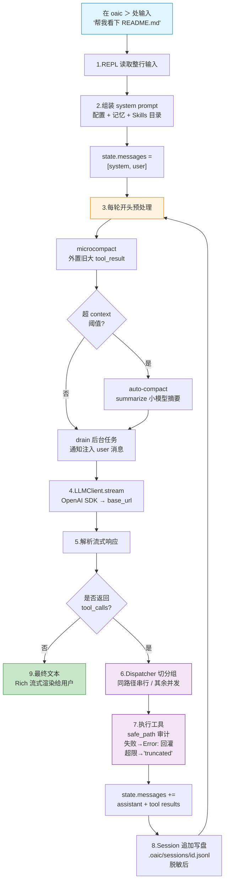

# oai-code

基于 OpenAI 兼容协议的命令行编码 Agent —— 一个 Claude Code 替代品，可对接任意 OpenAI 兼容后端（OpenAI / DeepSeek / Qwen / OpenRouter / Ollama / vLLM / 自建网关等）。

> **当前状态**：M3 完成 —— 156 个测试通过。支持 Agent Loop、6 个内置工具、TodoWrite / 持久化 Tasks / Subagent / Skills / 记忆 / 上下文压缩 / 分角色模型 / Session 持久化 / 后台任务 / MCP stdio+sse+http / 多 Agent 协作（s09 消息总线 + s10 协议 + s11 自治认领）/ 退出总结写 MEMORY.md / PyPI 构建就绪。

## 快速开始

```bash
# 1. 安装依赖(首次)
uv sync

# 2. 配好 API key(见 .env.example,把 FENBI_API_KEY 等写到 .env 即可)

# 3. 启动 —— 默认进入交互式 REPL
uv run oaic
```

进入后就像这样对话：
```
oai-code provider=fenbi model=pa/gpt-5.4  (/help for commands, Ctrl-D to quit)
oaic > 帮我看下 README.md 说了什么
assistant 这个项目是 oai-code,一个基于 OpenAI 兼容协议的命令行编码 Agent ...
oaic > /quit
```

其他使用方式：
```bash
uv run oaic --provider fenbi-sonnet      # 用另一个 profile 启动 REPL
uv run oaic -p "总结一下 README.md"      # 单次执行,跑完就退出
uv run oaic --resume latest              # 恢复最近一次会话
uv run oaic --list-sessions              # 列出所有保存的会话
```

在 REPL 里输 `/help` 查看所有斜杠命令（`/models` `/provider` `/tools` `/tasks` `/compact` `/resume` 等）。

## 数据流程

> 在 `oaic >` 提示符后敲一句话按回车，到屏幕上看到 `assistant` 开始说话，中间发生了什么？

典型场景：
```
oaic > 帮我看下 README.md 说了什么
assistant 这个项目是 oai-code,一个 ...
oaic >
```

### 术语速查

读正文前先建立一个"术语 - 中文 - 作用"对照表。后文首次出现时会再简单提一下，但这里是最全的一览。

| 英文 | 中文 | 作用 |
|------|------|------|
| **REPL** | 交互式命令行 / 对话循环 | Read-Eval-Print-Loop，你看到的 `oaic >` 提示符就是它 |
| **Agent Loop** | Agent 主循环 | 一次用户输入对应的反复调 LLM + 执行工具的过程 |
| **messages** | 消息数组 | 对话历史，`[{role: "system"/"user"/"assistant"/"tool", content: ...}]` 这种结构 |
| **system prompt** | 系统提示词 | messages 最前面那条，告诉 LLM 自己的身份和可用工具 |
| **stream / streaming** | 流式 | LLM 响应逐字返回，而不是等全部生成完再一次性吐出 |
| **tool_calls** | 工具调用 | LLM 在回复里附带的"想调用哪个工具、传什么参数"的结构 |
| **tool_result** | 工具执行结果 | 工具跑完后回传给 LLM 看的字符串 |
| **tool_call_id** | 工具调用 ID | 每次 `tool_calls` 和 `tool_result` 一一对应的标识符 |
| **finish_reason** | 结束原因 | LLM 告知本次生成为什么停：`stop`(正常结束) / `tool_calls`(等待工具结果) / `length`(超长度) |
| **dispatcher** | 调度器 | 本地负责把 LLM 要求的多个工具按规则切分"并行组 / 串行组"的模块 |
| **microcompact** | 微压缩 | 每轮开头自动做：把早期大块的工具结果外置到磁盘，in-memory 换成占位符 |
| **auto-compact** | 自动压缩 | 对话过长时，让一个小模型把历史摘要成一条，替换掉老的 messages |
| **session** | 会话 | 一次 REPL 从启动到退出之间的完整对话，落盘到 `.oaic/sessions/<id>.jsonl` |
| **skills** | 技能 | 放在 `skills/` 目录下的 `SKILL.md`，启动时只加载标题，模型按需展开正文 |
| **safe_path** | 路径审计 | 所有文件操作前先过这层，拒 `~/.ssh` 之类的敏感路径和越界 |
| **redact** | 脱敏 | 写 session 到磁盘前把 API key、Bearer token 替换成 `[REDACTED]` |
| **provider profile** | 供应商配置档 | 预置的 LLM 后端组合（`fenbi` / `deepseek` / `openai` 等），含 base_url + model + api_key_env |

### 流程图



### 文字描述

下面把每一步用人话讲一遍，读完你就知道在 `oaic >` 里敲完一句话按下回车之后究竟发生了什么。

**第 1 步 · REPL 读取整行输入**
程序入口是 `src/oai_code/cli.py::main`。默认进入 REPL（交互式命令行）模式，由 `prompt_toolkit` 在 `oaic >` 处等你按回车；按下回车后拿到一整行字符串。（另外还有两种非交互模式：`oaic -p "..."` 单次执行后退出、`oaic --resume <id>` 恢复旧会话。三种模式之后的流程完全一样。）

**第 2 步 · 组装 system prompt（系统提示词）**
启动时一次性做：四级合并配置（env → user → project → `--config` → CLI flag）→ 按 `memory_files` 读项目根 `CLAUDE.md` / `AGENTS.md` / `~/.oaic/CLAUDE.md`，并展开里面的 `@other.md` 引用 → 扫描 `skills/`（技能）目录，把 skill 的名字和一句描述（**不是正文**）注入 prompt。到这一步我们有了 `state.messages = [system, user]`（消息数组：一条系统消息 + 一条用户消息）。

**第 3 步 · 每轮循环开头预处理**
Agent Loop（Agent 主循环）每轮调 LLM **之前**要做三件事：
- `microcompact`（微压缩）：超过最近 3 条的大 tool_result（工具执行结果，>4 KiB）外置到 `.oaic/blobs/<hash>.txt`，内存里替换为提示占位。原始文件仍在磁盘上，模型想看可以用 Read 工具找回。
- 估算 token 是否超过 `context_window × 75%`，超了就调 `roles.summarize`（摘要角色，通常配便宜小模型如 `fenbi-mini`）做 `auto-compact`（自动压缩）：把历史压成一条 summary + 保留最近 6 条消息。完整 transcript（对话记录）落盘到 `.oaic/transcripts/`。
- 拉后台任务的完成通知（`BackgroundRun` 跑完的结果），有就注入一条 `<background-results>` user 消息，让模型知道"刚才让你在后台跑的 test 结束了"。

**第 4 步 · LLMClient.stream 发起 LLM 调用**
用官方 `openai` SDK，以 `base_url`（后端地址）+ `api_key`（密钥）+ `default_query`（附加查询参数）拼出请求（如 fenbi 网关会加 `?service_provider=ppio`）。SDK 开流式（stream）连接，逐块返回：文字片段 / 工具调用开始 / 工具调用参数 / 结束。

**第 5 步 · 解析流式响应**
流式 chunk（数据块）边到边拼：文字片段通过回调直接渲染到终端（Rich Live 组件），工具调用按顺序累积参数字符串。stream 结束时拿到 `finish_reason`（结束原因）：
- `finish_reason == "stop"` 或 `"length"` → 模型不再调用工具，**进入第 9 步**输出结束
- `finish_reason == "tool_calls"` → 模型要求执行工具，进入第 6 步

**第 6 步 · Dispatcher（调度器）切分组**
拿到一批 `tool_calls`（工具调用请求，每条含 `id` / `name` / `arguments`）后，`agent/dispatcher.py` 按以下规则切分组：
- 如果两个工具写**同一路径**（Write/Edit 的 `file_path` 相同，或 Bash 的重定向目标相同）→ 串行，塞进同一组
- 其它 → 并发，各占一组
- 最多并发数由 `config.parallel_tools`（默认 4）限制
- `config.serial_only = true` 时一律串行

组内顺序执行，组间用线程池（`ThreadPoolExecutor`）并发。

**第 7 步 · 执行工具**
每个工具走 `registry.handler(**args)`。文件类工具先过 `safe_path`（路径审计）：拒 `denied_paths`（黑名单路径，如 `~/.ssh`）、拒越界 workspace（工作区根目录）；Bash 过 deny-list（命令黑名单，挡 `sudo` / `rm -rf /` 等）。出错不抛，一律转为 `"Error: <msg>"` 字符串返回。结果超过 `tool_result_max_bytes`（单条结果上限，50 KiB）时尾部追加 `[truncated: total N bytes]`（截断提示）。

**第 8 步 · 追加消息 + 落盘**
执行完一批工具后，messages 扩展为：
```
[..., assistant(含 tool_calls 结构), tool(id=..., content=结果), tool(id=..., content=结果)]
```
然后 `SessionStore.append_new_messages` 把这一轮新增的消息追加写入 `.oaic/sessions/<session-id>.jsonl`（会话持久化文件），写入前过一次 `redact`（脱敏）：把 Bearer token / `sk-*` 前缀密钥 / `api_key` 字段都替换为 `[REDACTED]`。

**然后回到第 3 步**，这就是 Agent Loop（Agent 主循环）。一次用户输入可能对应 1~30 轮这样的往返（上限由 `MAX_ITERATIONS=50` 控制），直到模型认为不再需要工具为止。

**第 9 步 · 最终文本输出**
当某一轮的 `finish_reason != "tool_calls"` 时循环结束。最近那条 assistant（助手回复）的文本已经在第 4 步流式渲染过了，所以用户看到的是**即时**的输出，不是等到全部结束再打印的。

---

### 6 条不变式（"为什么要这样设计"）

1. **一次输入 = 多轮 LLM 调用**：Agent Loop（Agent 主循环）是反复 (3)→(8) 直到模型停止调用工具。用户只输入一次，但后台可能跑 20 次 LLM 请求、15 次 Bash、8 次 Read。
2. **上下文管理发生在每轮开头**（第 3 步）：保证 messages（消息数组）不会撑爆 token 预算；自动压缩用的是**分角色配置**里的 summarize（摘要角色）小模型，主对话依然用你选的大模型。
3. **并行安全由本地兜底**（第 6 步）：哪怕模型让两个工具并发写同一个文件，dispatcher（调度器）会识别路径冲突强制串行，避免文件损坏。
4. **错误永不抛出循环**：任何工具失败都以 `"Error: ..."` 字符串形式作为 tool_result（工具结果）回灌。模型能看见失败原因、自己决定下一步，而不是让程序崩溃。
5. **Ctrl-C 保证 messages 合法**：中断时为每个未完成的 `tool_call_id`（工具调用 ID）补一条 `[interrupted by user]`（"被用户中断"）的 tool result。避免留下"半条 assistant（带 tool_calls）+ 无对应 tool result"的畸形状态 —— 那样下次 LLM 调用会直接报 API 错误。
6. **Session（会话）每轮落盘**（第 8 步）：不是退出时一次性写。异常崩溃也不丢数据，`oaic --resume latest` 可继续上次对话。

详见 [`docs/DESIGN.md`](./docs/DESIGN.md) §5（核心数据流）和 §4（各模块职责）。

## 配置

最小配置示例（`~/.oaic/settings.json`）：

```json
{
  "provider": "deepseek",
  "api_key_env": "DEEPSEEK_API_KEY"
}
```

支持的 provider profile：`openai` / `deepseek` / `qwen` / `openrouter` / `ollama` / `vllm` / `fenbi` / `custom`。

完整字段说明见 [`docs/CONFIG.md`](./docs/CONFIG.md)。

## 文档

- [`docs/DESIGN.md`](./docs/DESIGN.md) —— 架构、Agent Loop、并行与中断策略、威胁模型、测试策略
- [`docs/TOOLS.md`](./docs/TOOLS.md) —— 工具规格（真源）：所有工具的 name / schema / tool_result / 错误串格式
- [`docs/CONFIG.md`](./docs/CONFIG.md) —— 配置字段总表、四级加载顺序、provider profile、CLI flag

## 路线图

- **M0** ✅ CLI + REPL + 流式渲染 + 6 个基础工具 + 四级配置（27 测试）
- **M1** ✅ TodoWrite / 持久化 Tasks / Subagent / Skills / 上下文压缩 + 分角色模型 / CLAUDE.md 记忆（73 测试）
- **M2** ✅ Session 持久化 + resume / 后台任务 / MCP stdio 客户端 / Slash 完整集（103 测试）
- **M3** ✅ MCP sse+http / 退出总结 / 多 Agent 协作（s09 总线 + s10 协议 + s11 自治）/ PyPI 构建就绪（156 测试）
- **M4** ⏳ Worktree 隔离 / 队友 loop 回归测试 / 队友 auto-compact / 真实 PyPI 发布

每个里程碑均有 [溯源](./docs/milestones/) 与 [验收报告](./docs/milestones/) 两份文档。
