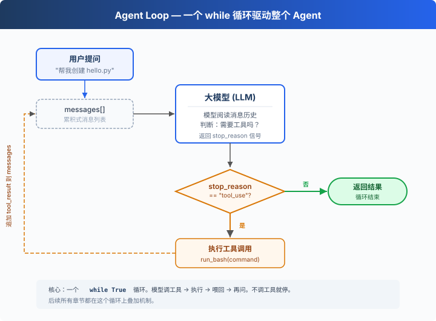

# s01: Agent Loop — 一個迴圈就夠了

[中文](README.md) · [繁中](README.zh-tw.md) · [English](README.en.md) · [日本語](README.ja.md)

`s01` → [s02](../s02_tool_use/) → s03 → s04 → ... → s20
> *"One loop & Bash is all you need"* — 一個工具 + 一個迴圈 = 一個 Agent。
>
> **Harness 層**: 迴圈 — 模型與真實世界的第一道連線。

---

## 問題

你提出了一個問題給大模型：“幫我讀取下我的目錄下有哪些檔案，並且執行XXX.py”。

模型能輸出一條 bash 命令，但輸出完了就停了，它不會自己跑，也不會看到結果後繼續推理。

你可以手動跑一遍，把輸出貼回對話視窗，讓它接著幹。下一個命令出來，你再跑一遍、再貼回去。

每一個來回，你都在做中間層。而把它自動化，就是這一章要做的事。

---

## 解決方案



一個 `while True` 迴圈，模型呼叫工具就繼續，不呼叫就停。整個過程只有兩個訊號：

| 訊號 | 含義 | 迴圈動作 |
|------|------|---------|
| `stop_reason == "tool_use"` | 模型舉手說"我要用工具" | 執行 → 結果喂回去 → 繼續 |
| `stop_reason != "tool_use"` | 模型說"我做完了" | 退出迴圈 |

---

## 工作原理

將這個過程翻譯成程式碼。分步來看：

**第 1 步**：把使用者的問題作為第一條訊息。

```python
messages = [{"role": "user", "content": query}]
```

**第 2 步**：將訊息和工具定義一起發給 LLM。

```python
response = client.messages.create(
    model=MODEL, system=SYSTEM, messages=messages,
    tools=TOOLS, max_tokens=8000,
)
```

**第 3 步**：追加模型回答，檢查它是否調了工具。沒調 → 結束。

```python
messages.append({"role": "assistant", "content": response.content})
if response.stop_reason != "tool_use":
    return
```

**第 4 步**：執行模型要求的工具，收集結果。

```python
results = []
for block in response.content:
    if block.type == "tool_use":
        output = run_bash(block.input["command"])
        results.append({
            "type": "tool_result",
            "tool_use_id": block.id,
            "content": output,
        })
```

**第 5 步**：把工具結果作為新訊息追加，回到第 2 步。

```python
messages.append({"role": "user", "content": results})
```

組裝為一個完整函式：

```python
def agent_loop(messages):
    while True:
        response = client.messages.create(
            model=MODEL, system=SYSTEM, messages=messages,
            tools=TOOLS, max_tokens=8000,
        )
        messages.append({"role": "assistant", "content": response.content})

        if response.stop_reason != "tool_use":
            return

        results = []
        for block in response.content:
            if block.type == "tool_use":
                output = run_bash(block.input["command"])
                results.append({
                    "type": "tool_result",
                    "tool_use_id": block.id,
                    "content": output,
                })
        messages.append({"role": "user", "content": results})
```

不到 30 行，這就是最小可執行的 agent harness 核心。它不是智慧本身，而是讓模型能持續行動的最小執行框架，模型負責決策（要不要調工具、調哪個），harness 負責執行（調了就跑、結果喂回去）。後面 18 個章節都在這個迴圈上疊加機制，迴圈本身始終不變。

---

## 試一下

> **教學 demo 提示**：程式碼會執行模型生成的 shell 命令。建議在一個臨時測試目錄中執行，避免影響你的專案檔案。s03 會講真正的許可權系統。

**準備**（首次執行）：

```sh
pip install -r requirements.txt
cp .env.example .env
# 編輯 .env，填入 ANTHROPIC_API_KEY 和 MODEL_ID
```

**執行**：

```sh
python s01_agent_loop/code.py
```

試試這些 prompt：

1. `Create a file called hello.py that prints "Hello, World!"`
2. `List all Python files in this directory`
3. `What is the current git branch?`

觀察重點：模型什麼時候呼叫工具（迴圈繼續），什麼時候不呼叫（迴圈結束）？

---

## 接下來

現在模型手裡只有 bash 一個工具，讀檔案要 `cat`，寫檔案要 `echo ... >`，找個檔案要 `find`，又醜又容易出錯。

s02 Tool Use → 給它 5 個真正的工具，會發生什麼？模型會不會一次呼叫多個工具？幾個工具同時跑會不會互相踩？

<details>
<summary>深入 CC 原始碼</summary>

> 以下內容基於 CC 原始碼 `src/query.ts`（1729 行）的核查。核心差異就兩個：CC 不看 `stop_reason` 欄位而是檢查內容裡有沒有 tool_use 塊（因為流式響應中 stop_reason 不可靠）；CC 有更多的退出路徑和恢復策略做生產級保護。

**教學版的 30 行 `while True` 就是 CC 1729 行的核心。** 下面每一項都是在這個核心上疊加的保護機制。

<details>
<summary>一、迴圈結構差異</summary>

教學版檢查 `response.stop_reason`。CC 不把它作為迴圈繼續的唯一依據——流式響應中 `stop_reason` 可能還沒更新但內容裡已經有 `tool_use` 塊了。CC 用 `needsFollowUp` 標誌：接收到流式訊息時（`query.ts:830-834`），只要檢測到 `tool_use` 塊就設為 `true`；`QueryEngine.ts` 會從 `message_delta` 捕獲真實 `stop_reason` 用於其他邏輯，但 query loop 本身靠 `needsFollowUp` 決定是否繼續。

```typescript
// query.ts:554-558
// stop_reason === 'tool_use' is unreliable.
// Set during streaming whenever a tool_use block arrives.
let needsFollowUp = false
```

</details>

<details>
<summary>二、State 物件 10 欄位（教學版只用 messages）</summary>

| # | 欄位 | 用途 | 對應章節 |
|---|------|------|---------|
| 1 | `messages` | 當前迭代的訊息陣列 | s01 |
| 2 | `toolUseContext` | 工具、訊號、許可權上下文 | s02 |
| 3 | `autoCompactTracking` | 壓縮狀態追蹤 | s08 |
| 4 | `maxOutputTokensRecoveryCount` | token 恢復嘗試次數（上限 3） | s11 |
| 5 | `hasAttemptedReactiveCompact` | 本輪是否已嘗試響應式壓縮 | s08 |
| 6 | `maxOutputTokensOverride` | 8K→64K 的升級覆蓋 | s11 |
| 7 | `pendingToolUseSummary` | 後臺 Haiku 生成的 tool use 摘要 | s08 |
| 8 | `stopHookActive` | 停止鉤子是否產生阻塞錯誤 | s04 |
| 9 | `turnCount` | 輪次計數（maxTurns 檢查） | s01 |
| 10 | `transition` | 上一次繼續原因 | s11 |

> 注：`taskBudgetRemaining`（`query.ts:291`）是 loop-local 區域性變數，不在 State 上。原始碼註釋明確寫了 "Loop-local (not on State)"。

</details>

<details>
<summary>三、多條退出和繼續路徑</summary>

教學版只有 1 條退出路徑（模型不調工具就結束）。生產版有多條退出和繼續路徑，覆蓋 blocking limit、prompt too long、model error、abort、hook stop、max turns、token budget continuation、reactive compact retry 等場景。每種場景都有對應的恢復或退出策略。

</details>

<details>
<summary>四、流式工具執行和 QueryEngine</summary>

CC 的 `StreamingToolExecutor`（`query.ts:561`）讓工具在模型還在生成時就開始並行執行（根據工具是否 concurrency-safe 決定併發或獨佔）。`QueryEngine.ts` 額外加了費用超限、結構化輸出驗證失敗等保護。教學版不實現這些——目標是概念清晰，不是效能極致。

</details>

**一句話**：1729 行的 query.ts 核心就是 30 行 `while True`。所有複雜欄位和退出路徑都是保護機制。先理解核心迴圈，後面的一切自然展開。

</details>

<!-- translation-sync: zh@v1, en@v0, ja@v0 -->
