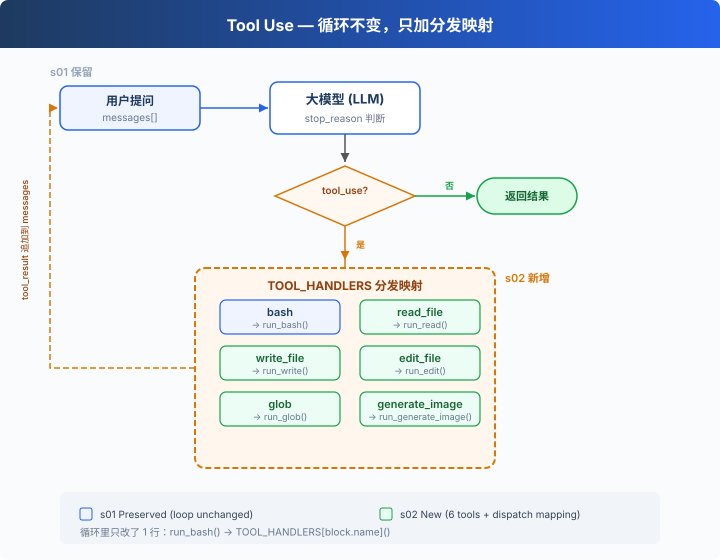
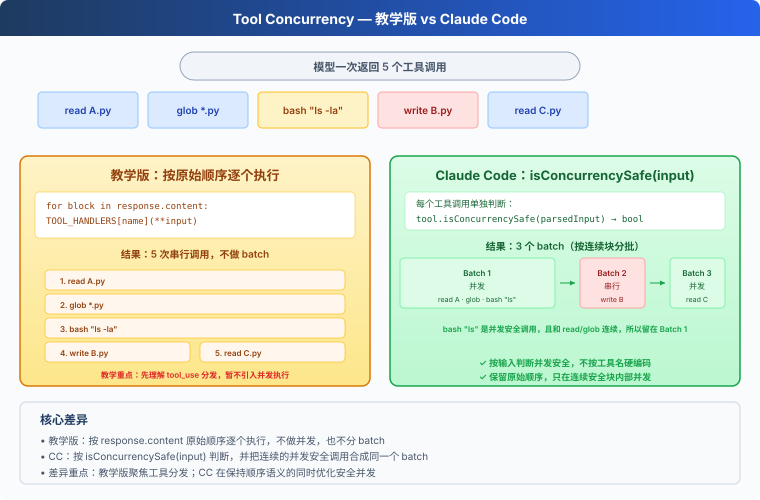

# s02: Tool Use — 多加一個工具，只加一行

[中文](README.md) · [繁中](README.zh-tw.md) · [English](README.en.md) · [日本語](README.ja.md)

s01 → `s02` → [s03](../s03_permission/) → s04 → ... → s20
> *"加一個工具, 只加一個 handler"* — 迴圈不用動, 新工具註冊進 dispatch map 就行。
>
> **Harness 層**: 工具分發 — 擴充套件模型能觸達的邊界。

---

## 只有 bash 一個工具

s01 的 Agent 只有一個 bash 工具。讀檔案要 `cat`，寫檔案要 `echo "..." > file.py`，改檔案要 `sed`。

模型想的是"讀這個檔案"，卻要拼出 `cat path/to/file`。多了一層翻譯，浪費 token，還容易拼錯。

---

## 全域性視角：工具分發



s01 的迴圈完全保留（LLM 呼叫、stop_reason 判斷、訊息追加）。唯一的變動在工具執行那 1 行：`run_bash()` 替換為 `TOOL_HANDLERS[block.name]()` 查表分發。

給 Agent 加一個工具只需要做兩件事：

1. **定義工具**：在 `TOOLS` 數組裡加一條描述
2. **註冊處理函式**：在 `TOOL_HANDLERS` 字典里加一個對映

---

## 從 1 個工具到 5 個工具

s01 只有一個 bash：

```python
TOOLS = [{"name": "bash", ...}]

def run_bash(command): ...
```

s02 加到 5 個，每個工具都是獨立定義：

```python
TOOLS = [
    {"name": "bash",       "description": "Run a shell command.", ...},
    {"name": "read_file",  "description": "Read file contents.",  ...},
    {"name": "write_file", "description": "Write content to file.", ...},
    {"name": "edit_file",  "description": "Replace text in file once.", ...},
    {"name": "glob",       "description": "Find files by pattern.", ...},
]
```

每個工具有自己的實現函式：

```python
def run_read(path, limit=None):
    lines = safe_path(path).read_text().splitlines()
    if limit:
        lines = lines[:limit]
    return "\n".join(lines)

def run_write(path, content):
    safe_path(path).write_text(content)
    return f"Wrote {len(content)} bytes to {path}"

def run_edit(path, old_text, new_text):
    text = safe_path(path).read_text()
    if old_text not in text:
        return "Error: text not found"
    safe_path(path).write_text(text.replace(old_text, new_text, 1))
    return f"Edited {path}"

def run_glob(pattern):
    import glob as g
    return "\n".join(g.glob(pattern, root_dir=WORKDIR))
```

---

## 工具分發

```python
TOOL_HANDLERS = {
    "bash":       run_bash,
    "read_file":  run_read,
    "write_file": run_write,
    "edit_file":  run_edit,
    "glob":       run_glob,
}

# 迴圈裡只改了一行——從硬編碼 run_bash 變成查表：
for block in response.content:
    if block.type == "tool_use":
        handler = TOOL_HANDLERS[block.name]    # 查表
        output = handler(**block.input)         # 呼叫
        results.append(...)
```

加一個工具 = 在 `TOOLS` 陣列加一條 + 在 `TOOL_HANDLERS` 字典加一行。迴圈不變。

---

## 多個工具呼叫

模型經常一次返回多個 tool_use："讀一下 a.py 和 b.py，然後列出所有 .py 檔案"。

教學版按 `response.content` 原始順序逐個執行。CC 的做法更復雜：按原始順序切成連續 batch，batch 內併發安全的工具並行執行，batch 間嚴格順序（見附錄）。

---

## 速查

| 概念 | 一句話 |
|------|--------|
| TOOL_HANDLERS | 工具名 → 處理函式的字典。加工具 = 加一行對映 |
| 工具定義 | 告訴模型"我能做什麼"的 JSON schema |
| 多工具呼叫 | 模型可一次返回多個 tool_use，教學版按原始順序逐個執行 |
| 迴圈不變 | s01 的 `while True` 迴圈一行都沒改 |

---

## 相對 s01 的變更

| 元件 | 之前 (s01) | 之後 (s02) |
|------|-----------|-----------|
| 工具數量 | 1 (bash) | 5 (+read, write, edit, glob) |
| 工具執行 | 硬編碼 `run_bash()` | TOOL_HANDLERS 查表分發 |
| 路徑安全 | 無 | safe_path 校驗（僅 file tools） |
| 迴圈 | `while True` + `stop_reason` | 與 s01 完全一致 |

---

## 試一下

```sh
cd learn-claude-code
python s02_tool_use/code.py
```

試試這些 prompt：

1. `Read the file README.md and tell me what this project is about`
2. `Create a file called test.py that prints "hello", then read it back`
3. `Find all Python files in this directory`
4. `Read both README.md and requirements.txt, then create a summary file`

觀察重點：模型什麼時候只調一個工具，什麼時候一次調多個？多個工具呼叫的順序和結果是否正確？

---

## 接下來

現在 Agent 有 5 個專用工具。file tools 受 `safe_path` 保護，但 bash 不受限制，`rm -rf /` 還是能跑。

s03 Permission → 在工具執行之前加一道門：這個操作安全嗎？需要使用者批准嗎？

<details>
<summary>深入 CC 原始碼</summary>

> 以下基於 CC 原始碼 `Tool.ts`、`tools.ts`、`toolOrchestration.ts`、`toolExecution.ts`、`StreamingToolExecutor.ts` 的核查。

### 一、工具定義方式

**教學版**：`TOOLS` 陣列 + `TOOL_HANDLERS` 字典。定義和實現分開。
**CC**：每個工具是 `buildTool()` 建立的獨立物件，包含 schema、驗證、許可權、執行。`getAllBaseTools()` 彙總所有工具。

教學版的分離方式對教學更清晰——讀者一眼看到"加一個工具 = 兩條定義"。

### 二、併發安全判斷：isConcurrencySafe()



教學版按原始順序逐個執行，不做併發。CC 用 `isConcurrencySafe(input)` 判斷能否併發——注意這不是簡單的"只讀 vs 寫"，而是按具體輸入判斷：

| | isReadOnly | isConcurrencySafe |
|---|---|---|
| FileRead | true | true |
| Glob | true | true |
| Bash `ls` | true | **true** ← 關鍵差異 |
| Bash `rm` | false | false |
| TaskCreate | false | **true** ← 改狀態但可併發（TaskCreate 在 s12 介紹） |

CC 的 Bash tool 的 `isConcurrencySafe` 等於 `isReadOnly`——只讀命令可併發，寫命令不可。TaskCreate 雖然改了任務檔案，但每次都寫不同的檔案，所以可以併發。

### 三、分割槽演算法

CC 的 `partitionToolCalls()`（`toolOrchestration.ts:91-115`）不是分兩組，而是把工具呼叫**按連續塊分批**：

```
[read A, read B, glob *.py, bash "rm x", read C]
  → batch1(併發): [read A, read B, glob *.py]
  → batch2(序列): [bash "rm x"]
  → batch3(併發): [read C]
```

併發安全的連續塊編入同一個 batch，batch 內真正併發執行（`toolOrchestration.ts:152-176`，有併發上限）。遇到非併發安全的就開新 batch 序列執行。batch 之間嚴格順序。

### 四、驗證管線

CC 的每個工具呼叫經過嚴格的 5 步驗證（`toolExecution.ts`）：

1. **Zod schema 驗證**（`614-680`，教學版用 JSON Schema 替代）：引數型別/結構檢查
2. **工具級 validateInput()**（`682-733`）：引數值驗證（如路徑是否在工作區內）
3. **PreToolUse hooks**（`800-862`，s04 詳細介紹）：鉤子可以返回訊息、修改輸入、阻止執行
4. **許可權檢查**（`921-931`，s03 的核心內容）：canUseTool + checkPermissions → allow/deny/ask
5. **執行 tool.call()**（`1207-1222`）

教學版省略了 Zod（用 JSON Schema）、省略了 validateInput（用安全函式）、保留了許可權檢查和鉤子概念。

### 五、流式工具執行

CC 的 `StreamingToolExecutor`（`StreamingToolExecutor.ts`）讓工具在模型還在生成時就啟動——不等模型說完。`read_file` 可能在模型還在輸出"我來分析"的時候就跑完了。教學版不實現這個，目標和 s01 一致——概念清晰，不追求效能極致。

### 六、工具結果持久化

每個工具有一個 `maxResultSizeChars` 欄位。結果超過這個值就落盤，模型看到的是預覽 + 檔案路徑。FileRead 特殊——設為 `Infinity`，防止讀檔案的輸出又被當成檔案落盤。具體來說，如果 FileRead 的結果超過閾值被落盤，模型下次讀那個落盤檔案時又會觸發落盤 → 無限迴圈（讀檔案 → 落盤 → 再讀 → 再落盤 → ...）。

</details>

<!-- translation-sync: zh@v1, en@v0, ja@v0 -->
