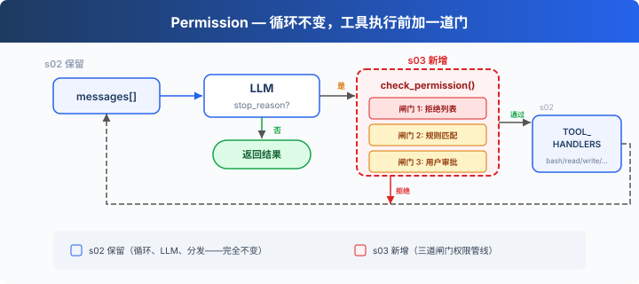
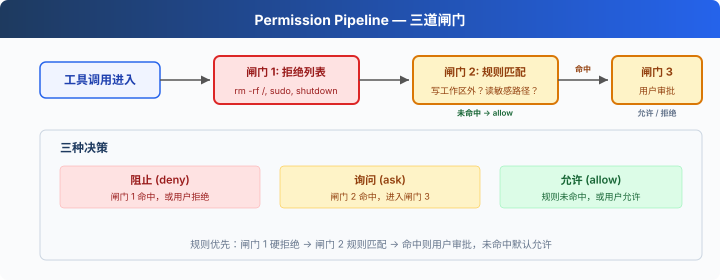

# s03: Permission — 執行前做許可權判斷

[中文](README.md) · [繁中](README.zh-tw.md) · [English](README.en.md) · [日本語](README.ja.md)

s01 → s02 → `s03` → [s04](../s04_hooks/) → s05 → ... → s20
> *"工具執行前先做許可權判斷"* — 許可權管線決定哪些操作需要審批。
>
> **Harness 層**: 許可權 — 在工具執行前加一道門。

---

## 問題

s02 的 Agent 有 5 個工具。file tools 受 `safe_path` 保護，但 bash 不受限制。讓它"清理一下專案"，可能執行 `rm -rf /`。

安全不能靠信任模型，要靠程式碼——在工具執行之前做判斷。

---

## 解決方案



s02 的迴圈完全保留。唯一的變動在工具執行前插入 `check_permission()`——每個工具呼叫經過三道閘門，順序固定：硬拒絕優先，軟詢問次之，都沒命中就放行。

三道閘門對應三種決策：

| 閘門 | 作用 | 命中後 |
|------|------|--------|
| 1. 拒絕列表 | 永遠禁止的操作（`rm -rf /`、`sudo`） | 直接拒絕，不執行 |
| 2. 規則匹配 | 取決於上下文的操作（寫工作區外、`rm` 檔案） | 交給閘門 3 |
| 3. 使用者審批 | 閘門 2 命中後，暫停等使用者確認 | 使用者決定允許或拒絕 |

三道都沒命中 → 直接執行。大部分日常操作走這條路。

---

## 工作原理



**閘門 1**：一張硬拒絕表，先查，命中就返回阻止資訊。（教學示意：簡單字串匹配不是可靠安全機制，命令變體和 shell 展開可能繞過。CC 的做法見附錄。）

```python
DENY_LIST = [
    "rm -rf /", "sudo", "shutdown", "reboot",
    "mkfs", "dd if=", "> /dev/sda",
]

def check_deny_list(command: str) -> str | None:
    for pattern in DENY_LIST:
        if pattern in command:
            return f"Blocked: '{pattern}' is on the deny list"
    return None
```

**閘門 2**：規則匹配——描述"什麼時候需要問使用者"。每條規則指定工具和檢查條件。

```python
PERMISSION_RULES = [
    {
        "tools": ["write_file", "edit_file"],
        "check": lambda args: not (WORKDIR / args.get("path", "")).resolve().is_relative_to(WORKDIR),
        "message": "Writing outside workspace",
    },
    {
        "tools": ["bash"],
        "check": lambda args: any(kw in args.get("command", "") for kw in ["rm ", "> /etc/", "chmod 777"]),
        "message": "Potentially destructive command",
    },
]

def check_rules(tool_name: str, args: dict) -> str | None:
    for rule in PERMISSION_RULES:
        if tool_name in rule["tools"] and rule["check"](args):
            return rule["message"]
    return None
```

**閘門 3**：規則命中後，暫停等使用者輸入。

```python
def ask_user(tool_name: str, args: dict, reason: str) -> str:
    print(f"\n⚠  {reason}")
    print(f"   Tool: {tool_name}({args})")
    choice = input("   Allow? [y/N] ").strip().lower()
    return "allow" if choice in ("y", "yes") else "deny"
```

**三道閘門串在一起**，插在工具執行之前：

```python
def check_permission(block) -> bool:
    # 閘門 1: 硬拒絕
    if block.name == "bash":
        reason = check_deny_list(block.input.get("command", ""))
        if reason:
            print(f"\n⛔ {reason}")
            return False

    # 閘門 2 + 3: 規則匹配 → 使用者審批
    reason = check_rules(block.name, block.input)
    if reason:
        decision = ask_user(block.name, block.input, reason)
        if decision == "deny":
            return False

    return True

# 在 agent_loop 中——s02 的迴圈只加了一行：
for block in response.content:
    if block.type == "tool_use":
        if not check_permission(block):           # ← 新增
            results.append({... "content": "Permission denied."})
            continue
        output = TOOL_HANDLERS[block.name](**block.input)  # s02 原有
        results.append(...)
```

---

## 相對 s02 的變更

| 元件 | 之前 (s02) | 之後 (s03) |
|------|-----------|-----------|
| 安全模型 | 無（信任模型） | 三道閘門許可權管線 |
| 新函式 | — | check_deny_list, check_rules, ask_user, check_permission |
| 迴圈 | 直接執行所有工具 | 執行前插入 check_permission() |

---

## 試一下

```sh
cd learn-claude-code
python s03_permission/code.py
```

試試這些 prompt：

1. `Create a file called test.txt in the current directory`（應該直接透過）
2. `Delete all temporary files in /tmp`（bash + rm 會觸發閘門 2）
3. `What files are in the current directory?`（只讀，全部透過）
4. `Try to write a file to /etc/something`（寫工作區外，觸發閘門 2）

觀察重點：哪些操作直接透過？哪些需要你確認？哪些被直接拒絕？

---

## 接下來

許可權檢查做了——但每次都在迴圈裡硬編碼 `check_permission()`。如果我想在每次工具執行前後加日誌？如果想在某些操作後自動觸發 git commit？這些擴充套件邏輯散落在 loop 裡，迴圈很快就會膨脹。

s04 Hooks → 給迴圈加鉤子，擴充套件邏輯掛在鉤子上，迴圈保持乾淨。

<details>
<summary>深入 CC 原始碼</summary>

> 以下基於 CC 原始碼 `types/permissions.ts`、`utils/permissions/permissions.ts`、`toolExecution.ts`、`utils/permissions/yoloClassifier.ts`、`tools/AgentTool/forkSubagent.ts` 的核查。

### 一、PermissionResult：不是 3 種，是 4 種

教學版的三道閘門（deny → ask → allow）和 CC 不完全對應。CC 的 `PermissionResult` 有 4 個 behavior（`types/permissions.ts:241-266`）：

| behavior | 含義 | 教學版對應 |
|----------|------|-----------|
| `allow` | 直接允許 | 閘門 3 透過 |
| `deny` | 直接拒絕 | 閘門 1 命中 |
| `ask` | 彈出對話方塊問使用者 | 閘門 2 命中 |
| `passthrough` | 工具不表態，交給通用管線決定 | 教學版無 |

### 二、生產版的驗證階段

CC 的工具呼叫不是經過三道閘門，而是經過多個階段，分佈在 `checkPermissionsAndCallTool()`（`toolExecution.ts:599-1745`）、hooks、`hasPermissionsToUseToolInner()`（`utils/permissions/permissions.ts:1158-1310`）和 classifier 邏輯裡：

1. **Zod schema 驗證**（`toolExecution.ts:614-680`）— 引數型別檢查
2. **validateInput()**（`toolExecution.ts:682-733`）— 工具級語義驗證
3. **backfillObservableInput()**（`toolExecution.ts:784`）— 補全遺留欄位
4. **PreToolUse hooks**（`toolExecution.ts:800-862`）— 鉤子可以返回 allow/deny/ask
5. **resolveHookPermissionDecision()**（`toolExecution.ts:921-931`）— 協調鉤子+管線決策
6. **hasPermissionsToUseToolInner()**（`permissions.ts:1158-1310`）— 多層規則檢查：
   - 整個工具被 deny rule 停用 → `deny`
   - 整個工具被 ask rule 標記 → `ask`
   - `tool.checkPermissions()` 工具自己的判斷
   - 工具自己返回 deny → `deny`
   - `requiresUserInteraction()` → `ask`
   - 內容相關的 ask 規則 → `ask`（不可繞過）
   - 安全檢查違規 → `ask`（不可繞過）
   - bypassPermissions 模式 → `allow`
   - 整個工具被 allow rule 放行 → `allow`
   - passthrough → 轉為 `ask`

### 三、拒絕列表：不是一個檔案，是 8 個來源

CC 沒有單一的 deny list。許可權規則來自 8 個來源（`types/permissions.ts:54-62`）：

| 來源 | 配置位置 |
|------|---------|
| `userSettings` | `~/.claude/settings.json` |
| `projectSettings` | `.claude/settings.json` |
| `localSettings` | `settings.local.json` |
| `flagSettings` | Feature flags |
| `policySettings` | 企業管理策略 |
| `cliArg` | `--allowedTools` / `--deniedTools` |
| `command` | 內聯命令 |
| `session` | 會話內臨時授權 |

每條規則格式：`{ toolName: "Bash", ruleBehavior: "deny", ruleContent: "npm publish:*" }`。多個來源的規則合併，高優先順序來源覆蓋低優先順序（從低到高：user < project < local < flag < policy，加上 cliArg、command、session）。

### 四、isDestructive() 是什麼

CC 中 `isDestructive`（`Tool.ts:405-406`）**純粹是 UI 展示用的**——在工具列表裡顯示 `[destructive]` 標籤。它不參與權限決策。預設所有工具都返回 `false`。只有 ExitWorktree（remove 時）和 MCP 工具（依賴 `annotations.destructiveHint`）覆寫了它。

### 五、YoloClassifier（自動審批）

CC 的 auto 模式下，不會每次都彈對話方塊。`classifyYoloAction`（`utils/permissions/yoloClassifier.ts:1012`）把工具呼叫 + 對話上下文發給一個分類器 LLM 判斷是否安全。先嚐試 acceptEdits 模式模擬（`permissions.ts:620-656`，如果 acceptEdits 允許 → 直接批准），再查安全工具白名單（`permissions.ts:658-686`），最後才調分類器。分類器連續拒絕太多次 → 回退到人工審批。

### 六、許可權冒泡

子 Agent（透過 AgentTool fork 出來的）的 `permissionMode` 設為 `'bubble'`（`forkSubagent.ts:50`）。意思是許可權彈窗**冒泡到父 Agent 的終端**，而不是在子 Agent 裡靜默拒絕。Bash 分類器在這個過程中繼續跑——給許可權對話方塊顯示的同時在後臺判斷是否可以自動批准。

### 教學版的簡化是刻意的

- 多階段管線 → 3 道閘門：理解門檻大幅降低
- 8 個規則來源 → 1 個本地 DENY_LIST：概念量可控
- isDestructive → 忽略（教學版沒有 UI 層，CC 裡它也不參與權限決策）
- YoloClassifier → 省略（依賴於額外的 LLM 呼叫和遙測系統）
- 許可權冒泡 → 省略（s15 才涉及多 Agent）

</details>

<!-- translation-sync: zh@v1, en@v1, ja@v1 -->
