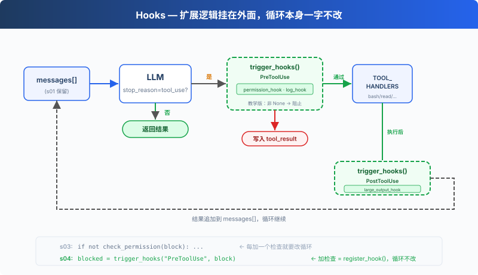

# s04: Hooks — 掛在迴圈上，不寫進迴圈裡

[中文](README.md) · [繁中](README.zh-tw.md) · [English](README.en.md) · [日本語](README.ja.md)

s01 → s02 → s03 → `s04` → [s05](../s05_todo_write/) → s06 → ... → s20

> *"掛在迴圈上, 不寫進迴圈裡"* — hook 在工具執行前後注入擴充套件邏輯。
>
> **Harness 層**: hook — 擴充套件點不侵入迴圈。

---

## 問題

s03 的 Agent 有許可權檢查了。但每次加一個新檢查，比如"記錄每次 bash 呼叫"、"操作後自動 git add"，都要修改 `agent_loop` 函式。

迴圈很快就變成了這樣：

```python
def agent_loop(messages):
    while True:
        # ... LLM call ...
        for block in response.content:
            if block.type == "tool_use":
                log_to_file(block)          # 加一行
                check_permission(block)     # 加一行
                notify_slack(block)         # 又加一行
                output = execute(block)
                auto_git_add(block)         # 再加一行
                # ... 很快迴圈就認不出來了
```

你想擴充套件的是 Agent 的行為，但你改的卻是迴圈本身。迴圈應該是一個穩定的核心，擴充套件應該掛在外面。

---

## 解決方案



s03 的迴圈和許可權邏輯完全保留。唯一的變動是把 `check_permission()` 從迴圈體內移到了 hook 上，迴圈不再直接呼叫任何檢查函式，改為 `trigger_hooks("PreToolUse", block)`，由登錄檔決定跑什麼。

四個事件，覆蓋一個完整的 agent cycle：

| 事件 | 觸發時機 | 典型用途 |
|------|---------|---------|
| UserPromptSubmit | 使用者輸入提交後、進入 LLM 前 | 輸入驗證、注入上下文 |
| PreToolUse | 工具執行前 | 許可權檢查、日誌記錄 |
| PostToolUse | 工具執行後 | 副作用（自動 git add 等）、輸出檢查 |
| Stop | 迴圈即將退出時 | 收尾清理（CC 還支援強制續跑） |

擴充套件透過 `register_hook()` 新增，迴圈只調用 `trigger_hooks()`。

---

## 工作原理

**hook 登錄檔**：一個字典，事件名對映到回撥列表。

```python
HOOKS = {
    "UserPromptSubmit": [],
    "PreToolUse": [],
    "PostToolUse": [],
    "Stop": [],
}

def register_hook(event: str, callback):
    HOOKS[event].append(callback)

def trigger_hooks(event: str, *args):
    for callback in HOOKS[event]:
        result = callback(*args)
        if result is not None:   # 返回值 ≠ None → hook 說"停"
            return result
    return None
```

教學版中，PreToolUse 的非 None 返回值會阻止本次工具執行，Stop 的非 None 返回值會強制續跑。UserPromptSubmit 和 PostToolUse 的返回值未被使用。

**UserPromptSubmit**，使用者輸入提交後、進入 LLM 前觸發。CC 中可以攔截或修改輸入，教學版只做日誌演示：

```python
def context_inject_hook(query: str) -> str | None:
    """Inject current working directory info into every prompt."""
    print(f"\033[90m[HOOK] UserPromptSubmit: working in {WORKDIR}\033[0m")
    return None   # return None = no modification, let prompt through

register_hook("UserPromptSubmit", context_inject_hook)
```

在主迴圈中，使用者輸入後立即觸發：

```python
query = input("s04 >> ")
trigger_hooks("UserPromptSubmit", query)   # ← 進入 LLM 之前
history.append({"role": "user", "content": query})
agent_loop(history)
```

**PreToolUse / PostToolUse**，工具執行前後的 hook。s03 的許可權檢查邏輯現在包裝成 PreToolUse hook，再加一個日誌 hook 和一個大輸出提醒：

```python
# PreToolUse: 許可權檢查（s03 的邏輯，從迴圈移到 hook）
def permission_hook(block):
    if block.name == "bash":
        for pattern in DENY_LIST:
            if pattern in block.input.get("command", ""):
                return "Permission denied by deny list"
    if block.name in ("write_file", "edit_file"):
        path = block.input.get("path", "")
        if not (WORKDIR / path).resolve().is_relative_to(WORKDIR):
            choice = input("   Allow? [y/N] ").strip().lower()
            if choice not in ("y", "yes"):
                return "Permission denied by user"
    return None

# PreToolUse: 日誌
def log_hook(block):
    print(f"[HOOK] {block.name}(...)")

# PostToolUse: 大檔案提醒
def large_output_hook(block, output):
    if len(str(output)) > 100000:
        print(f"[HOOK] ⚠ Large output from {block.name}")

register_hook("PreToolUse", permission_hook)
register_hook("PreToolUse", log_hook)
register_hook("PostToolUse", large_output_hook)
```

**Stop**，迴圈即將退出時觸發（`stop_reason != "tool_use"`）。教學版用於列印收尾統計：

```python
def summary_hook(messages: list) -> str | None:
    """Print a summary when the loop is about to stop."""
    tool_count = sum(1 for m in messages
                     for b in (m.get("content") if isinstance(m.get("content"), list) else [])
                     if isinstance(b, dict) and b.get("type") == "tool_result")
    print(f"\033[90m[HOOK] Stop: session used {tool_count} tool calls\033[0m")
    return None   # return None = allow stop, return string = force continuation

register_hook("Stop", summary_hook)
```

在 agent_loop 中，退出前觸發：

```python
if response.stop_reason != "tool_use":
    force = trigger_hooks("Stop", messages)   # ← 退出之前
    if force:
        # hook returned a message → inject it and continue
        messages.append({"role": "user", "content": force})
        continue
    return
```

**迴圈裡只改了一處**：s03 直接呼叫 `check_permission(block)`，s04 改為 `trigger_hooks("PreToolUse", block)`：

```python
for block in response.content:
    if block.type != "tool_use":
        continue

    # s03: if not check_permission(block): ...
    # s04: hook 替代硬編碼
    blocked = trigger_hooks("PreToolUse", block)
    if blocked:
        results.append({"type": "tool_result", "tool_use_id": block.id,
                        "content": str(blocked)})
        continue

    handler = TOOL_HANDLERS.get(block.name)
    output = handler(**block.input) if handler else f"Unknown: {block.name}"

    trigger_hooks("PostToolUse", block, output)

    results.append({"type": "tool_result", "tool_use_id": block.id,
                    "content": output})
```

四個 hook 覆蓋了 agent cycle 的關鍵節點：輸入→執行前→執行後→退出。迴圈只負責呼叫 trigger_hooks()，具體邏輯全在 hook 回撥裡。

---

## 相對 s03 的變更

| 元件 | 之前 (s03) | 之後 (s04) |
|------|-----------|-----------|
| 擴充套件方式 | check_permission() 硬編碼在迴圈裡 | HOOKS 登錄檔 + trigger_hooks() |
| 新函式 | — | register_hook, trigger_hooks |
| hook 回撥 | — | context_inject_hook, permission_hook, log_hook, large_output_hook, summary_hook |
| 迴圈 | 直接呼叫 check_permission() | 呼叫 trigger_hooks("PreToolUse", ...) |
| 退出控制 | 無 | trigger_hooks("Stop", ...) 可阻止退出 |
| 輸入攔截 | 無 | trigger_hooks("UserPromptSubmit", ...) 可注入上下文 |

---

## 試一下

```sh
cd learn-claude-code
python s04_hooks/code.py
```

試試這些 prompt：

1. `Read the file README.md`（應該直接透過，觀察 hook 日誌）
2. `Create a file called test.txt`（通過後觀察 PostToolUse 是否觸發）
3. `Delete all temporary files in /tmp`（bash + rm 觸發許可權 hook）

觀察重點：每次工具執行前，是否出現了 `[HOOK]` 日誌？許可權被拒時，是 hook 攔截的還是迴圈裡硬編碼的？

---

## 接下來

Agent 現在能安全執行操作了。但它有沒有停下來想過"我應該先做什麼，再做什麼"？給它一個複雜任務，它是一上來就動手，還是先列個計劃？

s05 TodoWrite → 給 Agent 一個計劃工具。先列清單，再做。

<details>
<summary>深入 CC 原始碼</summary>

> 以下基於 CC 原始碼 `toolHooks.ts`（650 行）、`hooks.ts`、`stopHooks.ts`、`coreTypes.ts` 的完整分析。

### 一、Hook 事件：不止這 4 個，而是 27 個

教學版只講了 PreToolUse 和 PostToolUse。CC 實際有 27 個 hook 事件（`coreTypes.ts:25-53`）：

| 類別 | 事件 |
|------|------|
| 工具相關 | `PreToolUse`, `PostToolUse`, `PostToolUseFailure` |
| 會話相關 | `SessionStart`, `SessionEnd`, `Stop`, `StopFailure`, `Setup` |
| 使用者互動 | `UserPromptSubmit`, `Notification`, `PermissionRequest`, `PermissionDenied` |
| 子 Agent | `SubagentStart`, `SubagentStop` |
| 壓縮相關 | `PreCompact`, `PostCompact` |
| 團隊相關 | `TeammateIdle`, `TaskCreated`, `TaskCompleted` |
| 其他 | `Elicitation`, `ElicitationResult`, `ConfigChange`, `WorktreeCreate`, `WorktreeRemove`, `InstructionsLoaded`, `CwdChanged`, `FileChanged` |

教學版只講 4 個核心事件（UserPromptSubmit、PreToolUse、PostToolUse、Stop），因為它們覆蓋了一個完整 agent cycle 的關鍵節點。其他 23 個都是同樣的模式。

### 二、HookResult 常用欄位摘錄

CC 的 `HookResult`（`types/hooks.ts:260-275`）有 14 個欄位，以下是常用欄位：

| 欄位 | 型別 | 用途 |
|------|------|------|
| `message` | Message | 可選 UI 訊息 |
| `blockingError` | HookBlockingError | 阻塞錯誤 → 注入對話讓模型自糾 |
| `outcome` | success/blocking/non_blocking_error/cancelled | 執行結果 |
| `preventContinuation` | boolean | 阻止後續執行 |
| `stopReason` | string | 停止原因描述 |
| `permissionBehavior` | allow/deny/ask/passthrough | hook 返回許可權決策 |
| `updatedInput` | Record | 修改工具輸入 |
| `additionalContext` | string | 附加上下文 |
| `updatedMCPToolOutput` | unknown | MCP 工具輸出修改 |

### 三、關鍵不變式：Hook 'allow' 不能繞過 deny/ask 規則

這是 CC 許可權系統最重要的安全設計（`toolHooks.ts:325-331`）：**hook 返回 allow 時，仍然要檢查 settings.json 的 deny/ask 規則**。即使使用者的 hook 指令碼說"允許"，如果在 settings.json 中停用了這個工具，操作仍然會被阻止。

教學版沒有這個層次，只把 PreToolUse 的非 None 返回值解釋為阻止本次工具執行。這在教學場景中夠了，但在生產環境中會形成安全漏洞。

### 四、stopHookActive 機制

CC 的 Stop hooks 有一個防無限迴圈機制（`query.ts:212,1300`）：`stopHookActive` 狀態欄位。當 stop hooks 產生 blockingError 時，迴圈帶 `stopHookActive: true` 重入下一輪。後續迭代中 stop hooks 看到這個標誌就不會再次觸發。這防止了一個永不停機的 bug：模型自糾後 stop hook 再次報錯 → 模型再自糾 → stop hook 再報錯...

### 五、hook_stopped_continuation

PostToolUse hooks 返回 `preventContinuation: true` 時，會產生一個 `hook_stopped_continuation` 附件（`toolHooks.ts:117-130`）。query.ts（L1388-1393）檢測到後設置 `shouldPreventContinuation = true`，迴圈退出。這是 "hook 優雅地讓 Agent 停機" 的機制，不是崩潰，是完成。

### 教學版的簡化是刻意的

- 27 個事件 → 4 個（UserPromptSubmit/PreToolUse/PostToolUse/Stop）：覆蓋 agent cycle 關鍵節點
- 14 個欄位 → 簡單的返回值（None = 繼續，非 None = 阻止/續跑）：心智負擔降到最低
- Hook allow vs deny/ask 不變式 → 省略：教學版沒有 settings.json 層
- stopHookActive → 省略：教學版 Stop hook 只做簡單續跑，不涉及防無限迴圈機制

</details>

<!-- translation-sync: zh@v1, en@v0, ja@v0 -->
