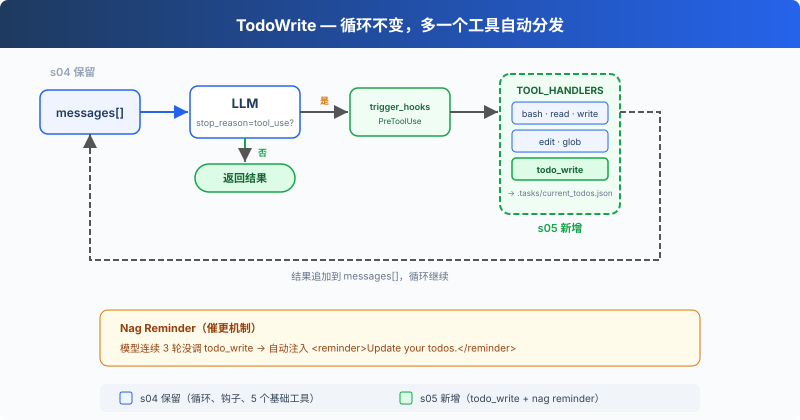

# s05: TodoWrite — 沒有計劃的 Agent，做著做著就偏了

[中文](README.md) · [繁中](README.zh-tw.md) · [English](README.en.md) · [日本語](README.ja.md)

s01 → s02 → s03 → s04 → `s05` → [s06](../s06_subagent/) → s07 → ... → s20

> *"沒有計劃的 agent 走哪算哪"* — 先列步驟再動手，長任務更不容易漏項。
>
> **Harness 層**: 規劃 — 讓 Agent 在動手之前先想清楚。

---

## 問題

給 Agent 一個複雜任務："把所有 Python 檔案改成 snake_case 命名，然後跑測試，修好失敗。"

Agent 開始幹活，改了 3 個檔案，跑了個測試，發現 2 個失敗，開始修。修著修著，它忘了最初是"改成 snake_case"，測試失敗把注意力全吸走了。

對話越長越嚴重：工具結果不斷填滿上下文，系統提示的影響力被稀釋。一個 10 步重構，做完 1-3 步就開始即興發揮，因為 4-10 步已經被擠出注意力了。

---

## 解決方案



保留上一章的最小 hook 結構，重點看新增的 `todo_write` 工具和 reminder 機制。`todo_write` 本身不做任何實際工作，不能讀檔案、不能跑命令，只是讓 Agent 在動手之前先理清思路。

dispatch 機制不變，新工具仍然走 `TOOL_HANDLERS[block.name]` 分發。但為了演示 todo reminder，迴圈里加了一個計數器：連續 3 輪沒調 `todo_write` 就注入一條提醒。

---

## 工作原理

**todo_write 工具**，接收一個帶狀態的列表，持久化到 `.tasks/current_todos.json`（教學版寫盤以便觀察），同時在終端顯示進度：

```python
def run_todo_write(todos: list) -> str:
    tasks_file = TASKS_DIR / "current_todos.json"
    tasks_file.write_text(json.dumps(todos, indent=2, ensure_ascii=False))

    lines = ["\n## Current Tasks"]
    for t in todos:
        icon = {"pending": " ", "in_progress": "▸", "completed": "✓"}[t["status"]]
        lines.append(f"  [{icon}] {t['content']}")
    print("\n".join(lines))
    return f"Updated {len(todos)} tasks"
```

工具定義和其他 5 個工具一起加入 dispatch map：

```python
TOOLS = [
    {"name": "bash",       ...},
    {"name": "read_file",  ...},
    {"name": "write_file", ...},
    {"name": "edit_file",  ...},
    {"name": "glob",       ...},
    # s05: 新增一條
    {"name": "todo_write", "description": "Create and manage a task list ...",
     "input_schema": {
         "type": "object",
         "properties": {
             "todos": {
                 "type": "array",
                 "items": {
                     "type": "object",
                     "properties": {
                         "content": {"type": "string"},
                         "status": {"type": "string", "enum": ["pending", "in_progress", "completed"]},
                     },
                 },
             },
         },
     },
    },
]

TOOL_HANDLERS["todo_write"] = run_todo_write
```

**Nag reminder**，模型連續 3 輪沒調 `todo_write` 時，自動注入一條提醒（教學版機制，CC 原始碼中沒有這個固定輪數邏輯）：

```python
if rounds_since_todo >= 3 and messages:
    messages.append({
        "role": "user",
        "content": "<reminder>Update your todos.</reminder>",
    })
    rounds_since_todo = 0
```

Agent 收到任務後的典型流程：先調 `todo_write` 列出所有步驟（全 `pending`）→ 做一個步驟，改成 `in_progress` → 做完改成 `completed` → 看下一個 `pending` → 繼續。連續 3 輪沒有呼叫 `todo_write` 時，迴圈會在下一次 LLM 呼叫前追加一條 reminder。

**關鍵洞察**：todo_write 不給 Agent 增加任何**執行能力**。它增加的是**規劃能力**。

---

## 相對 s04 的變更

| 元件 | 之前 (s04) | 之後 (s05) |
|------|-----------|-----------|
| 工具數量 | 5 (bash, read, write, edit, glob) | 6 (+todo_write) |
| 規劃能力 | 無 | 帶狀態的 TODO 列表 + nag reminder |
| SYSTEM 提示 | 通用提示 | 加入 "先計劃再執行" 引導 |
| 迴圈 | 不變 | dispatch 不變，新增 rounds_since_todo 計數器和 reminder 注入 |

---

## 試一下

```sh
cd learn-claude-code
python s05_todo_write/code.py
```

試試這些 prompt：

1. `Refactor s05_todo_write/example/hello.py: add type hints, docstrings, and a main guard`（先列 3 步再執行）
2. `Create a Python package under s05_todo_write/example/demo_pkg with __init__.py, utils.py, and tests/test_utils.py`
3. `Review Python files under s05_todo_write/example and fix any style issues`

觀察重點：第一次工具呼叫是不是 `todo_write`？TODO 列了幾步？執行過程中狀態有沒有從 `pending` 變成 `in_progress` / `completed`？

---

## 接下來

Agent 能計劃了。但如果一個任務太大，比如"重構整個認證模組"，光靠 TODO 列表不夠。這個任務本身就是幾十個小任務的集合，放在同一個對話裡會被上下文淹沒。

s06 Subagent → 把大任務拆成子任務，每個子任務派一個獨立的 Agent。它們有自己的乾淨上下文，不會互相汙染。

<details>
<summary>深入 CC 原始碼</summary>

CC 中有兩套任務系統並存（`tasks.ts:133-139`）：

- **TodoWrite（V1）**：一個簡單的列表工具，資料在記憶體 AppState 中維護（`TodoWriteTool.ts:65-103`）。教學版寫盤到 `.tasks/current_todos.json` 是為了可觀察性，真實 V1 不寫盤
- **Task System（V2 = s12）**：檔案持久化、依賴圖、併發鎖、ownership

切換由 `isTodoV2Enabled()` 控制。當前原始碼的實現邏輯：互動式會話中 V2 預設啟用，非互動式會話（SDK）中 V1 預設啟用；設定 `CLAUDE_CODE_ENABLE_TASKS` 環境變數可強制啟用 V2。注意原始碼註釋 "Force-enable tasks in non-interactive mode" 描述的是 env var 路徑的用途，和預設分支的返回值語義不同，閱讀時需區分。

教學版省略了真實原始碼中的 `activeForm` 欄位（`utils/todo/types.ts:8-15`）。CC 用它給 UI spinner 展示"正在做什麼"，教學版只有終端輸出，不需要這個欄位。

教學版的 nag reminder（3 輪未更新就注入提醒）是教學機制。CC 原始碼中沒有固定的"3 輪"邏輯，更接近的是 `TodoWriteTool.ts:72-107` 中當 3 個以上 todo 全部完成但沒有 verification 項時，追加 verification nudge。

Task System 相比 TodoWrite 的核心增量：
- 檔案持久化（Claude 配置目錄下 `tasks/{taskListId}/{taskId}.json`）而非記憶體列表
- `blockedBy` 依賴圖而非平鋪列表
- `proper-lockfile` 併發安全而非無鎖
- 四個獨立工具（Create/Get/Update/List）而非一個
- TaskCreated / TaskCompleted hooks（`TaskCreateTool.ts:80-129`、`TaskUpdateTool.ts:231-260`）供外部系統整合

</details>

<!-- translation-sync: zh@v1, en@v0, ja@v0 -->
