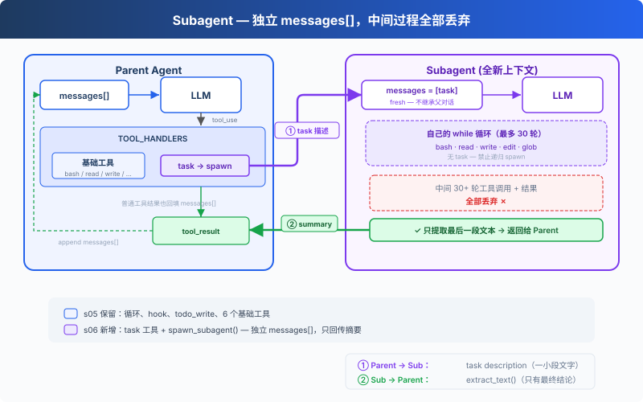

# s06: Subagent — 大任務拆小，每個拿到的都是乾淨上下文

[中文](README.md) · [繁中](README.zh-tw.md) · [English](README.en.md) · [日本語](README.ja.md)

s01 → s02 → s03 → s04 → s05 → `s06` → [s07](../s07_skill_loading/) → s08 → ... → s20

> *"大任務拆小, 每個小任務乾淨的上下文"* — Subagent 用獨立 messages[], 不汙染主對話。
>
> **Harness 層**: 子 Agent — 上下文隔離, 注意力不漂移。

---

## 問題

Agent 在修一個 bug。它讀了 30 個檔案來追蹤呼叫鏈，中間聊了 60 輪。messages 列表漲到 120 條，其中大部分是"追蹤呼叫鏈"的中間過程，和"修 bug"這個最終目標無關。

這些中間過程佔著上下文位置，讓 Agent 越來越"健忘"，它記不住最初的問題是什麼了。

換個角度：你修 bug 的時候，會"開一個新終端"來追蹤呼叫鏈。追蹤完了，終端關掉，結果寫進筆記，回到原來的終端繼續修 bug。Agent 也需要這個能力：開一個獨立的子程序，給它一個獨立的訊息列表，讓它專心做一件事。

---

## 解決方案



保留上一章的最小 hook 結構和 `todo_write` 工具，本章重點轉向新增的 `task` 工具。呼叫它時，spawn 一個子 Agent，擁有全新的 `messages[]`，跑自己的迴圈，結束後只把摘要文本回傳給主 Agent。對話上下文被丟棄，但檔案系統的副作用（寫檔案、改檔案、跑命令）保留在工作目錄中。

子 Agent 的工具受限：有 bash/read/write/edit/glob，但沒有 task，不能遞迴 spawn 新的子 Agent。子 Agent 的工具呼叫仍經過許可權 hook，安全策略不因上下文隔離而跳過。

---

## 工作原理

**spawn_subagent**，給子 Agent 一個全新的 messages 列表，跑自己的迴圈，只回傳結論：

```python
def spawn_subagent(description: str) -> str:
    # 子 Agent 的工具：基礎工具，但沒有 task（禁止遞迴）
    sub_tools = [
        {"name": "bash", ...}, {"name": "read_file", ...},
        {"name": "write_file", ...}, {"name": "edit_file", ...},
        {"name": "glob", ...},
    ]
    messages = [{"role": "user", "content": description}]  # 全新 messages[]

    for _ in range(30):  # safety limit
        response = client.messages.create(
            model=MODEL, system=SUB_SYSTEM,
            messages=messages, tools=sub_tools, max_tokens=8000,
        )
        messages.append({"role": "assistant", "content": response.content})
        if response.stop_reason != "tool_use":
            break
        results = []
        for block in response.content:
            if block.type == "tool_use":
                blocked = trigger_hooks("PreToolUse", block)
                if blocked:
                    results.append({... "content": str(blocked)})
                    continue
                handler = SUB_HANDLERS.get(block.name)
                output = handler(**block.input) if handler else f"Unknown"
                trigger_hooks("PostToolUse", block, output)
                results.append({... "content": output})
        messages.append({"role": "user", "content": results})

    # 只返回最後的文字結論，中間過程全部丟棄
    return extract_text(messages[-1]["content"])
```

主 Agent 呼叫時，跟調其他工具一樣：

```python
TOOLS = [
    {"name": "bash", ...},
    {"name": "read_file", ...},
    {"name": "write_file", ...},
    {"name": "edit_file", ...},
    {"name": "glob", ...},
    {"name": "todo_write", ...},
    # s06: 新增 task 工具
    {"name": "task",
     "description": "Launch a subagent to handle a complex subtask. Returns only the final conclusion.",
     "input_schema": {"type": "object", "properties": {"description": {"type": "string"}}, "required": ["description"]}},
]

TOOL_HANDLERS["task"] = spawn_subagent
```

三個關鍵設計決策：

| 決策 | 選擇 | 原因 |
|------|------|------|
| 上下文隔離 | 全新 `messages[]` | 子 Agent 的中間過程不汙染主 Agent 的上下文 |
| 只回傳結論 | `extract_text(last_message)` | 不是回傳整個 messages 列表 |
| 禁止遞迴 | 子 Agent 無 task 工具 | 防止子 Agent 再 spawn 新的子 Agent |
| 安全策略不跳過 | 子 Agent 工具呼叫也走 PreToolUse hook | 上下文隔離不代表權限隔離 |

dispatch 機制不變，task 工具透過 `TOOL_HANDLERS[block.name]` 分發。子 Agent 有獨立的 `SUB_SYSTEM` 提示，明確要求"直接完成任務，不要再委派"。

---

## 相對 s05 的變更

| 元件 | 之前 (s05) | 之後 (s06) |
|------|-----------|-----------|
| 工具數量 | 6 (bash, read, write, edit, glob, todo_write) | 7 (+task) |
| 新函式 | — | spawn_subagent（獨立 messages[] + 30 輪安全限制） |
| 上下文隔離 | 全部在主對話中 | 子 Agent 用全新的 messages[] |
| 迴圈 | 不變 | dispatch 不變，子 Agent 有獨立 SUB_SYSTEM 和 hook 保護的迴圈 |

---

## 試一下

```sh
cd learn-claude-code
python s06_subagent/code.py
```

試試這些 prompt：

1. `Use a subtask to find what testing framework this project uses`（子 Agent 去讀檔案，主 Agent 只收結論）
2. `Delegate: read all .py files in agents/ and summarize what each one does`
3. `Use a task to create s06_subagent/example/string_tools.py with a slugify(text: str) function, then verify it from the parent agent`

觀察重點：是否出現 `[Subagent spawned]` / `[Subagent done]`？子 Agent 的工具呼叫是否以 `[sub] ...` 輸出？主 Agent 最後是否只繼續處理子 Agent 返回的摘要？

---

## 接下來

Agent 現在能拆任務了。但每個任務需要的知識不一樣：改前端元件需要知道 React 規範，寫 SQL 需要知道表結構。這些知識全塞進 system prompt，上下文直接爆了。

s07 Skill Loading → 技能按需注入，不在 system prompt 裡堆文件。用到的時候才載入，和讀檔案一樣自然。

<details>
<summary>深入 CC 原始碼</summary>

> 以下基於 CC 原始碼 `AgentTool.tsx`、`runAgent.ts`、`forkSubagent.ts`、`forkedAgent.ts` 的完整分析。

### 一、不是一種模式，是三種

教學版只講了"全新的 messages[]"。CC 實際有三種執行模式：

| 模式 | 觸發條件 | 上下文 |
|------|---------|--------|
| **Normal Subagent** | 指定了 `subagent_type`（normal path） | 全新 messages[]，只有 prompt |
| **Fork Subagent** | 沒指定 `subagent_type`，fork gate 開啟 | 透過 `buildForkedMessages()` 構造 cache-friendly 字首，共享 prompt cache |
| **General-Purpose** | 沒指定 `subagent_type`，fork gate 關閉 | 同 Normal |

### 二、Fork 模式：為了共享 Prompt Cache

這是教學版沒有的核心概念。Fork 模式（`forkSubagent.ts:60-71`）不建立全新上下文，而是透過 `buildForkedMessages()`（`forkSubagent.ts:107-168`）構造 cache-friendly 訊息字首，保留父 assistant message 並生成 placeholder tool results。目的不是隔離，而是讓 Anthropic API 的 prompt cache 命中：父子 Agent 的 system prompt、tools、messages 字首完全一致，API 端不需要重算。

快取命中的五個關鍵元件（`forkedAgent.ts:57-68`）：system prompt、tools、model、messages 字首、thinking config，必須位元組級一致。

### 三、Context Isolation 的精確粒度

`createSubagentContext()`（`forkedAgent.ts:345-462`）建立子 Agent 的 `ToolUseContext`：

| 欄位 | 行為 |
|------|------|
| `abortController` | 新的 child controller，父 abort 向下傳播 |
| `setAppState` | 預設 no-op；但 sync agent 透過 `shareSetAppState` 共享（`runAgent.ts:697-714`） |
| `readFileState` | **從父克隆**（避免重複讀相同檔案） |
| `queryTracking` | 新 chainId，`depth = parentDepth + 1` |

子 Agent 不是完全隔離的：檔案讀取狀態是共享的。UI 和通知的隔離程度取決於執行路徑（sync/async/fork/teammate 各不同）。

### 四、遞迴 Fork 防護

教學版用"子 Agent 不給 task 工具"表達遞迴保護。真實實現更精細：`isInForkChild()`（`forkSubagent.ts:78-89`）檢查對話歷史中是否有 `FORK_BOILERPLATE_TAG`，有就拒絕。但 `constants/tools.ts:36-46` 中 `Agent` 工具預設在所有 agent 的停用集合裡，`USER_TYPE === 'ant'` 時例外；`forkSubagent.ts:73-89` 針對 fork child 有專門的遞迴保護；`agentToolUtils.ts:100-110` 在 teammate 場景下有特殊放行。不是簡單的"禁止新的子 Agent"。

### 五、Permission Bubbling

Fork Agent 的 `permissionMode: 'bubble'`（`forkSubagent.ts:67`）意味著子 Agent 的許可權彈窗冒泡到父終端，使用者在主終端裡審批子 Agent 的操作。

### 六、Async vs Sync

教學版只展示了同步子 Agent（父等著子跑完）。CC 還支援非同步路徑（`AgentTool.tsx:686-764`）：`run_in_background: true` 時非同步啟動，返回 `{ status: 'async_launched' }` 立即給父 Agent，子 Agent 完成後透過通知機制告知父 Agent。實際觸發條件不止 `run_in_background`，還有 auto-background、assistant force async、coordinator/proactive 等路徑。

### 教學版的簡化是刻意的

- 三種模式 → 一種（fresh messages）：概念清晰
- Prompt cache 共享 → 省略：教學版不涉及 API 層最佳化
- 遞迴 fork 防護 → 簡化為"子 Agent 無 task 工具"
- Async → 省略（留給 s13）：s06 先理解同步模型

</details>

<!-- translation-sync: zh@v1, en@v0, ja@v0 -->
