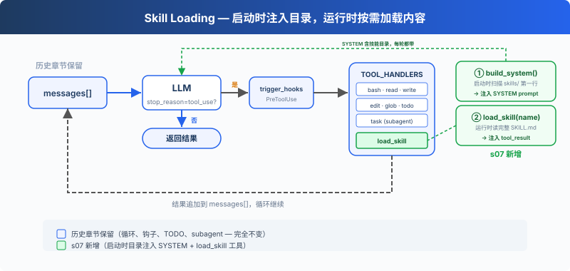

# s07: Skill Loading — 用到的時候才載入

[中文](README.md) · [繁中](README.zh-tw.md) · [English](README.en.md) · [日本語](README.ja.md)

s01 → s02 → s03 → s04 → s05 → s06 → `s07` → [s08](../s08_context_compact/) → s09 → ... → s20
> *"用到時再載入, 別全塞 prompt 裡"* — 透過 tool_result 注入, 不塞 system prompt。
>
> **Harness 層**: 知識 — 按需載入, 不堆滿上下文。

---

## 問題

你的專案有一套 React 元件規範、一份 SQL 風格指南、一份 API 設計文件。你希望 Agent 自動遵守這些規範。最直接的想法，全塞進 system prompt：

```python
SYSTEM = (
    f"You are a coding agent. "
    + open("docs/react-style.md").read()       # 2000 行
    + open("docs/sql-style.md").read()         # 1500 行
    + open("docs/api-design.md").read()        # 3000 行
)
```

6500 行 system prompt。Agent 每次呼叫 LLM 都帶著這些文件——不管是在改 CSS 顏色還是修 SQL 查詢。99% 的內容和當前任務無關，白白消耗 token。

---

## 解決方案



保留上一章的最小 hook 結構、`todo_write` 和子 Agent，本章重點轉向新增的 `load_skill` 工具。啟動時把技能目錄注入 SYSTEM prompt，執行時多註冊一個工具載入完整內容，用到才花 token。

兩層設計：

| 層 | 位置 | 時機 | 代價 |
|---|------|------|------|
| 1. 目錄 | system prompt | 啟動時注入（harness 掃描 skills/） | ~100 tokens/skill，每輪都帶 |
| 2. 內容 | tool_result | Agent 呼叫 load_skill 時 | ~2000 tokens/skill，按需 |

dispatch 機制不變，load_skill 透過 `TOOL_HANDLERS[block.name]` 分發。

---

## 工作原理

**skills/ 目錄**，每個技能一個子目錄，包含 `SKILL.md` 檔案：

```
skills/
  agent-builder/SKILL.md
  code-review/SKILL.md
  mcp-builder/SKILL.md
  pdf/SKILL.md
```

**第一級：啟動時注入目錄**：harness 啟動時呼叫 `_scan_skills()` 掃描 skills/ 目錄，解析每個 SKILL.md 的 YAML frontmatter（`name`、`description`），存入 `SKILL_REGISTRY` 字典。`list_skills()` 從登錄檔生成目錄，注入 SYSTEM prompt。Agent 每輪都能看到"我有哪些技能可用"，不花額外 API 呼叫：

```python
SKILL_REGISTRY: dict[str, dict] = {}

def _scan_skills():
    if not SKILLS_DIR.exists():
        return
    for d in sorted(SKILLS_DIR.iterdir()):
        if not d.is_dir():
            continue
        manifest = d / "SKILL.md"
        if manifest.exists():
            raw = manifest.read_text()
            meta, body = _parse_frontmatter(raw)
            name = meta.get("name", d.name)
            desc = meta.get("description", raw.split("\n")[0].lstrip("#").strip())
            SKILL_REGISTRY[name] = {"name": name, "description": desc, "content": raw}

_scan_skills()  # runs once at startup

def list_skills() -> str:
    return "\n".join(f"- **{s['name']}**: {s['description']}" for s in SKILL_REGISTRY.values())

def build_system() -> str:
    catalog = list_skills()
    return (
        f"You are a coding agent at {WORKDIR}. "
        f"Skills available:\n{catalog}\n"
        "Use load_skill to get full details when needed."
    )

SYSTEM = build_system()
```

**第二級：load_skill**：Agent 決定"我需要 SQL 風格指南"，呼叫 `load_skill("sql-style")`。透過登錄檔查詢，不走檔案路徑，沒有路徑遍歷風險。內容透過 `tool_result` 注入：

```python
def load_skill(name: str) -> str:
    skill = SKILL_REGISTRY.get(name)
    if not skill:
        return f"Skill not found: {name}"
    return skill["content"]
```

關鍵區別：技能內容不是 system prompt 的一部分，它作為一次工具結果進入當前 messages。後續呼叫會隨歷史一起攜帶，直到上下文壓縮、截斷或會話結束。這和 s08 的 compact 自然銜接：按需載入解決了"不該提前帶的不要帶"，compact 解決"該丟的怎麼丟"。

---

## 相對 s06 的變更

| 元件 | 之前 (s06) | 之後 (s07) |
|------|-----------|-----------|
| 工具數量 | 7 (bash, read, write, edit, glob, todo_write, task) | 8 (+load_skill) |
| 知識載入 | 無 | 兩級：啟動時目錄注入 SYSTEM + 執行時 load_skill |
| SYSTEM 提示 | 靜態字串 | 啟動時掃描 skills/ 注入目錄 |
| 技能登錄檔 | 無 | SKILL_REGISTRY（啟動時填充，防路徑遍歷） |
| 迴圈 | 不變 | 不變（skill 工具自動分發） |

---

## 試一下

```sh
cd learn-claude-code
python s07_skill_loading/code.py
```

試試這些 prompt：

1. `What skills are available?`
2. `Load the code-review skill and follow its instructions`
3. `I need to do a code review -- load the relevant skill first`

觀察重點：Agent 是否直接從 SYSTEM 裡的目錄知道有哪些技能？需要完整規範時是否出現 `[HOOK] load_skill`？載入後回答是否使用了對應 skill 的說明？

---

## 接下來

按需載入解決了"不該帶的不要帶"。但另一個問題來了：Agent 連續工作 30 分鐘後，messages 列表塞滿了中間過程。舊的 tool_result、過時的檔案內容，佔著上下文但不產生價值。

s08 Context Compact → 四層壓縮策略。便宜的先跑，貴的後跑。

<details>
<summary>深入 CC 原始碼</summary>

> 以下基於 CC 原始碼 `loadSkillsDir.ts`、`SkillTool.ts`、`bundledSkills.ts`、`commands.ts` 的分析。

### 一、技能來源：不是隻有一個 skills/ 目錄

教學版假設所有技能在 `skills/` 目錄下。CC 實際從多個來源載入，分佈在多個檔案中：`loadSkillsDir.ts` 負責從 user/project/`--add-dir` 目錄和 legacy commands（`.claude/commands/`）載入；`bundledSkills.ts` 負責內建技能；`SkillTool.ts` 處理 MCP 遠端技能；`commands.ts` 負責命令聚合。型別包括 managed/policy skills、user skills（`~/.claude/skills/`）、project skills（`.claude/skills/`）、`--add-dir` skills、legacy commands、dynamic skills、conditional skills（帶 `paths` frontmatter，按檔案路徑啟用）、bundled skills、plugin skills、MCP skills。

### 二、SKILL.md Frontmatter 常見欄位

CC 的 SKILL.md YAML frontmatter 由 `parseSkillFrontmatterFields()` 解析（`loadSkillsDir.ts`），常見欄位包括：

| 欄位 | 用途 |
|------|------|
| `name` / `description` | 顯示名稱和描述 |
| `when_to_use` | 指導模型何時呼叫 |
| `allowed-tools` | 技能可用工具的自動允許列表 |
| `context` | `inline`（預設）或 `fork`（作為子 Agent 執行） |
| `model` | 模型覆蓋（haiku/sonnet/opus/inherit） |
| `hooks` | 技能級別的 hook 配置 |
| `paths` | 條件啟用的 glob 模式 |
| `user-invocable` | 使用者可以透過 `/name` 呼叫 |

完整欄位列表隨版本迭代會變化，以上僅列出教學版涉及的核心欄位。

### 三、兩級載入的精確實現

1. **Catalog（啟動時）**：`getSkillDirCommands()` 掃描目錄 → 註冊為 `Command` 物件，只包含後設資料。`getSkillListingAttachments()` 把技能列表格式化為附件，預算為上下文視窗的 ~1%（上限 8000 字元）。
2. **Load（呼叫時）**：模型調 `Skill` 工具（輸入欄位是 `skill` + 可選 `args`，教學版用 `name`）→ `getPromptForCommand()` 展開完整 SKILL.md 內容 → `SkillTool` 返回的 tool_result 展示文字只是 `"Launching skill: {name}"`，真正的技能內容透過 `newMessages` 注入對話。教學版把兩者合併為"透過 tool_result 注入"是一種簡化。

### 教學版的簡化是刻意的

- 多檔案多來源 → 1 個 `skills/` 目錄：足以展示兩級載入的核心概念
- 多個 frontmatter 欄位 → 只解析 name/description：減少解析複雜度
- forked skills（`context: 'fork'`）→ 省略：教學版只展開 inline 技能載入
- `Skill` 工具輸入 `skill`+`args` → 教學版用 `name`：避免參數解析的額外複雜度

</details>

<!-- translation-sync: zh@v1, en@v1, ja@v1 -->
