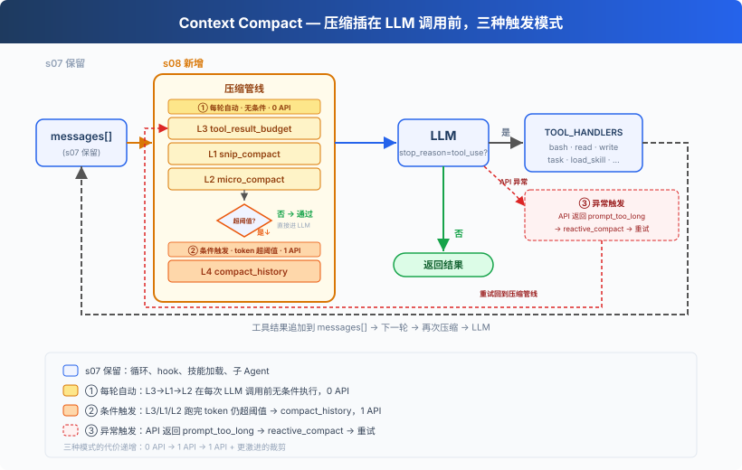
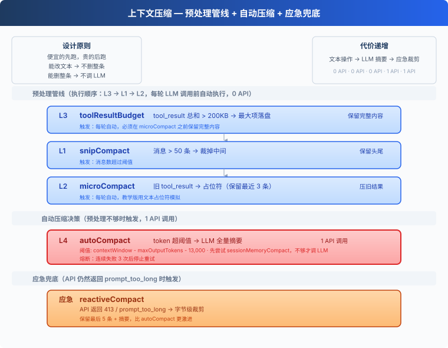
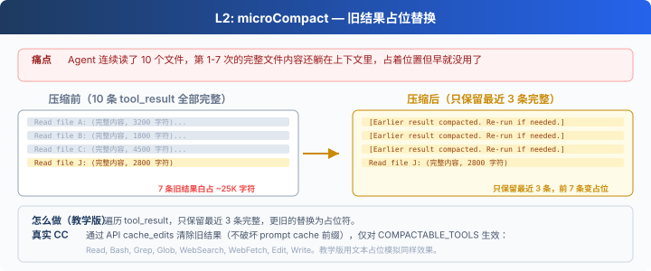
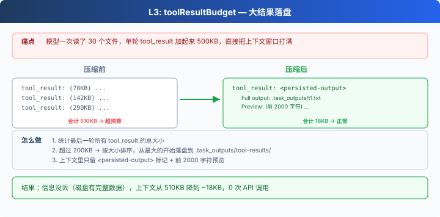
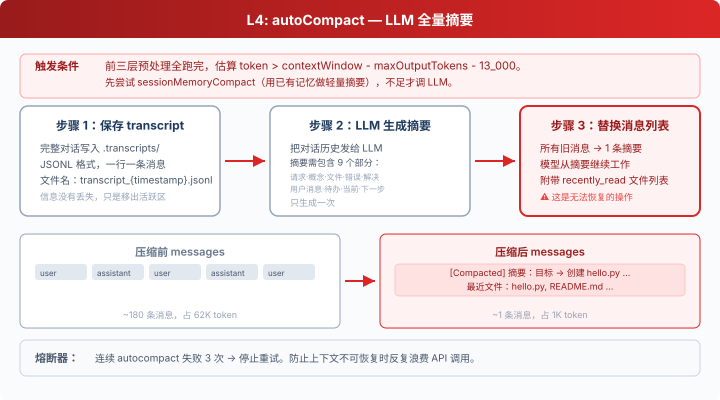

# s08: Context Compact — 上下文總會滿，要有辦法騰地方

[中文](README.md) · [繁中](README.zh-tw.md) · [English](README.en.md) · [日本語](README.ja.md)

s01 → s02 → s03 → s04 → s05 → s06 → s07 → `s08` → [s09](../s09_memory/) → s10 → ... → s20
> *"上下文總會滿, 要有辦法騰地方"* — 四層壓縮策略, 便宜的先跑貴的後跑。
>
> **Harness 層**: 壓縮 — 乾淨的記憶, 無限的會話。

---

## 問題

Agent 跑著跑著，不動了。

手裡有 bash、有 read、有 write，能力是夠的。但它讀了一個 1000 行的檔案（~4000 token），又讀了 30 個檔案，跑了 20 條命令。每條命令的輸出、每個檔案的內容，全都堆在 `messages` 列表裡。

上下文視窗是有限的。滿了之後，API 直接拒絕：`prompt_too_long`。

不壓縮，Agent 根本沒法在大專案裡幹活。

---

## 解決方案



保留 s07 的 hook 結構、技能載入、子 Agent 等骨架，省略部分工具細節以聚焦壓縮。核心變動：每輪 LLM 呼叫前插入三層預處理器（0 API），token 仍超閾值時觸發 LLM 摘要（1 API），API 報錯時應急裁剪。

核心設計：便宜的先跑，貴的後跑。

---

## 工作原理



### L1: snip_compact — 裁掉無關的舊對話

Agent 跑了 80 輪對話，`messages` 攢了 160 條。最前面的"幫我建立 hello.py"和當前工作幾乎無關了，但全佔著位置。

訊息數超過 50 條 → 保留頭部 3 條（初始上下文）和尾部 47 條（當前工作），中間裁掉：

```python
def snip_compact(messages, max_messages=50):
    if len(messages) <= max_messages:
        return messages
    keep_head, keep_tail = 3, max_messages - 3
    snipped = len(messages) - keep_head - keep_tail
    placeholder = {"role": "user",
                   "content": f"[snipped {snipped} messages from conversation middle]"}
    return messages[:keep_head] + [placeholder] + messages[-keep_tail:]
```

裁掉了整條訊息，但剩下的訊息裡 `tool_result` 內容仍在累積——第 34 條訊息裡可能躺著 30KB 的舊檔案內容。→ L2。

### L2: micro_compact — 舊工具結果佔位



Agent 連續讀了 10 個檔案。第 1-7 次的完整內容還躺在上下文裡，早就不需要了，但佔著大量空間。

只保留最近 3 條 `tool_result` 的完整內容，更舊的替換為一行佔位符：

```python
KEEP_RECENT_TOOL_RESULTS = 3

def micro_compact(messages):
    tool_results = collect_tool_result_blocks(messages)
    if len(tool_results) <= KEEP_RECENT_TOOL_RESULTS:
        return messages
    for _, _, block in tool_results[:-KEEP_RECENT_TOOL_RESULTS]:
        if len(block.get("content", "")) > 120:
            block["content"] = "[Earlier tool result compacted. Re-run if needed.]"
    return messages
```

舊結果清掉了，但單條新結果可能就有 500KB——一個 `cat` 大檔案的輸出就能打滿上下文。→ L3。

### L3: tool_result_budget — 大結果落盤



模型一次讀了 5 個大檔案，單條 user 訊息裡所有 `tool_result` 加起來 500KB。

統計最後一條 user 訊息裡所有 `tool_result` 的總大小。超過 200KB → 按大小排序，從最大的開始落盤到 `.task_outputs/tool-results/`，上下文裡只留 `<persisted-output>` 標記 + 前 2000 字元預覽。模型看到標記後知道完整內容在磁碟上，需要時可以重新讀。

```python
def tool_result_budget(messages, max_bytes=200_000):
    last = messages[-1]
    blocks = [(i, b) for i, b in enumerate(last["content"])
              if b.get("type") == "tool_result"]
    total = sum(len(str(b.get("content", ""))) for _, b in blocks)
    if total <= max_bytes:
        return messages
    ranked = sorted(blocks, key=lambda p: len(str(p[1].get("content", ""))), reverse=True)
    for idx, block in ranked:
        if total <= max_bytes:
            break
        block["content"] = persist_large_output(block["tool_use_id"], str(block["content"]))
        total = recalculate_total(blocks)
    return messages
```

前三層都是純文字/結構操作，0 API 呼叫，但也無法"理解"對話內容。上下文可能仍然太大。→ L4。

### L4: compact_history — LLM 全量摘要



前三層全跑完了，但在超大專案中連續工作 30 分鐘後，token 仍然超過閾值。

三步流程：

1. **儲存 transcript**：完整對話寫入 `.transcripts/`，JSONL 格式。transcript 保留了可恢復記錄，但模型的活躍上下文裡只剩摘要。對模型當下推理來說，細節已經不在上下文中了。教學程式碼沒有提供 transcript 檢索工具。
2. **LLM 生成摘要**：把對話歷史發給 LLM，要求保留當前目標、重要發現、已改檔案、剩餘工作、使用者約束等關鍵資訊。
3. **替換訊息列表**：所有舊訊息被替換為一條摘要。教學版只保留摘要；真實 Claude Code 會在 compact 後重新附加部分最近檔案、計劃、agent/skill/tool 等上下文。

```python
def compact_history(messages):
    transcript_path = write_transcript(messages)  # 先儲存完整對話
    summary = summarize_history(messages)          # LLM 生成摘要
    return [{"role": "user",
             "content": f"[Compacted]\n\n{summary}"}]
```

**熔斷器**：連續失敗 3 次後停止重試，防止死迴圈浪費 API 呼叫。

### 應急: reactive_compact

有時候 API 還是返回 `prompt_too_long`（413），上下文增長速度快於壓縮觸發速度時。

這時觸發 **reactive_compact**：比 compact_history 更激進，從尾部回退，以位元組級精度裁剪到 API 可接受的大小，只保留最後 5 條訊息 + 摘要。

```python
def reactive_compact(messages):
    transcript = write_transcript(messages)
    summary = summarize_history(messages)
    tail = messages[-5:]
    return [{"role": "user",
             "content": f"[Reactive compact]\n\n{summary}"}, *tail]
```

reactive compact 有重試上限（預設 1 次）。再失敗就丟擲異常，不無限迴圈。完整的錯誤恢復邏輯留給 s11。

### 合起來跑

```python
def agent_loop(messages):
    reactive_retries = 0
    while True:
        # 三個預處理器（0 API 呼叫）
        # 順序：budget 先跑，確保大內容落盤後再做佔位和裁剪
        messages[:] = tool_result_budget(messages)    # L3: 大結果落盤
        messages[:] = snip_compact(messages)          # L1: 裁中間
        messages[:] = micro_compact(messages)         # L2: 舊結果佔位

        # 還不夠？LLM 摘要（1 API 呼叫）
        if estimate_token_count(messages) > THRESHOLD:
            messages[:] = compact_history(messages)

        try:
            response = client.messages.create(...)
        except PromptTooLongError:
            if reactive_retries < MAX_REACTIVE_RETRIES:
                messages[:] = reactive_compact(messages)  # 應急
                reactive_retries += 1
                continue
            raise  # 超過重試上限，丟擲異常
        # ... 工具執行 ...

        # compact 工具：模型主動呼叫時觸發 compact_history
        if block.name == "compact":
            messages[:] = compact_history(messages)
            results.append({..., "content": "[Compacted. History summarized.]"})
            messages.append({"role": "user", "content": results})
            break  # 結束當前 turn，用壓縮後的上下文開始新一輪
```

**順序不能換。** L3（budget）在 L2（micro）前面，因為 micro 會把舊的大 tool_result 替換成一行佔位符，budget 必須在那之前把完整內容落盤。這也是為什麼 CC 原始碼把 `applyToolResultBudget` 放在最前面。

---

## 相對 s07 的變更

| 元件 | 之前 (s07) | 之後 (s08) |
|------|-----------|-----------|
| 上下文管理 | 無（上下文無限膨脹） | 四層壓縮管線 + 應急 |
| 新函式 | — | snip_compact, micro_compact, tool_result_budget, compact_history, reactive_compact |
| 工具 | bash, read, write, edit, glob, todo_write, task, load_skill (8) | 8 + compact (9) |
| 迴圈 | LLM 呼叫 → 工具執行 | 每輪前跑三層預處理器 + 閾值觸發 compact_history |
| 設計原則 | — | 便宜的先跑，貴的後跑 |

---

## 試一下

```sh
cd learn-claude-code
python s08_context_compact/code.py
```

試試這些 prompt：

1. `Read the file README.md, then read code.py, then read s01_agent_loop/README.md`（連續讀多個檔案，觀察 L2 壓縮舊結果）
2. `Read every file in s08_context_compact/`（一次性讀大量內容，觀察 L3 落盤）
3. 反覆對話 20+ 輪，觀察是否出現 `[auto compact]` 或 `[reactive compact]`

觀察重點：每次工具執行後，舊 tool_result 是否被壓縮？連續對話後 token 超閾值時，是否自動觸發了摘要？

---

## 接下來

上下文壓縮讓 Agent 能跑很久不會崩。但每次壓縮後，使用者之前告訴它的偏好、約束也跟著丟了。能不能讓 Agent 有選擇地記住重要的事？

s09 Memory → 三個子系統：選擇記什麼、提取關鍵資訊、整理鞏固。跨壓縮、跨會話。

<details>
<summary>深入 CC 原始碼</summary>

> 以下基於 CC 原始碼 `compact.ts`、`autoCompact.ts`、`microCompact.ts`、`query.ts` 的分析。

### 執行順序對照

教學版為了講解方便按 L1/L2/L3/L4 編號，但實際執行順序和編號不完全對應：

| 維度 | 教學版 | Claude Code |
|------|--------|-------------|
| 執行順序 | budget → snip → micro → auto | budget → snip → micro → collapse → auto（`query.ts:379-468`） |
| snip_compact | 保留頭 3 + 尾 47 | CC 僅主執行緒啟用；實現不在開源倉庫中（`HISTORY_SNIP` feature gate），但介面可見：`snipCompactIfNeeded(messages)` → `{ messages, tokensFreed, boundaryMessage? }`，還暴露了 `SnipTool` 工具讓模型主動呼叫。教學版的 3/47 是簡化引數 |
| micro_compact | 文字佔位符替換 | 兩條路徑：time-based 直接清內容，cached 走 API `cache_edits`（legacy path 已移除） |
| micro_compact 白名單 | 按位置（最近 3 條） | time-based 按時間閾值觸發；cached 按計數觸發（`microCompact.ts`） |
| tool_result_budget | 200KB 字元 | 200,000 字元（`toolLimits.ts:49`） |
| compact_history 閾值 | 字元數估算 | 精確 token：`contextWindow - maxOutputTokens - 13_000` |
| 摘要要求 | 5 類資訊 | 9 個部分 + `<analysis>`/`<summary>` 雙標籤 |
| 壓縮 prompt | 簡單 prompt | 首尾雙重防呆禁止調工具 |
| PTL retry | 有（簡化） | `truncateHeadForPTLRetry()` 按訊息組回退（`compact.ts:243-290`） |
| 後壓縮恢復 | 無（教學版只保留摘要） | 自動重新讀取最近檔案、計劃、agent/skill/tool 等 |
| 熔斷器 | 3 次 | 3 次（`autoCompact.ts:70`） |
| reactive 重試 | 1 次 | CC 有更精細的分級重試 |

### 執行順序詳解

CC 原始碼 `query.ts` 中的真實順序：

1. `applyToolResultBudget`（L379）：先處理大結果，確保完整內容落盤
2. `snipCompact`（L403）：裁中間訊息
3. `microcompact`（L414）：舊結果佔位
4. `contextCollapse`（L441）：獨立的上下文管理系統（教學版無）
5. `autoCompact`（L454）：LLM 全量摘要

教學版的 budget → snip → micro 順序與此一致。教學版沒有 contextCollapse 機制。

### 完整常量參考

| 常量 | 值 | 原始檔 |
|------|-----|--------|
| `AUTOCOMPACT_BUFFER_TOKENS` | 13,000 | `autoCompact.ts:62` |
| `MAX_CONSECUTIVE_AUTOCOMPACT_FAILURES` | 3 | `autoCompact.ts:70` |
| `MAX_OUTPUT_TOKENS_FOR_SUMMARY` | 20,000 | `autoCompact.ts:30` |
| `POST_COMPACT_TOKEN_BUDGET` | 50,000 | `compact.ts:123` |
| `POST_COMPACT_MAX_FILES_TO_RESTORE` | 5 | `compact.ts:122` |
| `POST_COMPACT_MAX_TOKENS_PER_FILE` | 5,000 | `compact.ts:124` |
| 時間 micro_compact 間隔 | 60 分鐘 | `timeBasedMCConfig.ts` |
| `MAX_COMPACT_STREAMING_RETRIES` | 2 | `compact.ts:131` |

### contextCollapse 和 sessionMemoryCompact

CC 原始碼中還有兩個機制本教學版沒有展開：

- **contextCollapse**：獨立的上下文管理系統，啟用時抑制 proactive autocompact（`autoCompact.ts:215-222`），由 collapse 的 commit/blocking 流程接管上下文管理。但 manual `/compact` 和 reactive fallback 仍是獨立路徑，不受 contextCollapse 影響。
- **sessionMemoryCompact**：compact_history 之前，CC 會先嚐試用已有的 session memory（s09 會講到）做輕量摘要，不調 LLM。這個機制等學完 s09 之後回頭看會更清楚。

### 壓縮 prompt 長什麼樣？

CC 的壓縮 prompt 有兩個硬性要求：

1. **絕對禁止呼叫工具**：開頭就是 `CRITICAL: Respond with TEXT ONLY. Do NOT call any tools.`，末尾還會再 REMINDER 一次
2. **先分析再總結**：模型需要先在 `<analysis>` 標籤裡理清思路，然後在 `<summary>` 標籤裡輸出正式摘要。analysis 在格式化時被剝離

### 教學版的簡化是刻意的

- micro_compact 用文字佔位 → 我們沒有 API 層的 `cache_edits` 許可權
- token 用字元數估算 → 精確 tokenizer 不在教學範圍內
- 後壓縮恢復省略 → 教學版只保留摘要，不自動重新附加檔案
- 兩個輔助機制不展開 → 屬於 10% 的細節

核心設計思想，便宜的先跑貴的後跑，完整保留。

</details>

<!-- translation-sync: zh@v1, en@v1, ja@v1 -->
