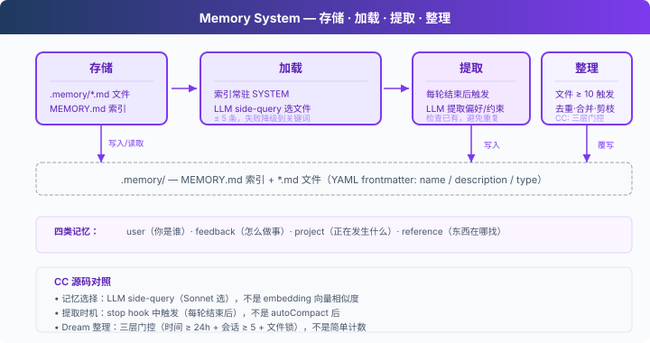

# s09: Memory — 壓縮會丟細節，要有一層不丟的

[中文](README.md) · [繁中](README.zh-tw.md) · [English](README.en.md) · [日本語](README.ja.md)

s01 → ... → s07 → s08 → `s09` → [s10](../s10_system_prompt/) → s11 → ... → s20
> *"壓縮會丟細節, 要有一層不丟的"* — 檔案倉庫 + 索引 + 按需載入，跨壓縮、跨會話。
>
> **Harness 層**: 記憶 — 跨壓縮、跨會話的知識積累。

---

## 問題

s08 的 autoCompact 會把當前目標、剩餘工作、使用者約束寫進摘要，但細節會丟失："用 tab 縮排不要用空格"可能被簡化成"使用者有程式碼風格偏好"。而且新開一個會話，連摘要也沒了。

LLM 沒有持久狀態，所有資訊都在上下文窗口裡。上下文滿了要壓縮，壓縮就有損。需要一層不參與壓縮、跨會話保留的儲存。

---

## 解決方案


s08 的壓縮管線保留，聚焦記憶。儲存選檔案系統：`.memory/` 目錄下，每個記憶一個 `.md` 檔案，帶 YAML frontmatter（`name` / `description` / `type`）。檔案多了需要索引：`MEMORY.md` 一行一個連結，注入 SYSTEM。

關鍵設計：索引常駐 SYSTEM prompt（可被 prompt cache 快取），檔案內容按需注入（按 filename/description 匹配當前對話，不破壞 cache）。寫入分兩條路徑：使用者顯式說"記住"，或者每輪結束後後臺提取。檔案積累多了，定期整理去重。

四類記憶，各有用途：

| 型別 | 回答什麼 | 示例 |
|------|---------|------|
| user | 你是誰 | "用 tab 不用空格" |
| feedback | 怎麼做事 | "別 mock 資料庫" |
| project | 正在發生什麼 | "auth 重寫是合規驅動" |
| reference | 東西在哪找 | "pipeline bug 在 Linear INGEST" |

---

## 工作原理



### 儲存：Markdown 檔案 + 索引

每個記憶是一個 `.md` 檔案，YAML frontmatter 記錄後設資料：

```markdown
---
name: user-preference-tabs
description: User prefers tabs for indentation
type: user
---

User prefers using tabs, not spaces, for indentation.
**Why:** Consistency with existing codebase conventions.
**How to apply:** Always use tabs when writing or editing files.
```

`MEMORY.md` 是索引，一行一個連結：

```markdown
- [user-preference-tabs](user-preference-tabs.md) — User prefers tabs for indentation
```

寫入新記憶時自動重建索引：

```python
def write_memory_file(name, mem_type, description, body):
    slug = name.lower().replace(" ", "-")
    filepath = MEMORY_DIR / f"{slug}.md"
    filepath.write_text(
        f"---\nname: {name}\ndescription: {description}\ntype: {mem_type}\n---\n\n{body}\n"
    )
    _rebuild_index()
```

### 載入：兩條路徑

**路徑一：索引常駐 SYSTEM。** `build_system()` 每輪重建 SYSTEM 時讀取 `MEMORY.md`，把記憶清單注入。SYSTEM prompt 中的索引可以被 prompt cache 快取，不需要每輪重新發送。

**路徑二：相關記憶按需注入。** 每輪呼叫前，`load_memories()` 把最近對話和記憶目錄（name + description）一起發給 LLM 做一次輕量 side-query，選出相關的檔名，再讀檔案內容注入上下文。最多 5 條，控制開銷。

```python
def select_relevant_memories(messages, max_items=5):
    files = list_memory_files()
    if not files:
        return []

    # Build catalog: "0: user-preference-tabs — User prefers tabs..."
    catalog = "\n".join(f"{i}: {f['name']} — {f['description']}" for i, f in enumerate(files))

    response = client.messages.create(model=MODEL, messages=[{"role": "user",
        "content": f"Select relevant memory indices. Return JSON array.\n\n"
                   f"Recent conversation:\n{recent}\n\nMemory catalog:\n{catalog}"}],
        max_tokens=200)
    indices = json.loads(re.search(r'\[.*?\]', response.content[0].text).group())
    return [files[i]["filename"] for i in indices if 0 <= i < len(files)]
```

如果 side-query 失敗（API 錯誤、JSON 解析失敗），降級到關鍵詞匹配 name + description。

### 寫入：每輪結束後提取

使用者不會每次都說"記住這個"。偏好通常散落在正常對話中："用 tab 比空格好"、"以後都用單引號"。

`extract_memories()` 在每輪結束時執行，條件是模型停止且沒有 tool_use（說明對話告一段落）：

```python
# In agent_loop:
if response.stop_reason != "tool_use":
    extract_memories(messages)   # 從最近對話提取新記憶
    consolidate_memories()       # 檢查是否需要整理
    return
```

提取前先檢查已有記憶，避免重複。提取 prompt 要求 LLM 返回 `{name, type, description, body}` 的 JSON 陣列，只有確實有新資訊時才寫檔案。

```python
def extract_memories(messages):
    dialogue = format_recent_messages(messages[-10:])
    existing = "\n".join(f"- {m['name']}: {m['description']}" for m in list_memory_files())

    prompt = (
        "Extract user preferences, constraints, or project facts.\n"
        "Return JSON array: [{name, type, description, body}].\n"
        "If nothing new or already covered, return [].\n\n"
        f"Existing memories:\n{existing}\n\nDialogue:\n{dialogue[:4000]}"
    )
    # ... parse response, write files ...
```

### 整理：低頻合併去重

記憶檔案會積累。`consolidate_memories()` 在檔案數達到閾值（預設 10）時觸發，讓 LLM 去重、合併矛盾、淘汰過時記憶：

```python
CONSOLIDATE_THRESHOLD = 10

def consolidate_memories():
    files = list_memory_files()
    if len(files) < CONSOLIDATE_THRESHOLD:
        return  # 太少，不值得整理
    # Send all memories to LLM, get back deduplicated list
    # Replace all files with consolidated results
```

CC 把這個過程叫 Dream，實際有四層門控：時間間隔、掃描節流、會話數、檔案鎖。教學版簡化為檔案數閾值。

### Memory 適合儲存什麼

Memory 儲存跨會話仍然有用的資訊：使用者偏好、反覆出現的反饋、專案背景、常用入口和排查線索。它關注“以後還會用到什麼”，並透過索引 + 按需載入把這些資訊帶回當前對話。

session memory 關注同一會話內的連續性：compact 之後，當前會話還需要保留哪些上下文。兩者配合使用：Memory 管長期知識，session memory 管當前會話的壓縮續接。

---

## 相對 s08 的變更

| 元件 | 之前 (s08) | 之後 (s09) |
|------|-----------|-----------|
| 記憶能力 | 無（壓縮後偏好隨摘要退化） | 儲存 + 載入 + 提取 + 整理 |
| 新函式 | — | write_memory_file, select_relevant_memories, load_memories, extract_memories, consolidate_memories |
| 儲存 | — | .memory/MEMORY.md 索引 + .memory/*.md 檔案 |
| 工具 | bash, read, write, edit, glob, todo_write, task, load_skill, compact (9) | bash, read_file, write_file, edit_file, glob, task (6) |
| 迴圈 | 每輪只做壓縮 | 每輪注入記憶 + 壓縮 + 每輪結束後提取 + 定期整理 |

---

## 試一下

```sh
cd learn-claude-code
python s09_memory/code.py
```

試試這些 prompt（分多輪輸入，觀察記憶的累積和載入）：

1. `I prefer using tabs for indentation, not spaces. Remember that.`
2. `Create a Python file called test.py`（觀察 Agent 是否用了 tab）
3. `What did I tell you about my preferences?`（觀察 Agent 是否記得）
4. `I also prefer single quotes over double quotes for strings.`

觀察重點：每輪結束後是否出現 `[Memory: extracted N new memories]`？`.memory/` 目錄下是否生成了 `.md` 檔案？`MEMORY.md` 索引是否更新？新一輪對話時 Agent 是否自動載入了之前的記憶？

---

## 接下來

記憶、壓縮、工具都已就緒。但 system prompt 還是硬編碼的一大段字串。加了新工具要手動加描述，換了專案要重寫整個 prompt。prompt 應該執行時組裝。

s10 System Prompt → 分段 + 執行時組裝。不同專案、不同工具，拼出不同的 prompt。

<details>
<summary>深入 CC 原始碼</summary>

> 以下基於 CC 原始碼 `src/` 下 `memdir/`、`services/`、`utils/`、`query/` 的分析，行號已對照核實。

### 原始碼路徑

| 檔案 | 行數 | 職責 |
|------|------|------|
| `memdir/memdir.ts` | 507 | 核心：MEMORY.md 定義（`34-38`）、記憶行為指令區分 memory/plan/tasks（`199-266`）、`loadMemoryPrompt()` 三條路徑（`419-490`） |
| `memdir/findRelevantMemories.ts` | 141 | Sonnet side-query 選記憶（`18-24` 系統提示、`97-122` 呼叫邏輯） |
| `memdir/memoryTypes.ts` | 271 | 型別定義，frontmatter 欄位 |
| `memdir/memoryScan.ts` | — | 掃描 .md 檔案，排除 MEMORY.md，讀 frontmatter，最多 200 個，按 mtime 降序（`35-94`） |
| `services/extractMemories/extractMemories.ts` | 615 | forked agent 提取記憶，受限許可權，`skipTranscript: true`，`maxTurns: 5`（`371-427`） |
| `services/autoDream/autoDream.ts` | 324 | Dream 整理，四層門控（`63-66` 預設值、`130-190` 門控、`224-233` forked agent） |
| `services/SessionMemory/sessionMemory.ts` | 495 | 會話級記憶管理 |
| `services/compact/sessionMemoryCompact.ts` | — | session memory 輕量摘要，閾值 10K/5/40K（`56-61`） |
| `utils/attachments.ts` | — | 注入預算：200 行 / 4096 位元組每檔案，60KB 每 session（`269-288`）；按 query 找相關 memory（`2196-2241`） |
| `query.ts` | — | memory prefetch 每輪啟動（`301-304`），非阻塞收集（`1592-1614`） |
| `query/stopHooks.ts` | — | stop hook fire-and-forget 觸發提取和 Dream（`141-155`） |

### 記憶選擇：LLM 選，不是 embedding

CC 用 **Sonnet 本身來選**（`findRelevantMemories.ts`），不是 embedding 向量相似度：

1. `memoryScan.ts` 掃描 `.memory/` 下所有 `.md` 檔案（排除 MEMORY.md），最多 200 個，按 mtime 降序
2. 把 `name` + `description` 列成清單
3. 發給 Sonnet side-query："根據名稱和描述選出真正有用的記憶（最多 5 個）。不確定就不要選。"
4. Sonnet 返回 `{ selected_memories: ["file1.md", ...] }`
5. 選中檔案讀取完整內容（每檔案 ≤ 200 行 / 4096 位元組），注入上下文。單 session 總預算 60KB

每輪使用者 turn 開始時，`query.ts:301-304` 啟動 memory prefetch（非同步）；工具執行後 `1592-1614` 非阻塞收集結果，不卡主流程。

### 提取時機：stop hook，不是 autoCompact 後

觸發位置（`stopHooks.ts:141-155`）：在 `handleStopHooks()` 中，fire-and-forget 觸發提取和 Dream。教學版把提取放在 `stop_reason != "tool_use"` 分支裡，方向一致。

CC 的提取透過 forked agent 執行（`extractMemories.ts:371-427`）：受限許可權、`skipTranscript: true`、`maxTurns: 5`。還有重疊保護：如果主 Agent 已經寫入了記憶檔案，跳過提取。

### 記憶檔案格式

CC 用 Markdown + YAML frontmatter，和教學版一致。四種類型：`user`、`feedback`、`project`、`reference`。

`memdir.ts:34-38` 定義索引約束：`MEMORY.md` 最多 200 行 / 25KB。`memdir.ts:199-266` 構建記憶行為指令，明確區分 memory、plan、tasks。儲存位置：`~/.claude/projects/<sanitized-git-root>/memory/`。

### Dream：四層門控

不是"空閒時觸發"或"數量夠了就合併"，而是四層門控（`autoDream.ts`，預設值 `63-66`，門控邏輯 `130-190`）：

1. **時間門控**：距上次合併 ≥ 24 小時
2. **掃描節流**：避免頻繁掃描檔案系統
3. **會話門控**：自上次合併以來修改了 ≥ 5 個會話 transcript
4. **鎖門控**：沒有其他程序正在合併（`.consolidate-lock` 檔案）

合併本身透過 forked agent 執行（`224-233`）：定位 → 收集近期訊號 → 合併寫檔案 → 剪枝更新索引。鎖檔案 mtime 就是 lastConsolidatedAt。崩潰恢復：1 小時後鎖自動過期。

### User Memory vs Session Memory

| | User Memory | Session Memory |
|---|---|---|
| 永續性 | 跨會話 | 單會話 |
| 儲存 | `memory/` 下多個 .md 檔案 | `session-memory/<id>/memory.md` |
| 載入到 | system prompt | compact 摘要 |
| 用途 | 跨會話的知識積累 | 跨 compact 的上下文連續性 |

sessionMemoryCompact（s08 中提到的機制）正是使用了 Session Memory：autoCompact 前先讀 session memory 檔案，如果內容足夠（≥ 10K token、≥ 5 條文字訊息、≤ 40K token，`sessionMemoryCompact.ts:56-61`），就用它做摘要，不調 LLM。

### 真實實現比教學版複雜的地方

- **Feature flags**：記憶相關功能有多層 feature gate 控制
- **Team memory**：團隊共享記憶，`loadMemoryPrompt()` 有專門路徑（教學版未涉及）
- **KAIROS**：時機感知的記憶提取策略，`loadMemoryPrompt()` 中 daily-log 模式
- **Prompt cache**：記憶注入需要考慮 prompt cache 的 TTL，避免每次都重寫 system prompt 的大段內容
- **檔案鎖**：多程序併發時的鎖機制
- **Memory prefetch**：非同步預取，不阻塞主流程

### 教學版的簡化是刻意的

- LLM side-query → LLM side-query + 關鍵詞降級：教學版保留了 LLM 選擇，加了降級路徑
- 記憶 JSON → Markdown + frontmatter：教學版與 CC 一致
- stop hook 觸發 → `stop_reason != "tool_use"` 分支：方向一致
- 四層門控 → 檔案數閾值：教學版沒有 transcript 系統和多會話概念
- forked agent + 受限許可權 → 直接呼叫：教學版沒有子程序隔離

</details>

<!-- translation-sync: zh@v1, en@v1, ja@v1 -->
