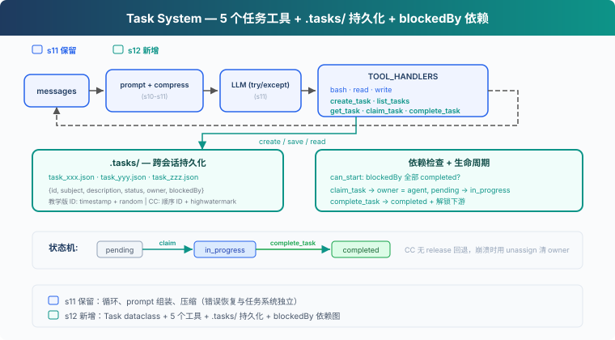

# s12: Task System — 目標太大，拆成小任務

[中文](README.md) · [繁中](README.zh-tw.md) · [English](README.en.md) · [日本語](README.ja.md)

s01 → ... → s10 → s11 → `s12` → [s13](../s13_background_tasks/) → s14 → ... → s20

> *"大目標拆成小任務, 排好序, 持久化"* — 檔案持久化的任務圖, 多 agent 協作的基礎。
>
> **Harness 層**: 任務 — 持久化的目標, 可恢復的進度。

---

## 問題

Agent 接到一個專案：搭資料庫、寫 API、加測試。它用 s05 的 TodoWrite 列了一張清單，然後開始寫 API，寫到一半發現沒資料庫表，回頭補；加測試時發現 API 介面簽名又變了...

蓋房子不能先蓋屋頂再打地基。任務之間有先後。任務依賴應該形成有向無環圖（DAG）；教學版只演示 `blockedBy` 檢查，沒有實現環檢測。

s05 的 TodoWrite 是一個列表。沒有依賴關係、沒有持久化、對話結束列表就沒了。你需要的是**任務系統**：每個任務是一個 JSON 檔案，任務之間有 `blockedBy` 依賴，跨會話持久化在磁碟上。

---

## 解決方案



教學程式碼保留基礎 agent loop，為聚焦任務系統省略了 S11 的完整錯誤恢復（RecoveryState、退避、升級、reactive compact、fallback model）。新增 5 個任務工具 + `.tasks/` 目錄持久化 + `blockedBy` 依賴檢查。任務系統與錯誤恢復是獨立層：CC 原始碼中 `utils/tasks.ts` 只管 CRUD，`query.ts` 的 with_retry/RecoveryState 管錯誤恢復，互不耦合。

TodoWrite vs Task System：

| | TodoWrite (s05) | Task System (s12) |
|---|---|---|
| 儲存 | 記憶體列表 | `.tasks/` JSON 檔案 |
| 依賴 | 無 | `blockedBy` 依賴圖 |
| 永續性 | 對話結束即丟 | 跨會話 |
| 多 Agent | 無 | `owner` 欄位 |
| 狀態 | checked / unchecked | pending → in_progress → completed |

---

## 工作原理


### Task: 資料結構

每個任務是一個 JSON 檔案，存於 `.tasks/` 目錄：

```python
@dataclass
class Task:
    id: str
    subject: str
    description: str
    status: str          # pending | in_progress | completed
    owner: str | None    # Agent 名（多 Agent 場景）
    blockedBy: list[str] # 依賴的任務 ID 列表
```

ID 用 `timestamp + random hex` 生成，簡單但夠用。CC 用順序 ID + highwatermark 檔案防止 ID 重用，是更嚴謹的設計。

### create_task: 建立任務

```python
def create_task(subject: str, description: str = "",
                blockedBy: list[str] | None = None) -> Task:
    task = Task(
        id=f"task_{int(time.time())}_{random_hex(4)}",
        subject=subject, description=description,
        status="pending", owner=None,
        blockedBy=blockedBy or [],
    )
    save_task(task)
    return task
```

建立時自動 `save_task` 到 `.tasks/{id}.json`。`blockedBy` 宣告依賴，比如 "寫 API" 的 `blockedBy` 是 `["task_schema"]`。

### can_start: 依賴檢查

一個任務只能在它的 `blockedBy` **全部 completed** 之後才能開始：

```python
def can_start(task_id: str) -> bool:
    task = load_task(task_id)
    for dep_id in task.blockedBy:
        if not _task_path(dep_id).exists():
            return False  # missing dependency = blocked
        dep = load_task(dep_id)
        if dep.status != "completed":
            return False
    return True
```

`can_start` 是 `claim_task` 的前置檢查：`blockedBy` 裡有任何一個不是 completed，就不能認領。不存在的依賴視為 blocked，避免引用錯誤 ID 時崩潰。

### claim_task: 認領任務

Agent 開始做一個任務時，呼叫 `claim_task`：設定 `owner`，狀態從 `pending` → `in_progress`。`owner` 欄位記錄誰在做這個任務，多 Agent 場景下防止重複認領：

```python
def claim_task(task_id: str, owner: str = "agent") -> str:
    task = load_task(task_id)
    if task.status != "pending":
        return f"Task {task_id} is {task.status}, cannot claim"
    if not can_start(task_id):
        deps = [d for d in task.blockedBy
                if load_task(d).status != "completed"]
        return f"Blocked by: {deps}"
    task.owner = owner
    task.status = "in_progress"
    save_task(task)
    return f"Claimed {task_id} ({task.subject})"
```

如果任務已被別人認領（`status != "pending"`），或者依賴沒完成（`can_start` 返回 False），拒絕認領。

### complete_task: 完成與解鎖

任務做完後，設為 `completed`。同時掃描所有其他任務，找出**剛剛被解鎖**的下游任務：

```python
def complete_task(task_id: str) -> str:
    task = load_task(task_id)
    task.status = "completed"
    save_task(task)
    # 找出被解鎖的下游任務
    unblocked = [t.subject for t in list_tasks()
                 if t.status == "pending" and t.blockedBy
                 and can_start(t.id)]
    msg = f"Completed {task_id} ({task.subject})"
    if unblocked:
        msg += f"\nUnblocked: {', '.join(unblocked)}"
    return msg
```

完成 "schema" 後，"endpoints" 和 "docs" 的 `can_start` 返回 True，它們可以開始。

### get_task: 檢視完整細節

`list_tasks` 只顯示一行摘要。`get_task` 返回完整的任務 JSON，包括 description 和依賴細節。跨會話恢復時，Agent 需要讀取完整描述才能繼續工作：

```python
def get_task(task_id: str) -> str:
    task = load_task(task_id)
    return json.dumps(asdict(task), indent=2)
```

### 狀態機: 兩個動作，三個狀態

```
pending ──claim──→ in_progress ──complete──→ completed
```

這裡的 `claim` / `complete` 是動作，`pending` / `in_progress` / `completed` 是狀態：

- **claim_task**: `pending` → `in_progress`。設定 owner，開始工作。
- **complete_task**: `in_progress` → `completed`。把任務標記為完成，並解鎖下游。

CC 沒有 `in_progress → pending` 的 release 路徑。如果 teammate 終止或 shutdown，CC 會把它未完成的任務 unassign（清除 owner），並將 status 重置為 `pending`，方便其他 agent 重新認領。教學版省略了這一恢復路徑。

### 合起來跑

```python
# 建立有依賴的任務
schema = create_task("setup database schema")
endpoints = create_task("create API endpoints", blockedBy=[schema.id])
tests = create_task("write tests", blockedBy=[endpoints.id])
docs = create_task("write docs", blockedBy=[schema.id])

# Agent 認領第一個可做的任務
claim_task(schema.id)       # ✓ Claimed (無依賴)
complete_task(schema.id)    # ✓ Completed → 解鎖 endpoints, docs

claim_task(endpoints.id)    # ✓ Claimed (schema 已完成)
complete_task(endpoints.id) # ✓ Completed → 解鎖 tests

claim_task(docs.id)         # ✓ Claimed (schema 已完成)
complete_task(docs.id)      # ✓ Completed

claim_task(tests.id)        # ✓ Claimed (endpoints 已完成)
complete_task(tests.id)     # ✓ Completed
```

每個 `create_task` 寫一個 JSON 檔案，每個 `claim_task` / `complete_task` 更新檔案。跨會話時，`.tasks/` 目錄還在，Agent 讀檔案就能恢復進度。

---

## 相對 s11 的變更

| 元件 | 之前 (s11) | 之後 (s12) |
|------|-----------|-----------|
| 任務管理 | 無 | Task dataclass + 5 個工具 |
| 新型別 | — | Task（id, subject, description, status, owner, blockedBy） |
| 儲存 | 無持久化 | `.tasks/{id}.json` 跨會話 |
| 依賴 | 無 | `blockedBy` 圖 + `can_start` 檢查 |
| 工具 | bash, read_file, write_file (3) | + create_task, list_tasks, get_task, claim_task, complete_task (8) |
| 生命週期 | — | pending → in_progress → completed（無 release 回退） |

---

## 試一下

```sh
cd learn-claude-code
python s12_task_system/code.py
```

試試這些 prompt：

1. `Create tasks: setup database schema, create API endpoints (depends on schema), write tests (depends on endpoints), write docs (depends on schema)`
2. `List all tasks and their statuses`
3. `Claim the first unblocked task and complete it`
4. `List tasks again — which ones are now unblocked?`

觀察重點：`.tasks/` 目錄下是否生成了 JSON 檔案？完成任務後，被阻塞的任務是否解鎖？

---

## 接下來

任務圖有了。但有些任務要跑很久——比如全量測試、部署到伺服器。Agent 調 LLM 按量計費，不能幹等一個慢操作。

s13 Background Tasks → 慢操作放後臺。Agent 繼續處理其他任務，後臺跑完了通知它。

<details>
<summary>深入 CC 原始碼</summary>

> 以下基於 CC 原始碼 `utils/tasks.ts`（862 行）、`tools/TaskCreateTool/TaskCreateTool.ts`（138 行）、`tools/TaskUpdateTool/TaskUpdateTool.ts`（406 行）、`tools/TaskGetTool/TaskGetTool.ts`（128 行）、`tools/TaskListTool/TaskListTool.ts`（116 行）、`hooks/useTaskListWatcher.ts`（221 行）的分析。

### 一、TaskRecord 的完整欄位

教學版只講了 id、subject、status、owner、blockedBy。CC 實際有 9 個欄位（`utils/tasks.ts:76-89`）：

| 欄位 | 型別 | 用途 |
|------|------|------|
| `id` | string | 遞增整數 ID |
| `subject` | string | 簡短標題 |
| `description` | string | 自由格式描述 |
| `activeForm` | string? | 進行時態，in_progress 時在 spinner 顯示 |
| `owner` | string? | 分配的 agent ID |
| `status` | pending/in_progress/completed | 生命週期 |
| `blocks` | string[] | 此任務阻塞的任務 ID（下游） |
| `blockedBy` | string[] | 阻塞此任務的任務 ID（上游） |
| `metadata` | Record? | 任意擴充套件鍵值對 |

儲存位置：`~/.claude/tasks/{taskListId}/{id}.json`。每個任務一個檔案。

### 二、不是 TodoWrite 的升級，是兩個獨立系統

CC 中 Task System 和 TodoWrite **同時存在**，透過 `isTodoV2Enabled()` 切換（`utils/tasks.ts:133`）——互動式會話預設啟用 Task（V2），非互動式/SDK 預設用 TodoWrite。環境變數 `CLAUDE_CODE_ENABLE_TASKS` 可強制啟用 Task。Task 有 TodoWrite 沒有的：檔案鎖併發保護、依賴強制執行、ownership、fs.watch 響應式監聽、生命週期 hooks。

### 三、併發認領的鎖機制

`claimTask()`（`utils/tasks.ts:541-612`）用雙重鎖防競爭：

**任務檔案鎖**：`proper-lockfile` 鎖住 `{taskId}.json`（最多重試 30 次，指數退避 5-100ms）。鎖內：
1. 重新讀取任務（防 TOCTOU）
2. 檢查已被他人認領 → `already_claimed`
3. 檢查已完成 → `already_resolved`
4. 檢查上游未完成 → `blocked`
5. 設定 owner

**列表級鎖**（agent busy 檢查時）：`.lock` 檔案，原子性掃描所有任務並檢查該 agent 是否已有其他 open task。

注意：教學版把 claim 和開始工作合成一步（claim = set owner + in_progress）；真實 CC 的 `claimTask` 主要解決 owner 競爭，只設 owner 不改 status，狀態更新由 `TaskUpdate` 完成。

### 四、高水位標防 ID 重用

`.highwatermark` 檔案記錄曾分配過的最高任務 ID。即使任務被刪除，ID 也不會被重用。

### 五、四個 Task 工具

CC 的任務系統有四個工具（不是教學版的一個通用 Task 工具）：`TaskCreate`、`TaskGet`、`TaskUpdate`、`TaskList`。全部設定 `isConcurrencySafe: true` 和 `shouldDefer: true`（工具 schema 不在初始 prompt 中，需 ToolSearch 後才可見）。

教學版的 `create_task(blockedBy=...)` 在建立時直接宣告依賴，是合理簡化。真實 CC 的 `TaskCreate` 只接受 subject/description/activeForm/metadata，依賴關係由 `TaskUpdate` 的 `addBlocks/addBlockedBy` 維護。

</details>

<!-- translation-sync: zh@v1, en@v0, ja@v0 -->
