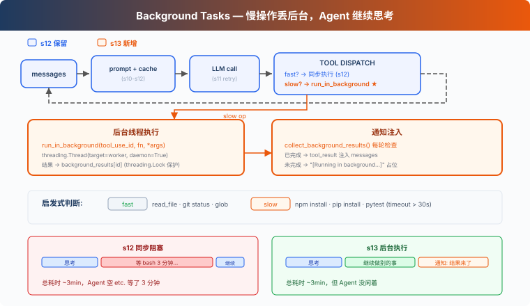

# s13: Background Tasks — 慢操作放後臺

[中文](README.md) · [繁中](README.zh-tw.md) · [English](README.en.md) · [日本語](README.ja.md)

s01 → ... → s11 → s12 → `s13` → [s14](../s14_cron_scheduler/) → s15 → ... → s20

> *"慢操作丟後臺, agent 繼續處理"* — 後臺執行緒跑命令, 完成後注入通知。
>
> **Harness 層**: 後臺 — 非同步執行, 不阻塞主迴圈。

---

## 問題

你用過洗衣機嗎？把衣服扔進去，按下啟動，然後去幹別的——做飯、回訊息、看論文。30 分鐘後洗衣機"滴滴滴"提醒你：好了。你不會站在洗衣機前面乾等 30 分鐘。

Agent 的 bash 工具也一樣。`pip install torch` 要 10 分鐘，`npm run build` 要 3 分鐘。這些命令一跑，Agent 就在等 bash 工具返回，沒法利用這段時間處理別的任務。

讀檔案是毫秒級，不等。`git status` 一秒內返回，不等。但 `npm install`？分鐘級。Agent 等 10 分鐘什麼都不做，而 LLM 按 token 計費，空轉就是浪費。

---

## 解決方案



教學程式碼沿用 S12 的簡化任務系統和 prompt 組裝；為了聚焦後臺任務，省略完整錯誤恢復、記憶和技能系統。唯一的變動：慢操作扔到後臺執行緒，Agent 繼續跑迴圈，後臺完成後把通知注入到對話裡。

同步 vs 後臺：

| | 同步 (s12) | 後臺 (s13) |
|---|---|---|
| 慢操作 | Agent 乾等 | 後臺執行緒執行 |
| Agent 空閒 | 是 | 否，繼續處理 |
| 結果 | 立即返回 | 下輪注入通知 |
| 判斷標準 | — | `run_in_background` 引數（模型顯式請求），啟發式兜底 |

---

## 工作原理

### should_run_background: 顯式請求優先，啟發式兜底

模型透過 bash 工具的 `run_in_background` 引數顯式請求後臺執行。如果模型沒指定，教學版用關鍵詞啟發式兜底：

```python
def is_slow_operation(tool_name: str, tool_input: dict) -> bool:
    """Fallback heuristic: commands likely to take > 30s."""
    if tool_name != "bash":
        return False
    cmd = tool_input.get("command", "").lower()
    slow_keywords = ["install", "build", "test", "deploy", "compile",
                     "docker build", "pip install", "npm install",
                     "cargo build", "pytest", "make"]
    return any(kw in cmd for kw in slow_keywords)

def should_run_background(tool_name: str, tool_input: dict) -> bool:
    """Model explicit request takes priority; fallback to heuristic."""
    if tool_input.get("run_in_background"):
        return True
    return is_slow_operation(tool_name, tool_input)
```

CC 的 bash 工具 schema 裡有 `run_in_background: boolean` 引數（`BashTool.tsx:241`）。模型自己決定哪些命令丟後臺，不靠關鍵詞猜。教學版保留啟發式作為兜底，但主路徑是模型顯式請求。

### start_background_task: 後臺執行與生命週期

把工具呼叫包裝成 worker 函式，扔到 daemon 執行緒裡執行。每個後臺任務有唯一 ID，狀態存在 `background_tasks` 字典裡：

```python
_bg_counter = 0
background_tasks: dict[str, dict] = {}   # bg_id → {tool_use_id, command, status}
background_results: dict[str, str] = {}   # bg_id → output
background_lock = threading.Lock()

def start_background_task(block) -> str:
    """Run tool in a daemon thread. Returns background task ID."""
    global _bg_counter
    _bg_counter += 1
    bg_id = f"bg_{_bg_counter:04d}"

    def worker():
        result = execute_tool(block)
        with background_lock:
            background_tasks[bg_id]["status"] = "completed"
            background_results[bg_id] = result

    with background_lock:
        background_tasks[bg_id] = {
            "tool_use_id": block.id,
            "command": block.input.get("command", ""),
            "status": "running",
        }
    thread = threading.Thread(target=worker, daemon=True)
    thread.start()
    return bg_id
```

返回 `bg_id` 而不是隻返回 `[Running in background...]`。`daemon=True` 確保 Agent 程序退出時執行緒跟著退出。教學版用記憶體字典追蹤狀態；真實 CC 有 `LocalShellTaskState`，輸出重定向到檔案，支援停止任務、讀取後續輸出等完整生命週期。

### collect_background_results: 通知收集

後臺任務完成後，收集結果並格式化為 `<task_notification>` 通知：

```python
def collect_background_results() -> list[str]:
    """Collect completed results as task_notification messages."""
    with background_lock:
        ready_ids = [bid for bid, task in background_tasks.items()
                     if task["status"] == "completed"]
    notifications = []
    for bg_id in ready_ids:
        with background_lock:
            task = background_tasks.pop(bg_id)
            output = background_results.pop(bg_id, "")
        notifications.append(
            f"<task_notification>\n"
            f"  <task_id>{bg_id}</task_id>\n"
            f"  <status>completed</status>\n"
            f"  <command>{task['command']}</command>\n"
            f"  <summary>{output[:200]}</summary>\n"
            f"</task_notification>")
    return notifications
```

通知不復用原始 `tool_use_id`。原始 tool call 已經用佔位 `tool_result` 回覆了，後臺完成是獨立事件，用 `task_notification` 格式注入。這符合 Messages API 的工具配對語義：一個 `tool_use` 只對應一個 `tool_result`。

### 迴圈中的整合

agent_loop 裡，工具執行分兩條路，通知和結果合併為一條 user 訊息：

```python
results = []
for block in response.content:
    if block.type != "tool_use":
        continue
    if should_run_background(block.name, block.input):
        bg_id = start_background_task(block)
        results.append({"type": "tool_result",
            "tool_use_id": block.id,
            "content": f"[Background task {bg_id} started] "
                       f"Result will be available when complete."})
    else:
        output = execute_tool(block)
        results.append({"type": "tool_result",
            "tool_use_id": block.id, "content": output})

# 通知和工具結果合入同一條 user 訊息
user_content = []
bg_notifications = collect_background_results()
if bg_notifications:
    for notif in bg_notifications:
        user_content.append({"type": "text", "text": notif})
user_content.extend(results)
messages.append({"role": "user", "content": user_content})
```

慢操作先回一個帶 `bg_id` 的佔位 tool_result，LLM 知道這個命令還在跑，可以先做別的事。後臺完成後，通知作為獨立 text block 和當前輪的 tool_result 一起組成 user 訊息。

教學版在 agent loop 繼續執行時輪詢後臺結果。真實 CC 透過通知佇列（`messageQueueManager.ts`）把後臺完成事件送入後續 turn，不需要等工具迴圈。

### 合起來跑

```
Turn 1:
  LLM → bash "npm install" (run_in_background=true)
  → start_background_task → bg_0001
  → tool_result: "[Background task bg_0001 started]..."
  → LLM: "OK, I'll check later. Let me also read the config."

Turn 2:
  LLM → read_file "package.json" (fast, sync)
  → tool_result: file content
  → collect: bg_0001 done! inject <task_notification>
  → LLM sees: config file + install notification in one message
```

Agent 沒幹等，npm install 跑後臺的時候，它去讀了配置檔案。

---

## 相對 s12 的變更

| 元件 | 之前 (s12) | 之後 (s13) |
|------|-----------|-----------|
| 執行模型 | 全部同步 | 慢操作後臺執行緒 + 通知注入 |
| bash schema | `command` | `command` + `run_in_background` |
| 新函式 | — | `should_run_background`, `is_slow_operation`, `start_background_task`, `collect_background_results` |
| 新型別 | — | `background_tasks: dict`, `background_results: dict`, `background_lock: Lock` |
| 通知格式 | — | `<task_notification>`（不復用 tool_use_id） |
| 迴圈行為 | 工具序列執行 | 慢操作非同步，快操作同步，通知每輪收集 |
| 工具 | 8 (s12) | 8（不變，執行策略變了） |

---

## 試一下

```sh
cd learn-claude-code
python s13_background_tasks/code.py
```

試試這些 prompt：

1. `Run pip list in the background and find all Python files in this directory`
2. `Run npm install (use run_in_background) and while waiting, read package.json`
3. `Create a task to setup the project, then run pip list in the background`

觀察重點：慢操作有沒有被送到後臺？`bg_id` 是否返回？後臺通知有沒有以 `<task_notification>` 格式注入？

---

## 接下來

後臺任務解決了"慢操作不阻塞"。但如果想定時做某件事呢？比如"每天早上 9 點跑測試"、"每 5 分鐘檢查一次伺服器狀態"。

s14 Cron Scheduler → 給 Agent 裝一個鬧鐘。

<details>
<summary>深入 CC 原始碼</summary>

> 以下基於 CC 原始碼 `query.ts`（211, 1054-1060, 1411-1482 行）、`services/toolUseSummary/toolUseSummaryGenerator.ts`（L15 prompt 文字）、`LocalShellTask.tsx`（L24-25 常量, L59-98 看門狗邏輯）、`messageQueueManager.ts`（通知佇列）、`utils/task/framework.ts`（L267 `enqueueTaskNotification`）的完整分析。

### 一、pendingToolUseSummary：Haiku 後臺生成

CC 在每批工具執行完後，啟動一個 Haiku side-query 生成工具使用摘要。發起程式碼在 `query.ts:1411-1482`，prompt 文字定義在 `services/toolUseSummary/toolUseSummaryGenerator.ts:15`（變數名 `TOOL_USE_SUMMARY_SYSTEM_PROMPT`）。提示是 "Write a short summary label... think git-commit-subject, not sentence"，過去時態，約 30 字元。

Haiku 摘要（~1s）在主模型流式生成（5-30s）期間完成。下一輪開始前，把摘要 yield 出去。SDK 消費這些摘要做移動端進度展示。

### 二、執行緒模型：沒有真正的執行緒

CC 執行在 Node.js/Bun 單執行緒事件迴圈中。"後臺"只是 "不 await"。`ShellCommand.background(taskId)` 把 stdout/stderr 重定向到檔案，讓程序獨立執行。

### 三、七種後臺任務型別

CC 定義了 7 種後臺任務（`Task.ts:7-13`）：`local_bash`、`local_agent`、`remote_agent`、`in_process_teammate`、`local_workflow`、`monitor_mcp`、`dream`。每種有自己的註冊、生命週期和通知機制。

### 四、通知注入：命令佇列

後臺任務完成後透過 `enqueueTaskNotification`（`utils/task/framework.ts:267`）或 `enqueuePendingNotification`（`messageQueueManager.ts`）入隊到共享命令佇列。通知格式是結構化的 XML：

```xml
<task_notification>
  <status>completed</status>
  <summary>Background command "npm test" completed (exit code 0)</summary>
</task_notification>
```

優先順序分 `next` > `later`（`messageQueueManager.ts`）。後臺任務預設 `later`（不阻塞使用者輸入）。消費點在 `query.ts:1566-1593`。

### 五、停滯看門狗

後臺 bash 任務有一個看門狗（`LocalShellTask.tsx` L24-25 常量, L59-98 邏輯），定期檢查輸出是否停滯，45 秒無增長後檢測互動式提示（`(y/n)` 等），防止後臺任務卡在無人響應的互動式對話方塊。

### 六、併發限制

前臺工具呼叫：`CLAUDE_CODE_MAX_TOOL_USE_CONCURRENCY`（預設 10 個併發安全工具）。後臺 bash 任務：沒有硬性限制，它們是獨立的子程序。

</details>

<!-- translation-sync: zh@v1, en@v1, ja@v1 -->
