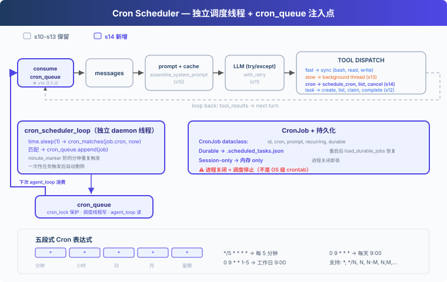

# s14: Cron Scheduler — 按時間表生產工作

[中文](README.md) · [繁中](README.zh-tw.md) · [English](README.en.md) · [日本語](README.ja.md)

s01 → ... → s12 → s13 → `s14` → [s15](../s15_agent_teams/) → s16 → ... → s20
> *"按時間表生產工作, 排程與執行解耦"* — cron 排程, 持久化或會話級。
>
> **Harness 層**: 排程 — 獨立執行緒判斷時間, 佇列傳遞觸發。

---

## 問題

鬧鐘不需要你盯著它才會響。你設好 7:00，到點它自己響，你在睡覺、在洗澡、在做飯，它都照響不誤。

s13 讓 Agent 能後臺執行慢操作，但所有操作仍然是你手動觸發的。你說一句，Agent 動一下。"每天早上 9 點跑測試"、"每 30 分鐘檢查 CI 狀態"，這些週期性任務不該需要人每次來推。

---

## 解決方案



教學程式碼沿用 S13 的簡化任務系統、後臺執行和 prompt 組裝；為了聚焦排程器，省略完整錯誤恢復、記憶和技能系統。新增：獨立的 cron 排程執行緒，每秒檢查一次，時間到了把任務塞進 `cron_queue`；再由 queue processor 在 Agent 空閒時自動交付。

手動 vs 定時：

| | 手動觸發 (s13) | 定時觸發 (s14) |
|---|---|---|
| 觸發者 | 使用者輸入 | 排程執行緒 |
| 觸發時機 | 隨時 | cron 表示式指定 |
| 需要人參與 | 是 | 否（排程器自動入隊，空閒時自動交付） |
| 永續性 | — | durable 跨重啟 |

---

## 工作原理

### 四層模型

Cron 排程分四層：

1. **Scheduler**：daemon 執行緒，每秒輪詢，判斷時間到了沒有
2. **Queue**：`cron_queue`，排程執行緒寫入已觸發任務
3. **Queue Processor**：發現佇列非空且 Agent 空閒，啟動一輪 agent_loop
4. **Consumer**：agent_loop 從佇列消費，注入到 messages

教學版實現的是最小 queue processor：用 `agent_lock` 判斷 Agent 是否空閒，空閒時自動交付定時任務。真實 CC 的 `useQueueProcessor.ts` 還會處理 UI 阻塞、佇列優先順序和不同訊息模式。

### CronJob: 資料結構

每個 cron 任務是一個 `CronJob` 物件：

```python
@dataclass
class CronJob:
    id: str
    cron: str        # "0 9 * * *" (五段式 cron 表示式)
    prompt: str      # 觸發時注入給 Agent 的訊息
    recurring: bool  # True=週期性，False=一次性
    durable: bool    # True=寫磁碟，跨會話保留
```

Cron 表示式，五段式，Unix 用了 50 年：

```
分鐘  小時  日  月  星期
  *    *   *   *   *      每分鐘
  0    9   *   *   *      每天早上 9:00
 */5    *   *   *   *      每 5 分鐘
  0    9   *   *  1-5     工作日早上 9:00
```

支援 `*`、`*/N`、`N`、`N-M`、`N,M,...`。

### cron_matches: 五段式匹配

標準 cron 語義：分鐘、小時、月必須全部匹配；日（DOM）和星期（DOW）同時被約束時任一匹配即可（OR）：

```python
def cron_matches(cron_expr: str, dt: datetime) -> bool:
    fields = cron_expr.strip().split()
    if len(fields) != 5:
        return False
    minute, hour, dom, month, dow = fields
    dow_val = (dt.weekday() + 1) % 7  # Python Monday=0 → cron Sunday=0

    m = _cron_field_matches(minute, dt.minute)
    h = _cron_field_matches(hour, dt.hour)
    dom_ok = _cron_field_matches(dom, dt.day)
    month_ok = _cron_field_matches(month, dt.month)
    dow_ok = _cron_field_matches(dow, dow_val)

    if not (m and h and month_ok):
        return False
    # DOM and DOW: both constrained → either matching is enough (OR)
    dom_unconstrained = dom == "*"
    dow_unconstrained = dow == "*"
    if dom_unconstrained and dow_unconstrained:
        return True
    if dom_unconstrained:
        return dow_ok
    if dow_unconstrained:
        return dom_ok
    return dom_ok or dow_ok
```

### 獨立排程執行緒: 每秒輪詢

排程器跑在獨立的 daemon 執行緒裡，不依賴 agent_loop 是否在執行。單個 job 異常不會殺掉整個執行緒：

```python
def cron_scheduler_loop():
    while True:
        time.sleep(1)
        now = datetime.now()
        minute_marker = now.strftime("%Y-%m-%d %H:%M")
        with cron_lock:
            for job in list(scheduled_jobs.values()):
                try:
                    if cron_matches(job.cron, now):
                        if _last_fired.get(job.id) != minute_marker:
                            cron_queue.append(job)
                            _last_fired[job.id] = minute_marker
                        if not job.recurring:
                            scheduled_jobs.pop(job.id, None)
                            if job.durable:
                                save_durable_jobs()
                except Exception as e:
                    print(f"[cron error] {job.id}: {e}")
```

關鍵設計：
- **獨立於 agent_loop**：即使 agent_loop 沒在跑，排程器也在後臺檢查時間
- **date-aware minute_marker**：用 `"YYYY-MM-DD HH:MM"` 防止同一分鐘重複觸發，同時不會在第二天跳過
- **單 job try/except**：一個壞 job 不會拖垮整個排程執行緒
- **一次性任務**：觸發後自動從 scheduled_jobs 裡刪除

### Queue Processor + agent_loop: 交付端

queue processor 不檢查時間，只負責在佇列有任務且 Agent 空閒時拉起一輪執行：

```python
def queue_processor_loop():
    while True:
        time.sleep(0.2)
        if not has_cron_queue():
            continue
        if not agent_lock.acquire(blocking=False):
            continue
        try:
            if has_cron_queue():
                run_agent_turn_locked()
        finally:
            agent_lock.release()
```

agent_loop 也不負責檢查時間，它只從 `cron_queue` 裡拿已觸發的任務，注入到 messages 裡：

```python
fired = consume_cron_queue()
for job in fired:
    messages.append({"role": "user",
                     "content": f"[Scheduled] {job.prompt}"})
```

生產者（排程執行緒）、交付者（queue processor）和消費者（agent_loop）透過 `cron_queue`、`cron_lock`、`agent_lock` 解耦。

### 校驗：防止壞 cron 殺掉排程器

`schedule_job` 在註冊前校驗 cron 表示式，非法的直接返回錯誤：

```python
def schedule_job(cron, prompt, recurring=True, durable=True):
    err = validate_cron(cron)
    if err:
        return err
    # ... register job
```

從磁碟載入 durable job 時也會跳過非法表示式，避免單個壞任務拖垮啟動。

### Durable vs Session-only

- **Durable**：任務定義寫進 `.scheduled_tasks.json`。Agent 重啟後加載檔案，恢復任務。
- **Session-only**：只在記憶體裡。Agent 關閉就沒了。

> **重要前提**：cron 排程器必須在 Agent 程序內跑。程序關閉，排程也停。Durable 只意味著任務定義跨重啟保留，下次 Agent 啟動時排程器才會發現"該觸發了"並觸發。如果需要"即使應用關閉也能定時跑"，請用系統 crontab 或 systemd timer。

### 合起來跑

```
1. 啟動時：
   load_durable_jobs() → 從 .scheduled_tasks.json 恢復持久化任務
   Thread(cron_scheduler_loop, daemon=True).start() → 排程執行緒開始輪詢
   Thread(queue_processor_loop, daemon=True).start() → 佇列處理器等待交付

2. 註冊任務：
   schedule_cron(cron="*/2 * * * *", prompt="run date", durable=True)
   → CronJob 寫入 scheduled_jobs + .scheduled_tasks.json

3. 每 2 分鐘：
   排程執行緒檢查 → cron_matches 返回 True → cron_queue.append(job)
   → queue processor 發現 Agent 空閒 → agent_loop consume_cron_queue
   → 注入 "[Scheduled] run date"
   → LLM 收到訊息，執行 date 命令

4. 關閉程序：
   排程執行緒跟著停（daemon=True）
   .scheduled_tasks.json 還在磁碟上
   下次啟動 → load_durable_jobs → 任務恢復
```

---

## 相對 s13 的變更

| 元件 | 之前 (s13) | 之後 (s14) |
|------|-----------|-----------|
| 觸發方式 | 使用者手動觸發 | 排程執行緒自動入隊 |
| 新型別 | — | CronJob dataclass (id, cron, prompt, recurring, durable) |
| 新函式 | — | cron_matches, validate_cron, schedule_job, cancel_job, cron_scheduler_loop, queue_processor_loop |
| 新儲存 | — | .scheduled_tasks.json (durable) + 記憶體 (session-only) |
| 執行緒 | 後臺執行執行緒 | + 排程執行緒 (daemon, 1s 輪詢) + queue processor 執行緒 |
| 佇列 | background_results | + cron_queue (排程執行緒寫, queue processor 交付, agent_loop 消費) |
| 工具 | 8 (s12/s13) | + schedule_cron, list_crons, cancel_cron (11) |

---

## 試一下

```sh
cd learn-claude-code
python s14_cron_scheduler/code.py
```

試試這些 prompt：

1. `Schedule a task to print the current date every 2 minutes`
2. `List all cron jobs`
3. `Create a one-shot reminder in 1 minute to check the build status`
4. `Cancel the recurring job and verify with list_crons`

觀察重點：排程執行緒是否在獨立執行？cron 任務是否在正確的時間點觸發？不輸入新 prompt 時，是否也出現 `[queue processor]` 並自動執行？durable job 是否寫入了 `.scheduled_tasks.json`？

---

## 接下來

一個 Agent 能做很多事了，能計劃、能壓縮、能後臺、能定時。但有些任務太大了，不是一個 Agent 能搞定的。

"重構整個後端"，把認證模組、資料庫層、API 路由、測試全部翻新。一個 Agent 的注意力是有限的，這需要一個團隊。

s15 Agent Teams → 一個 Agent 不夠，組隊吧。持久隊友 + 非同步收件箱。

<details>
<summary>深入 CC 原始碼</summary>

> 以下基於 CC 原始碼 `CronCreateTool.ts`、`cronScheduler.ts`、`cron.ts`、`cronTasks.ts`、`cronTasksLock.ts`、`useScheduledTasks.ts`（139 行）的完整分析。

### 一、三個 Cron 工具

CC 暴露了三個 cron 工具給模型：`CronCreate`、`CronDelete`、`CronList`。全部由編譯時門控 `feature('AGENT_TRIGGERS')` 和執行時 GrowthBook 標誌 `tengu_kairos_cron` 控制。還有一個 `CLAUDE_CODE_DISABLE_CRON` 環境變數做本地覆蓋。

### 二、儲存：`.claude/scheduled_tasks.json`

```json
{ "tasks": [{ "id": "abc12345", "cron": "0 9 * * *", "prompt": "...", "recurring": true, "durable": true, "createdAt": 1714567890000 }] }
```

Durable 任務寫磁碟；session-only 任務存於 `STATE.sessionCronTasks` 記憶體陣列（程序重啟丟失）。還有一個 `.scheduled_tasks.lock` 檔案防止同項目的多個 session 重複觸發。

### 三、排程器：1 秒輪詢

`cronScheduler.ts` 每秒檢查一次（`CHECK_INTERVAL_MS = 1000`）。誰持有鎖誰觸發檔案任務；所有 session 都觸發僅 session 任務。還有一個 `chokidar` 檔案觀察者監視 `scheduled_tasks.json` 變更。

### 四、Cron 表示式：標準 5 欄位

分鐘 小時 日 月 星期。支援 `*`、`*/N`、`N`、`N-M`、`N-M/S`、`N,M,...`。不支援 `L`、`W`、`?`。所有時間以本地時區解釋。Day-of-month 和 day-of-week 同時約束時用 OR 語義。

### 五、抖動（防驚群效應）

- 重複性任務：觸發延遲最多可達期間的 10%（上限 15 分鐘），基於任務 ID 的確定性雜湊
- 一次性任務：當觸發時間落在 `:00` 或 `:30` 時，最多提前 90 秒觸發
- 抖動配置可透過 GrowthBook 即時調整，60 秒重新整理一次

### 六、自動過期

重複性任務 7 天后自動過期（可配置，上限 30 天）。過期前最後一次觸發，觸發後自動刪除。

### 七、作業數上限

`MAX_JOBS = 50`（`CronCreateTool.ts:25`）。超限時返回錯誤："Too many scheduled jobs (max 50). Cancel one first."

### 八、觸發注入

觸發後透過 `enqueuePendingNotification()` 以 `priority: 'later'` 入隊命令佇列。標記 `workload: WORKLOAD_CRON`，API 在容量緊張時以更低的 QoS 為 cron 發起的請求服務。

### 九、Queue Processor：自動交付

真實 CC 透過 `useQueueProcessor.ts:48-60` 在無 query、無阻塞 UI、佇列非空時自動觸發處理。`queueProcessor.ts:52-87` 按佇列優先順序把命令交給 `handlePromptSubmit()`。教學版用 `queue_processor_loop` 保留核心行為：佇列有任務且 Agent 空閒時，自動啟動一輪 agent_loop。

</details>

<!-- translation-sync: zh@v1, en@v1, ja@v1 -->
