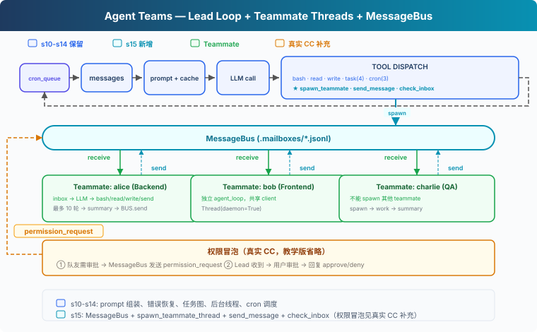
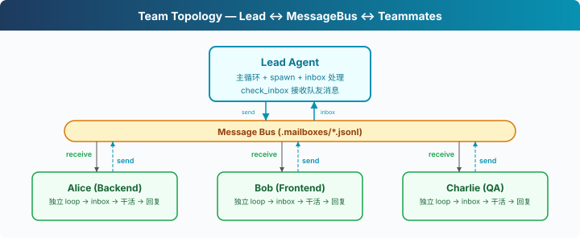

# s15: Agent Teams — 一個搞不定，組隊來

[中文](README.md) · [繁中](README.zh-tw.md) · [English](README.en.md) · [日本語](README.ja.md)

s01 → ... → s13 → s14 → `s15` → [s16](../s16_team_protocols/) → s17 → s18 → s19 → s20
> *"一個搞不定, 組隊來"* — 檔案收件箱 + 隊友執行緒。
>
> **Harness 層**: 團隊 — 多 Agent 協作, 訊息匯流排。

---

## 問題

"重構整個後端"涉及認證模組、資料庫層、API 路由、測試。一個 Agent 在修 API 路由時，認證模組的細節已經不在上下文裡了。上下文視窗就那麼大，單個 Agent 的注意力覆蓋不了所有模組。

s06 的子 Agent 是臨時工，叫來幹一件事就走了。但有些任務需要能通訊、能協作的隊友。

---

## 解決方案



教學程式碼沿用 S14 的能力（prompt 組裝、任務系統、後臺執行、cron 排程）。為了聚焦團隊機制，省略了完整錯誤恢復、記憶和技能系統。新增三樣：**MessageBus**（檔案收件箱）、**spawn_teammate_thread**（啟動隊友執行緒）、**inbox 注入**（Lead 接收隊友訊息並注入 history）。

子 Agent vs 隊友：

| | s06 子 Agent | s15 隊友 |
|---|---|---|
| 生命週期 | 一次性，用完銷燬 | 多輪（教學版限 10 輪，真實 CC 用 idle loop） |
| 通訊 | 只回傳結論 | 非同步收件箱，隨時通訊 |
| 上下文 | 完全隔離 | 透過訊息共享資訊 |
| 數量 | 一個主 Agent + 偶爾子 Agent | 一個 Lead + 多個隊友 |

---

## 工作原理



### MessageBus: 檔案收件箱

每個 Agent（包括 Lead 和隊友）有一個 `.jsonl` 郵箱。發訊息 = 往對方的檔案裡 append 一行 JSON。讀訊息 = 讀檔案 + 刪除（消費式）：

```python
class MessageBus:
    def send(self, from_agent: str, to_agent: str,
             content: str, msg_type: str = "message"):
        msg = {"from": from_agent, "to": to_agent,
               "content": content, "type": msg_type,
               "ts": time.time()}
        inbox = MAILBOX_DIR / f"{to_agent}.jsonl"
        with open(inbox, "a") as f:
            f.write(json.dumps(msg) + "\n")

    def read_inbox(self, agent: str) -> list[dict]:
        inbox = MAILBOX_DIR / f"{agent}.jsonl"
        if not inbox.exists():
            return []
        msgs = [json.loads(line) for line in inbox.read_text().splitlines()]
        inbox.unlink()  # 消費式：讀完刪除
        return msgs
```

為什麼用檔案而不是記憶體佇列？教學版選檔案是因為直觀、跨執行緒可觀察。真實 CC 也用檔案收件箱（`~/.claude/teams/{team}/inboxes/`），但加了 `proper-lockfile` 防併發寫衝突。教學版的 `read_inbox` 有 read + unlink 競態，多執行緒同時讀可能丟訊息，對教學場景可以接受。

### spawn_teammate_thread: 啟動隊友

Lead 呼叫 `spawn_teammate` 工具啟動一個隊友。隊友跑在自己的 daemon 執行緒裡，有自己的 system prompt、自己的 messages、自己的簡化工具集：

```python
def spawn_teammate_thread(name: str, role: str, prompt: str) -> str:
    system = f"You are '{name}', a {role}. Use tools to complete tasks."

    def run():
        messages = [{"role": "user", "content": prompt}]
        sub_tools = [bash, read_file, write_file, send_message]
        for _ in range(10):           # 最多 10 輪
            inbox = BUS.read_inbox(name)
            if inbox:
                messages.append({"role": "user",
                    "content": f"<inbox>{json.dumps(inbox)}</inbox>"})
            response = client.messages.create(
                model=MODEL, system=system, messages=messages[-20:],
                tools=sub_tools, max_tokens=8000)
            # ... 執行工具、處理結果
        # 完成後發 summary 給 Lead
        BUS.send(name, "lead", summary, "result")

    threading.Thread(target=run, daemon=True).start()
```

關鍵設計：
- **隊友有簡化工具集**：bash、read、write、send_message。教學版省略了任務和 cron，聚焦通訊機制。真實 CC 的隊友也有 TaskCreate、TaskUpdate 等工具，任務系統是團隊共享的
- **教學版限 10 輪**：防止隊友無限迴圈。真實 CC 用 idle loop：跑完一輪後發 `idle_notification`，等 inbox 訊息，收到後繼續，直到 `shutdown_request` 才退出
- **完成後自動彙報**：`BUS.send(name, "lead", summary)` 把最終結果發到 Lead 的收件箱

### Lead 的 inbox 注入

Lead 在每輪主迴圈結束後檢查收件箱。隊友發來的訊息注入到 history 裡，讓 LLM 能看到並做出反應：

```python
# 主迴圈結束後
inbox = BUS.read_inbox("lead")
if inbox:
    inbox_text = "\n".join(
        f"From {m['from']}: {m['content'][:200]}" for m in inbox)
    history.append({"role": "user",
                    "content": f"[Inbox]\n{inbox_text}"})
```

教學版在使用者輸入迴圈外注入。CC 更精細，Lead 的 `useInboxPoller` 每 1 秒檢查一次，有訊息就提交為新的 turn，不需要等使用者輸入。

### 許可權冒泡

教學版省略了許可權冒泡。真實 CC 的流程（`permissionSync.ts`、`useSwarmPermissionPoller.ts`）：

1. 隊友遇到需要審批的操作 → 發 `permission_request` 到 Lead 收件箱
2. Lead 的 `useInboxPoller` 檢測到請求 → 路由到審批佇列
3. 使用者審批後 → Lead 發 `permission_response` 回隊友
4. 隊友的 `useSwarmPermissionPoller`（每 500ms 輪詢）收到回覆 → 繼續或拒絕

### 合起來跑

```
1. Lead: "搭建後端：一個人搞不定，組隊吧"
2. Lead → spawn_teammate("alice", "backend dev", "建立資料庫 schema")
3. Lead → spawn_teammate("bob", "frontend dev", "寫 API 客戶端")
4. alice 執行緒啟動 → 自己的 LLM 呼叫 → bash "python manage.py migrate"
5. bob 執行緒啟動 → 自己的 LLM 呼叫 → write_file("client.ts", ...)
6. alice 完成 → BUS.send("alice", "lead", "Schema done: users, orders tables")
7. bob 完成 → BUS.send("bob", "lead", "Client written with types")
8. Lead 下次迴圈 → inbox 注入 history → LLM 看到 alice 和 bob 的結果
```

兩個隊友並行工作。

---

## 相對 s14 的變更

| 元件 | 之前 (s14) | 之後 (s15) |
|------|-----------|-----------|
| Agent 數量 | 1 | 1 Lead + N 隊友執行緒 |
| 通訊 | 無 | MessageBus + .mailboxes/*.jsonl |
| 新類 | — | MessageBus, active_teammates dict |
| 新函式 | — | spawn_teammate_thread, run_send_message, run_check_inbox |
| Lead 工具 | 11 (s14) | + spawn_teammate, send_message, check_inbox (14) |
| 隊友工具 | — | bash, read_file, write_file, send_message (4) |
| 許可權 | 本地決策 | 教學版省略（真實 CC 有冒泡機制） |

---

## 試一下

```sh
cd learn-claude-code
python s15_agent_teams/code.py
```

試試這些 prompt：

1. `Spawn alice as a backend developer. Ask her to create a file called schema.sql with a users table.`
2. `Check your inbox for alice's result.`
3. `Spawn bob as a tester. Ask him to check if schema.sql exists and list its contents.`

觀察重點：Lead 如何啟動隊友？`.mailboxes/` 目錄下的 JSONL 檔案長什麼樣？隊友完成後 Lead 的 inbox 有沒有注入到 history？

---

## 接下來

隊友能幹活、能通訊。但如果 Lead 想讓 Alice 關機，直接殺執行緒會留下寫到一半的檔案。需要一個體面的關機協議：Lead 發 shutdown_request，隊友收尾後退出。

s16 Team Protocols → 關機握手與訊息約定。

<details>
<summary>深入 CC 原始碼</summary>

> 以下基於 CC 原始碼 `spawnMultiAgent.ts`、`useInboxPoller.ts`（969 行）、`useSwarmPermissionPoller.ts`（330 行）、`teammateMailbox.ts`、`teamHelpers.ts` 的完整分析。

### 一、沒有中央訊息匯流排，是檔案系統

教學版用 `MessageBus` 類收發訊息。CC 的做法更直接，每個 Agent 直接寫其他 Agent 的收件箱檔案。

收件箱路徑：`~/.claude/teams/{teamName}/inboxes/{agentName}.json`

寫入時用 `proper-lockfile` 檔案鎖保證併發安全（最多重試 10 次）。每個檔案是一個 JSON 陣列，append 新訊息時讀→追加→寫回。

### 二、15 種訊息型別

CC 的團隊通訊有 15 種結構化訊息（`teammateMailbox.ts`）：

| 型別 | 方向 | 用途 |
|------|------|------|
| `plain text` | 雙向 | 普通隊友間通訊 |
| `idle_notification` | 隊友→Lead | 隊友完成一輪工作，進入空閒 |
| `permission_request` | 隊友→Lead | 隊友需要操作審批 |
| `permission_response` | Lead→隊友 | Lead 審批結果 |
| `plan_approval_request` | 隊友→Lead | 隊友提交計劃待審 |
| `plan_approval_response` | Lead→隊友 | Lead 審批計劃 |
| `shutdown_request` | Lead→隊友 | 請求體面關機 |
| `shutdown_approved` | 隊友→Lead | 確認關機 |
| `shutdown_rejected` | 隊友→Lead | 拒絕關機（附原因） |
| `task_assignment` | Lead→隊友 | 分配任務 |
| `team_permission_update` | Lead→隊友 | 廣播許可權變更 |
| `mode_set_request` | Lead→隊友 | 修改隊友的許可權模式 |
| `sandbox_permission_*` | 雙向 | 網路許可權請求/回覆 |
| `teammate_terminated` | 系統 | 隊友被移除通知 |

文字訊息被包裝在 `<teammate-message>` XML 標籤中交付給模型。

### 三、許可權冒泡：雙向輪詢

教學版省略了許可權冒泡。CC 的實際流程（`permissionSync.ts`）：

1. **隊友**遇到需要審批的操作 → 發 `permission_request` 到 Lead 的收件箱
2. **Lead** 的 `useInboxPoller`（每 1 秒輪詢）檢測到請求 → 路由到 `ToolUseConfirmQueue`
3. Lead 的 UI 顯示審批對話方塊，帶隊友名字和顏色
4. 使用者審批後 → Lead 發 `permission_response` 回隊友的收件箱
5. **隊友**的 `useSwarmPermissionPoller`（每 500ms 輪詢）收到回覆 → 繼續或拒絕執行

### 四、隊友生命週期

CC 的隊友由 `spawnTeammate()`（`spawnMultiAgent.ts`）建立：

1. **Spawn**：建立 tmux 窗格（或程序內），分配顏色，寫入 team config
2. **Work**：`useInboxPoller` 每 1 秒檢查收件箱 → 有訊息就提交為新的 turn
3. **Idle**：Stop hook 觸發 → 發 `idle_notification` 給 Lead
4. **Shutdown**：Lead 發 `shutdown_request` → 隊友回覆 `shutdown_approved` → Lead 清理

### 五、Team Config

團隊登錄檔在 `~/.claude/teams/{teamName}/config.json`（`teamHelpers.ts`）：

```json
{
  "name": "my-team",
  "leadAgentId": "lead@my-team",
  "members": [{
    "agentId": "researcher@my-team",
    "name": "researcher",
    "agentType": "general-purpose",
    "color": "blue",
    "isActive": true
  }]
}
```

隊友之間不能巢狀（`AgentTool.tsx:273` 明確禁止 "teammates spawning other teammates"）。

</details>

<!-- translation-sync: zh@v1, en@v1, ja@v1 -->
