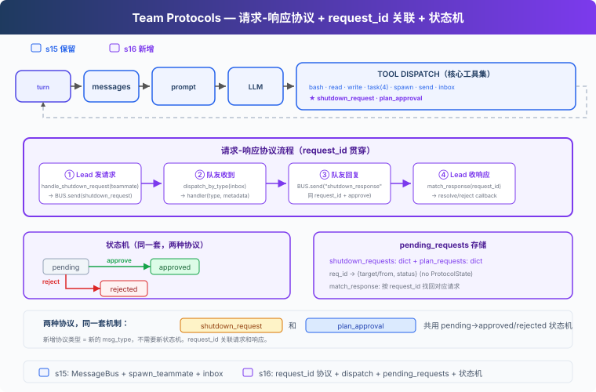

# s16: Team Protocols — 隊友之間要有約定

[中文](README.md) · [繁中](README.zh-tw.md) · [English](README.en.md) · [日本語](README.ja.md)

s01 → ... → s14 → s15 → `s16` → [s17](../s17_autonomous_agents/) → s18 → s19 → s20
> *"隊友之間要有約定"* — request-response 模式驅動協商。
>
> **Harness 層**: 協議 — Agent 之間的結構化握手。

---

## 問題

s15 的隊友能做事了，但協調是鬆散的：Lead 發訊息，隊友回覆，沒有結構化的協議。兩個場景暴露了問題：

**關機**：Lead 想讓 Alice 關機。直接殺執行緒，Alice 寫了一半的檔案留在磁碟上。需要握手：Lead 發請求，Alice 確認收尾後關機。

**計劃審批**：Bob 想重構認證模組，屬於高風險操作。應該先讓 Lead 看 Bob 的計劃，審批通過後再動手。

這兩個場景結構完全一樣：一方發請求，另一方給回覆，請求和回覆透過同一個 ID 關聯。有狀態機追蹤：pending → approved / rejected。

---

## 解決方案



教學程式碼承接前面章節的 Agent 能力脈絡，在 S15 團隊通訊基礎上加入結構化協議。為了聚焦協議機制，省略了完整錯誤恢復、記憶和技能系統。新增三樣：**ProtocolState**（請求狀態追蹤）、**dispatch_message**（按訊息型別路由到處理器）、**match_response**（透過 request_id 關聯回覆與請求，含型別校驗）。

兩種協議，一套機制：

| 協議 | 方向 | 用途 |
|------|------|------|
| shutdown_request / response | Lead → 隊友 | 體面關機握手 |
| plan_approval_request / response | 隊友 → Lead | 計劃審批協議示例 |

> 教學版演示了計劃審批的請求-響應訊息流程，沒有實現執行門控（未 approved 時攔截 bash/write_file）。真實 CC 的隊友有 permission gating 機制。

---

## 工作原理

### ProtocolState: 請求狀態

每個協議請求建立一條狀態記錄，記錄誰發的、發給誰、當前狀態、附帶內容：

```python
@dataclass
class ProtocolState:
    request_id: str      # 唯一 ID，如 "req_004281"
    type: str            # "shutdown" | "plan_approval"
    sender: str          # 發起方
    target: str          # 接收方
    status: str          # pending | approved | rejected
    payload: str         # 計劃文字或關機原因
    created_at: float    # 時間戳

pending_requests: dict[str, ProtocolState] = {}
```

發請求時建立記錄，收回復時透過 `request_id` 找到對應記錄，更新狀態。

### 四步協議流程

以關機為例，完整鏈路：

```
① Lead 發請求
   req_id = new_request_id()           # "req_004281"
   pending_requests[req_id] = ProtocolState(type="shutdown", status="pending", ...)
   BUS.send("lead", "alice", "shutdown_request", metadata={"request_id": req_id})

② 隊友收到 → dispatch
   inbox = BUS.read_inbox("alice")
   msg_type = msg["type"]              # "shutdown_request"
   → 路由到 handle_shutdown_request()

③ 隊友回覆
   BUS.send("alice", "lead", "shutdown_response",
            metadata={"request_id": req_id, "approve": True})

④ Lead 收響應 → match
   match_response("shutdown_response", req_id, approve=True)
   pending_requests[req_id].status = "approved"
```

`request_id` 是貫穿全鏈路的關聯鍵，請求帶著它出去，回覆帶著它回來。

> 教學版用 `shutdown_response` 統一命名（approve 欄位區分同意/拒絕）。真實原始碼拆成 `shutdown_approved` 和 `shutdown_rejected` 兩種獨立訊息型別（`teammateMailbox.ts:720-763`）。

### dispatch_message: 按型別路由

隊友的 inbox 不只收普通訊息，還收協議訊息。`handle_inbox_message` 按訊息型別分發：

```python
def handle_inbox_message(name, msg, messages):
    msg_type = msg.get("type", "message")
    req_id = msg.get("metadata", {}).get("request_id", "")

    if msg_type == "shutdown_request":
        BUS.send(name, "lead", "Shutting down.", "shutdown_response",
                 {"request_id": req_id, "approve": True})
        return True   # 停止迴圈

    if msg_type == "plan_approval_response":
        approve = msg["metadata"].get("approve", False)
        messages.append({"role": "user",
            "content": "[Plan approved]" if approve else "[Plan rejected]"})
    return False       # 繼續迴圈
```

新增協議型別只需加新的 `if` 分支。

### match_response: 型別校驗

`match_response` 不只按 `request_id` 找狀態，還會校驗響應型別是否匹配請求型別：

```python
def match_response(response_type, request_id, approve):
    state = pending_requests.get(request_id)
    if not state:
        return
    if state.type == "shutdown" and response_type != "shutdown_response":
        return  # type mismatch, skip
    if state.type == "plan_approval" and response_type != "plan_approval_response":
        return
    if state.status != "pending":
        return  # already resolved, skip duplicate
    state.status = "approved" if approve else "rejected"
```

一個 shutdown_response 不會意外 approve 一個 plan_approval 請求。

### 統一 inbox 消費：consume_lead_inbox

`check_inbox` 工具和主迴圈末尾都呼叫同一個 `consume_lead_inbox()` 函式，先路由協議訊息再返回剩餘內容，避免訊息被讀走但協議狀態沒更新：

```python
def consume_lead_inbox(route_protocol=True) -> list[dict]:
    msgs = BUS.read_inbox("lead")
    if route_protocol:
        for msg in msgs:
            meta = msg.get("metadata", {})
            req_id = meta.get("request_id", "")
            msg_type = msg.get("type", "")
            if req_id and msg_type.endswith("_response"):
                match_response(msg_type, req_id, meta.get("approve", False))
    return msgs
```

主迴圈末尾還會把 inbox 訊息注入到 `history`，讓 LLM 能看到並做出反應。

### 隊友 idle loop：等待而不是退出

s15 的隊友跑完 10 輪就退出。s16 的隊友在 LLM 返回非 tool_use 後進入 idle 等待：輪詢 inbox，收到 shutdown_request 就響應退出，收到新訊息就繼續工作。

```
LLM 返回非 tool_use
  → idle: 每秒輪詢 inbox
  → 收到 shutdown_request → 回覆 shutdown_response → 退出
  → 收到新訊息 → 注入 messages → 繼續 LLM turn
```

教學版省略了 idle_notification 給 Lead 的通知。真實 CC 在 idle 時發 `idle_notification`，Lead 收到後知道隊友空閒，可以分配新任務。

### 合起來跑

```
1. Lead: "讓 Alice 建立一個檔案，然後關機"
2. Lead → spawn_teammate("alice", "backend", "建立 config.py")
3. alice 執行緒啟動 → write_file("config.py", "...") → 完成 → idle
4. Lead → request_shutdown("alice")
   → BUS.send("shutdown_request", {request_id: "req_000142"})
5. alice idle 輪詢收到 → handle_shutdown_request
   → BUS.send("shutdown_response", {request_id: "req_000142", approve: True})
6. Lead consume_lead_inbox → match_response("req_000142", approve=True)
   → pending_requests["req_000142"].status = "approved"
   → inbox 訊息注入 history，LLM 看到關機結果
```

關機握手完整：請求 → 確認 → 關機。每一步有 `request_id` 追溯。

---

## 相對 s15 的變更

| 元件 | 之前 (s15) | 之後 (s16) |
|------|-----------|-----------|
| 協調方式 | 鬆散文字訊息 | 結構化請求-響應協議 |
| 請求追蹤 | 無 | ProtocolState + pending_requests dict |
| 訊息路由 | 全部當文字處理 | dispatch_message 按型別分發 |
| 關機 | 自然退出或殺執行緒 | request_id 握手機制 |
| 計劃審批 | 無 | 訊息流程示例（未實現執行門控） |
| 新訊息型別 | message, result | + shutdown_request/response, plan_approval_request/response |
| 隊友生命週期 | 最多 10 輪 | idle loop（等待 inbox 訊息） |
| Lead inbox | check_inbox 和主迴圈分別讀 | 統一 consume_lead_inbox |
| Lead 工具 | 14 (s15) | 14（核心工具集加入 request_shutdown, request_plan, review_plan） |
| 隊友工具 | 4 (s15) | + submit_plan (5) |

---

## 試一下

```sh
cd learn-claude-code
python s16_team_protocols/code.py
```

試試這些 prompt：

1. `Spawn alice as a backend dev. Ask her to create a file. Then request her shutdown.`
2. `Spawn bob with a refactoring task. Have him submit a plan first. Then review and approve it.`

觀察重點：關機握手是否完整（請求 → 確認 → 關機）？`pending_requests` 的狀態是否正確轉換？`request_id` 是否在請求和響應之間保持一致？隊友 idle 後是否能收到 shutdown_request？

---

## 接下來

s15-s16 中，Lead 必須給每個隊友分配任務。"Alice 做這個，Bob 做那個"。任務看板上有 10 個未認領的任務，Lead 得手動 assign。

能不能讓隊友自己看板、自己認領？Lead 只需要建立任務，隊友自己發現、自己認領、自己完成。

s17 Autonomous Agents → 隊友自組織，不需要領導分配。

<details>
<summary>深入 CC 原始碼</summary>

CC 的團隊協議實現（`teammateMailbox.ts`，1184 行）和教學版在核心結構上一致：request_id + approve/reject 的請求-響應模式。差異在於：

**關機協議**：CC 的 shutdown 是三向通訊（`teammateMailbox.ts:720-763`、`SendMessageTool.ts:268-430`）。Lead 發 `shutdown_request`，隊友回覆 `shutdown_approved`（或 `shutdown_rejected` 附原因），系統傳送 `teammate_terminated` 通知所有相關方。關機確認後系統自動清理 pane（tmux/iTerm2）、unassign 任務、從 team config 移除成員（`useInboxPoller.ts:677-800`）。教學版用 `shutdown_response` 統一命名，真實原始碼拆成 approved/rejected 兩種獨立訊息。

**計劃審批**：真實原始碼裡 plan approval request 由 `ExitPlanModeV2Tool.ts:263-312` 在 plan-mode-required 隊友退出 plan mode 時產生。`useInboxPoller.ts:599-661` 當前會自動回寫 approval，並把請求交給 Lead 作為上下文（regular message）。`SendMessageTool.ts:434-518` 仍保留顯式 approve/reject response 能力，審批時可同時設定 `permissionMode`（如"批准但以 plan mode 執行"），響應中可包含 `feedback` 字串供隊友修正後重新提交。不是簡單的"Lead 手動 review_plan 工具"流程。

**訊息格式**：CC 的協議訊息是結構化的 JSON（有 Zod schema 驗證），教學版用簡單的 type + metadata 字典。欄位名也不統一：permission 用 `request_id`（`teammateMailbox.ts:453-462`），shutdown 和 plan approval 用 `requestId`（`teammateMailbox.ts:684-763`）。

**執行門控**：CC 的隊友有完整的 permission gating。未獲批准的高風險操作會被攔截，不是可選的。教學版只演示了訊息流程，沒有實現執行攔截。

**通用性**：教學版的一個 FSM（pending → approved | rejected）對應兩種協議，這個簡化完全正確。CC 的所有協議訊息共用同一個 request id 關聯機制。

</details>

<!-- translation-sync: zh@v1, en@v1, ja@v1 -->
