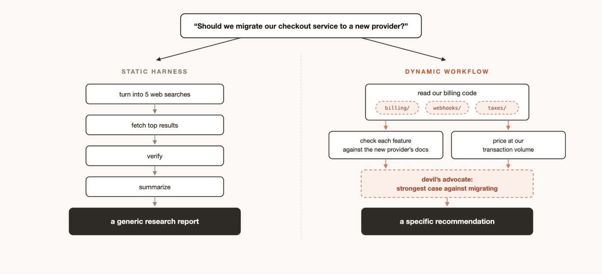
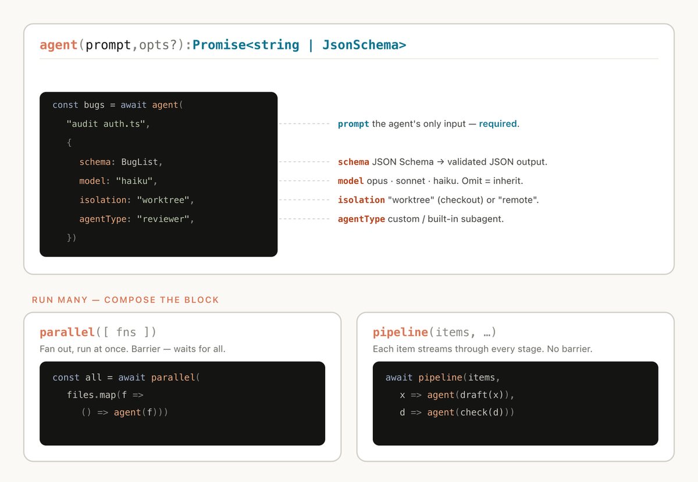
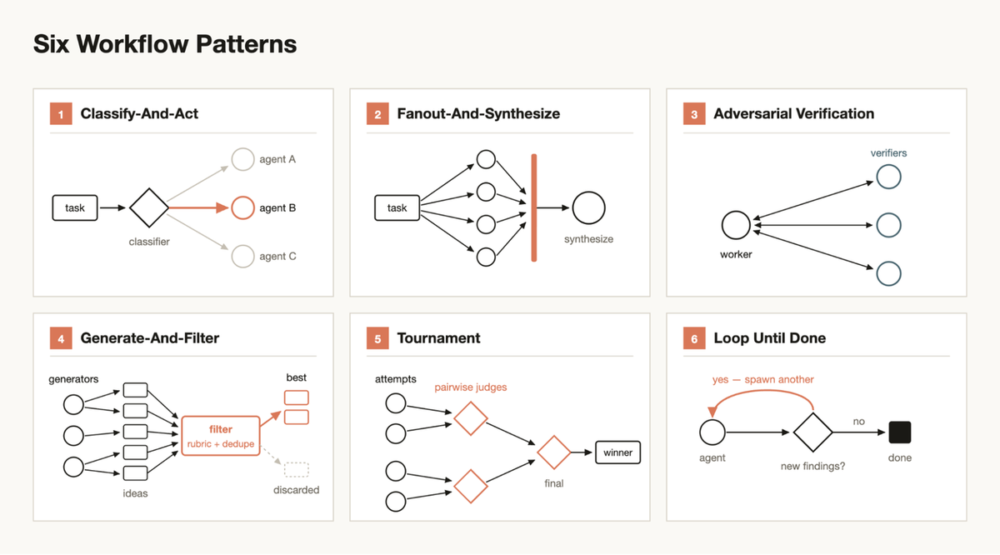
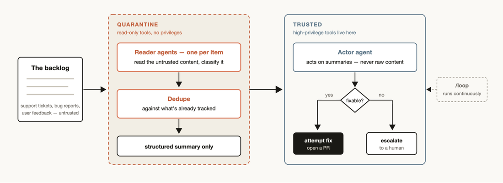

# s16: Workflow Runtime — レシピをコードに書く

[English](README.md) · [中文](README.zh.md) · [日本語](README.ja.md)

s01 → ... → s14 → [s15](../s15_integrated_harness/) → `s16` → [s17](../s17_goal_loop/)

> Workflow = コードに書いたオーケストレーション。トポロジはスクリプト、一歩の判断はモデル。
>
> **Harness 層**: オーケストレーション — 単一 agent ループの上で多 agent スクリプトを回す。
>
> モデルを信じ、harness を設計する。Workflow はその一言を一段上げる。

---

## 問題

長い仕事では計画と実行が同じ chat に同居する：途中で完了宣言、自分の宿題を甘く採点、圧縮のあと静かな制約が消える。並列・安定した結果形・再開——柔らかい会話メモリでは支えきれない。

十秒おきにシェフへ SMS を送るような催促。**Workflow** は厨房がそのまま従えるレシピだ。

## アイデア

ヘルパー（サブ agent）は考える。**スクリプト**がループ・分散・マージを握る。中間結果は変数と journal に置き、会話には入れない。

**オーケストレーションを「知性」から「構造」へ移す。**

```text
  messages[] ──► Workflow(...) ──► tool_result
                      │
                      ▼
              スクリプトが握る: agent / parallel / pipeline
                      │
                      ▼
                 変数 + journal
```

`Workflow` ツール呼び出しひとつで開始；レシピが終わると結果がひとつ返る。

<details>
<summary>Runtime 概要図</summary>


</details>

## ふたつの入口

- **Dynamic**: モデルが*この*タスク向けに JS オーケストレーションを書く（`script` / `scriptPath`）。
- **Saved**: 良いスクリプトを `.claude/workflows/` に置き、`name` + `args` で再呼び出し。
- **Static**（外のいとこ）: SDK / `claude -p` で事前に書く——だいたい汎用寄り。



*左: 固定パイプライン → 汎用レポート。右: あなたのコード向けに裁断 → 具体的な提案。*

本章は **Python のティーチング runtime**（JS VM なし）。概念は Claude Code に揃え、デモは Saved 入口。製品ではモデルが実行可能スクリプトを出せる——ここでは JS インタプリタを埋め込まないだけ。

```python
# teaching sketch — 完全な schema ではない
Workflow({ "name": "review-changes", "args": { "changes": "..." } })
# Claude Code はさらに: script | scriptPath | resumeFromRunId
```

## 三つの動詞

```text
  agent      ヘルパー一人、仕事ひとつ（schema で JSON 検証可）
  pipeline   item ごとに段階を進む（既定 — 障壁なし）
  parallel   全部揃ってから次へ（障壁 — 控えめに）
```

失敗しても艦隊は続く: `parallel` はそのスロットが `null`；`pipeline` は**その item** と後段を落とす。マージ前にフィルタ。

再開: journal は呼び出し順に記録；**最長の未変更プレフィックス**を再生し、最初の変更以降は実走。本物の JS runtime は `Date.now()` / `Math.random()` を禁じる。このデモは完全サンドボックスしない——それでも決定的に書く。

```text
  journal  [A] [B] [C] [D]
  resume    hit hit  ✂  live
```

<details>
<summary>公式プリミティブ・カード + 静かな動詞</summary>



*`agent`；`parallel`（障壁）vs `pipeline`（ストリーミング段階）。Claude Code には `model` / `isolation` / `agentType` もある；ティーチング面は小さめ。*

静かな動詞: `phase`、`log`、ネスト一段 `workflow`、`args`、`budget`。

</details>

## ふたつの形 + ひとつの sample

まずふたつ（六パターン全体は下の折りたたみ）:

```text
  Fanout          task ──► ● ● ● ● ══barrier══► synthesize
  Adversarial     worker ──► verifier×N  → 残るものだけ残す
```

sample `review-changes` = **Fanout** の中に **Adversarial**: 次元ごとに `pipeline(audit, verify)`、`verify` 内で `parallel` 検証、`isReal` だけ残す。

```text
  correctness ── audit ── verify ──┐
  security    ── audit ── verify ──┤── confirmed
  performance ── audit ── verify ──┤
  style       ── audit ── verify ──┘
```

```python
# code.py から（抜粋）
async def sample_workflow(ctx, args):
    ctx.phase("Review")
    results = await ctx.pipeline(DIMENSIONS, audit, verify)
    confirmed = [f for r in results if r for f in r["confirmed"]]
    return {"confirmed": confirmed}
```

艦隊は早止めできず、作者は審判にならず、トポロジは chat の毎ターンで書き換わらない。

<details>
<summary>六パターン格子 + プリミティブ対応</summary>



| パターン | プリミティブ速写 | 使わないとき |
|----------|------------------|--------------|
| Classify-And-Act | `agent` → 分岐 → `agent` | 全部同じ扱いでよい |
| Fanout-And-Synthesize | `pipeline` / `parallel` → マージ | 一回で収まる |
| Adversarial Verification | 生成 → `parallel(verify)` → フィルタ | 間違っても安い |
| Generate-And-Filter | `parallel(gens)` → フィルタ | 答え空間がもともと狭い |
| Tournament | 一対一の審判 `agent` | 明確な尺度で一発選定可 |
| Loop Until Done | `while` + 停止 + `budget` | 仕事量が既知 |

```python
# teaching sketch
kind = await ctx.agent("このチケットを分類", schema=KIND)
if kind["type"] == "billing":
    return await ctx.agent("請求を処理…")
```

</details>

<details>
<summary>信頼できない入力: quarantine</summary>

チケットを*読む* agent が PR を開く鍵まで持つべきではない。reader は読み取りのみ → 構造化サマリ；trusted actor はサマリだけ見て動く。

```text
  backlog（非信頼）→ [quarantine: readers → 重複除去 → summary] → [trusted: actor]
```



*高権限ツールは trusted 側。バックログが眠らないなら `/loop` と組む。*

</details>

<details>
<summary>s15 への掛け方</summary>

s15 がホストループのまま；s16 は `Workflow` ツールを足すだけ。製品ではバックグラウンド可；ティーチング CLI は前景の `demo` / `resume` で段階とキャッシュを見せる。

</details>

## 隣人と、使わないとき

計画を握るのは誰か。s06 一回委譲、s13 メール箱の仲間、s15 単一ループ、**s16 スクリプト + journal**、s17 は「全体ゴールは終わったか」。

普通のコーディングなら s15 一回、または正直な s06 で十分なことが多い。Workflow は token と調整コスト——構造が単一コンテキストより長生きすべきときだけ。

## 試してみる

```bash
python s16_workflow_runtime/code.py          # s15 ホスト + Workflow（本番 API）
python s16_workflow_runtime/code.py demo     # 固定データ；段階を見る
python s16_workflow_runtime/code.py resume   # 同じ runId；キャッシュ命中を期待
```

完全再開では `agents=0 tokens=0` になるはず。

## 次へ

s16 はバッチの回し方。[s17 Goal Loop](../s17_goal_loop/) は聞く：止めるか、もう一周か。

<!-- translation-sync: zh@v18, en@v18, ja@v18 -->
