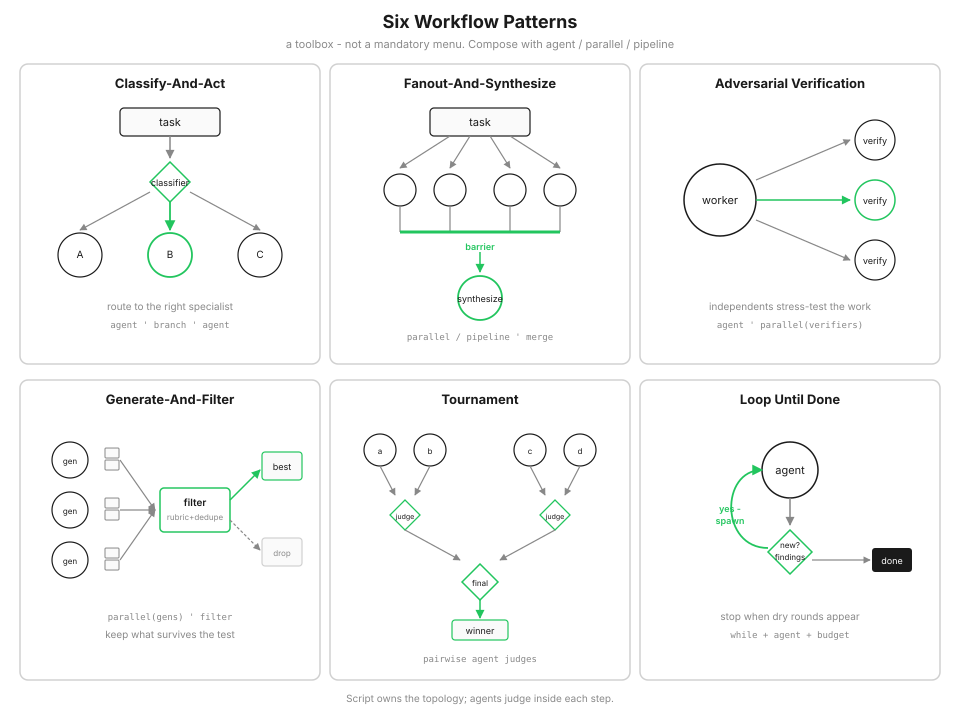

# s16: Workflow Runtime — レシピをコードに書く

[English](README.md) · [中文](README.zh.md) · [日本語](README.ja.md)

s01 → ... → s14 → [s15](../s15_integrated_harness/) → `s16` → [s17](../s17_goal_loop/)

> *「ターンごとのチャットは、10 秒ごとにシェフへメールするようなものです。Workflow は厨房が従えるレシピです。」*
>
> **Harness 層**: Orchestration — single-agent loop の上に multi-agent script を載せます。
>
> モデルを信頼し、harness をエンジニアリングする。Workflow は、その考えを orchestration の階へ運んだものです。

---

友だちとチャットだけで料理しているところを想像してください。「玉ねぎを切って」。待つ。「できた？」。次はフライパン、塩。一品ならそのリズムでも持ちます。二十卓の宴会では持ちません。手順は抜け、同じ言葉が返り、スマホが落ちたら冷たいところからやり直しです。

モデルがシェフとクリップボードを兼ねるときも、同じ感触です。計画と実行が一つの会話に押し込まれます。**Workflow** は書かれたレシピです。厨房（runtime）がそれに従い、助手（subagent）が味見と判断をし、仕掛かりの器はカウンターに置かれます。グループスレッドの中ではありません。

## なぜ、もう一枚の harness が要るのか

デフォルトの Claude Code harness は、コーディング型の仕事にもう十分強いです。直す、走らせる、エラーを読む、また試す。一つのループ、一つの頭で、かなりの手業が出ます。

ただ、形の違う仕事もあります。深い調査、セキュリティの洗い出し、agent teams、変更一式を広げて review するような仕事です。そういうとき、人は昔からその上に第二の harness を載せてきました。SDK で先に手書きしてもよい。あるいは——ここが生きているところですが——Claude に**このタスク用**の harness を書かせ、走らせ、良いものを残せます。

コースのモットーを一階上げると、こうなります。各ステップの中ではモデルを信頼する。ステップの並びは、自分で形を決める。

## 長いチャットで見かける癖

s01 から s15 まで、計画と行動は同じ context window を共有します。次の一手が直前の発見に依るときは、とても心地よいです。

ところが仕事が長く、大規模に並行し、硬い構造を求め、あるいは疑り深い第二意見が要ると、脆くなります。長いチャットをじっと見ていると、見覚えのある癖に出会います。50 項目のうち 35 で勝利宣言をする。自分の宿題を採点させると甘くなる——狐が鶏小屋を採点する。多ターンと圧縮のあいだに、「X には触るな」という静かな制約が薄れて、なぜそれがそこにあったのか誰も覚えていない。

Claude Code の設計者は、これらを agentic laziness、self-preferential bias、goal drift と呼びます。名前より感触が大事です。仕事をする窓が、計画を覚える窓でもある。会話履歴は、並行性や安定した結果の形、落ちたあとの再開を預けるには柔らかい場所です。多くのファイルを review する、調査してから検証する、N 個のモジュールを同じやり方で移す——そうした仕事は、形が先に分かっています。柔らかい記憶だけでは足りません。

## アイデアが落ちる瞬間

もし計画がコードの中に住んだらどうでしょう。

助手は相変わらず考えます——きれいな机で、焦点の定まった一つの仕事を。**script** がループと扇状の分配とマージを持ちます。中間結果は変数と journal にあり、会話には入りません。途中で切り上げる癖は、艦隊全体を止めにくくなります。自己採点の甘さは、著者ではない第二の助手にぶつかります。drift も掴みにくくなります。トポロジーを、疲れた語り手が毎ターン書き換える必要がないからです。

一行で言えば、workflow はオーケストレーションを「賢さ」から「構造」へ移します。モデルは各 `agent()` の中で判断し、地図は script が持ちます。


1 回の `Workflow` tool call が、その実行を始めます。進み具合は途中で小さく鳴り、最後に launch 情報と結果と task state が一つの tool result で戻ります。

## 同じ厨房への、ふたつの入口

Claude Code は入口について率直です。

ときどきモデルは、*この*タスク用の JavaScript オーケストレーションを書き、`script` として渡します（あとから `scriptPath` を編集することもあります）。これが **dynamic** の入口です。問題がまだ熱いうちに、合わせた harness を裁断します。

ときどき、良い script はすでに `.claude/workflows/` のような場所にあります。`name` と `args` で呼び出します。これが **saved** の入口です。残すに値した run が、再利用できるカードになったものです。

このレッスンの外にはいとこもあります。Agent SDK や `claude -p` で先に書く **static** harness です。あらゆるエッジケースに耐える必要があるので、どうしても汎用になります。dynamic はこの布のための裁断です。形が合ったら保存します。

**この章は Python の teaching runtime です。** 同じアイデアを、1 行ずつ読める形で示します。デモは名前で一つの saved workflow を登録します。概念は Claude Code の script 世界と一一対応です。「モデルは実行可能コードを渡せない」などと言いません——それは Claude Code については初めから正しくありませんでした。ここでは、完全な JavaScript インタプリタを埋め込まないだけです。

```python
# Teaching adapter: saved の入口（name + args）。
# Claude Code は script / scriptPath / resumeFromRunId も受け付ける。
WORKFLOW_TOOL = {
    "name": "Workflow",
    "input_schema": {
        "type": "object",
        "properties": {
            "name": {"type": "string"},
            "args": {"type": "object"},
            "resume_from_run_id": {"type": "string"},
            "resumeFromRunId": {"type": "string"},
        },
        "required": ["name"],
    },
}
```

## 厨房の動詞を少し

学校のバザーでケーキをたくさん焼くとします。どのテーブルも 混ぜる → 焼く → 箱詰め。助手が味見をし、レシピが順番を決めます。

`agent(...)` は、助手ひとりに一つの仕事を頼むことです。`pipeline(items, *stages)` が既定で、各ケーキが自分で段階を歩きます。だから一方が箱詰めのあいだに、もう一方はまだ混ぜていてもよい。`parallel(...)` は揃うまで待つバリアで、次の段が本当に全部の結果を要すときだけ欲しくなります。トレイ全部を味見してから採点表を書く、といった場面です。

その周りに、静かな動詞もあります。`phase` はボードにいまの場所を出し、`log` は短い一声、`workflow` は小さなレシピを入れ子にし、`args` は材料リスト、`budget` は使えるオーブン分（token）です。

```python
# 各 review dimension が自分で audit → verify を歩く。
results = await ctx.pipeline(DIMENSIONS, audit, verify)
confirmed = [f for r in results if r for f in r["confirmed"]]
```

## レシピが書けるようになったら

上の動詞は小麦粉と火加減です。人が何度も発明し直すのは、少数の*形*——dynamic agentic workflow のよくあるパターンです。道具箱だと思ってください。必点メニューではありません。痛みが出たときに手を伸ばし、残りは壁に掛けておきます。



*人が何度も発明する六つの形。トポロジーは script が持ち、このレッスンでは `agent` / `parallel` / `pipeline` / `phase` / journal で各形を話します。*

**Classify-And-Act。** 痛み: 万能の助手は何でもそこそこ。形: classifier がタスクを見て、専門家 A / B / C へ振り分ける。このレッスンでは、だいたい `agent({schema})` がラベルを返し、script の `if`/`match` が続く `agent`（または入れ子の `workflow`）を呼びます。全部が本当に同じ扱いでよいなら、使わない——振り分けは儀式になります。

**Fanout-And-Synthesize。** 痛み: 五十ファイルは一つの疲れた context に入らず、押し込めば混線する。形: 仕事を分け、多くの agent を走らせ、barrier で待ち、まとめる。各 item に自分の stage があるなら `pipeline`、次が全結果を要すなら `parallel`。まとめは gather のあとのふつうの Python。関連ファイルが三つか五つで一通しで足りるなら、使わない。

**Adversarial Verification。** 痛み: 狐が鶏小屋を採点する。形: worker が出す。独立した verifier が反証や負荷をかける。生き残ったものだけ残る。写し方は、生産の `agent`、それから verifier `agent` の `parallel`（できれば schema 付き）、そのあと filter。`phase` で “Review” と “Verify” を分ける。間違えても安いなら使わない——すべてのメモに法廷は要らない。

**Generate-And-Filter。** 痛み: 欲しいのは選択肢であり、最初に賢く聞こえた案ではない。形: 多くの generator がアイデアを rubric + dedupe の filter に流し、best を残して残りを捨てる。写し方は generator の `parallel`、そのあと script 側の filter（または schema 付きの審判 `agent`）。生成が高いとき journal / resume が効く。良い答えの空間がもともと狭いなら使わない。

**Tournament。** 痛み: 味や順位では絶対スコアがぼやける（「この名前はどれくらい良い？」）。形: ペアごとの審判、トーナメント表、勝者——比較判断は孤独な採点に勝る。写し方は、script 内で pairwise 審判 `agent` の `parallel` を回し、一つ残るまで続ける。鋭い rubric が一通しで勝者を決めるなら使わない。

**Loop Until Done。** 痛み: 坑道にまだ何巡あるか分からない。形: 「新しい発見？」が yes のあいだ spawn し続け、空振りや完了条件で止まる。写し方は `while` で `agent`/`parallel` を包み、schema 付きの停止チェックと硬い `budget` を置く。長い掘りが止まるなら journal resume と組む。仕事量が分かっているなら、固定の `pipeline` の方が単純で安全。

いくつか顔が付いたあと、道具箱は一目で収まります。

| パターン | プリミティブの素描 | 手を伸ばすとき |
|----------|--------------------|----------------|
| Classify-And-Act | `agent` → 分岐 → `agent` | 項目ごとに違う専門家が要る |
| Fanout-And-Synthesize | `pipeline` / `parallel` → 統合 | きれいな机がたくさん、そのあと一つの要約 |
| Adversarial Verification | 生産 → `parallel(verify)` → filter | 間違えると高い |
| Generate-And-Filter | `parallel(gens)` → rubric filter | まず選択肢、それから味 |
| Tournament | pairwise 審判 `agent` の bracket | 順位/味に鋭い物差しがない |
| Loop Until Done | `while` + 停止チェック + `budget` | どれだけ埋まっているか不明 |

組み合わせはふつうです。深い調査はしばしば fanout → filter → verify → synthesize と重ねます。私たちのサンプルは、すでに二つの音の小さな和音です。

## 次の段が受け取れる答え

助手が散文で返してくると、次の stage は finding と verdict を揃えられません。`schema` を渡します。runtime は JSON を求め、確かめ、**一度だけ**やり直します。それでもだめならその call はエラーになります——失敗のとき艦隊がどう優しくいられるかは、次の話です。

```python
out = await ctx.agent(
    f"この変更に {dimension} 関連の問題がないか確認してください:\n{changes}",
    schema=FINDINGS_SCHEMA,
    label=f"audit:{dimension}",
)
```

あなたとの会話は散文のままでよいです。パイプラインには合うソケットが要ります。

## トレイがひとつ焦げたとき

助手のオーブンが一つ失敗したくらいで、艦隊を止めてはいけません。

`parallel` では、失敗した thunk がそのスロットで `null` / `None` になり、gather 自体は reject しません。`pipeline` では、失敗した stage が**その item** を null にし、残りの stage を飛ばします。ほかの item は歩き続けます。マージの前に注意して絞ります。`if r`、JS ならよく `.filter(Boolean)` です。

```python
verdicts = await ctx.parallel([...])  # 空のスロットがありうる
confirmed = [
    f for f, v in zip(findings, verdicts)
    if v and v.get("isReal")
]
```

## また開けるノート

各 run には `runId` があります。`agent()` が終わるたび、disk 上の journal に一行が乗ります——助手がオーブンから戻った順ではなく、あなたが**呼んだ**順のノートです。

resume（`resume_from_run_id` / `resumeFromRunId`）は script をまた先頭から走らせますが、丁寧です。呼び出し順に次の journal 行と照合し、最長の未変更プレフィックスはキャッシュから再生します。最初の変更または未完了でプレフィックスが切れ——それ以降はすべて live です。ノートの後ろに古い key が残っていても、割れ目を飛び越えて黙って hit しません。

本物の JavaScript workflow runtime が `Date.now()` や `Math.random()`、引数なしの `new Date()` を禁じるのも、このためです。時計とサイコロが prompt や呼び出し順を揺らすと、ノートが揃わなくなります。この Python デモはそのサンドボックスまではやりません。それでも script は決定的に書いてください。

```text
journal:  [A ✓] [B ✓] [C ✓] [D ✓]
resume:   A hit → B hit → C 変更 → D は live
```

## `review-changes` を歩く — ひとつの composition

サンプルは「一つのパターン」ではありません。**Fanout-And-Synthesize** の中に **Adversarial Verification** が入り、終わりで軽く generate-and-filter がかかる——`isReal` の finding だけが残ります。

```text
correctness ── audit ── verify ──┐
security    ── audit ── verify ──┤── 確認済みの finding
performance ── audit ── verify ──┤
style       ── audit ── verify ──┘
         fanout                              synthesize
              └── 各 finding: 懐疑的 verify ──┘
```

`pipeline(DIMENSIONS, audit, verify)` が各 dimension に机を渡し、correctness の雑談が security へ流れないようにします。`verify` 内の verifier agent の `parallel` が敵対の和音です。ふつうのリスト filter が synthesize。`phase` が Review と Verify を印し、journal が各 `agent()` を覚えるので、止まっても audit をやり直さない。

三つの癖がお気に入りの席を失う感触があります。艦隊は二つの dimension で止められず、著者は審判ではなく、トポロジーは途中で漂いません。

```python
async def sample_workflow(ctx, args):
    ctx.phase("Review")
    results = await ctx.pipeline(DIMENSIONS, audit, verify)
    confirmed = [f for r in results if r for f in r["confirmed"]]
    ctx.log(f"{len(confirmed)} 件の実在する問題を確認")
    return {"confirmed": confirmed}
```

## s15 に掛けて、置き換えない

s15 は依然として host loop です。s16 が足すのは `Workflow` という tool だけです。あなた（またはモデル）が saved の名前を頼み、adapter が script を見つけて走らせます。

本番では、その run は通知付きで背景に置き、セッションは応答し続けられます。teaching CLI は `demo` と `resume` を前景に置き、phase と cache hit を目で追えるようにしています。アイデアは同じで、簡略化したところははっきり言います。

main loop が workflow エンジンになるわけではありません。`bash` や `task` を借りるように、tool を一つ借ります。

## 宝石を回す: 計画を握っているのは誰か

近所を見ると、同じものが別の面を見せます。役に立つ問いは「agent は何人か？」ではなく、**トポロジーを誰が持つか**、仕掛かりの器はどこに置かれるか、です。

| 近所 | 計画を握るもの | 中間結果の置き場 | 向いている用途 |
|------|----------------|------------------|----------------|
| [s06 Subagent](../s06_subagent/) | モデル、一度きり | ほとんど捨てる | 汚い子タスクの隔離 |
| [s13 Agent Teams](../s13_agent_teams/) | Lead がターンごと + mailbox | 共有タスク / メッセージ | 長時間の同僚 |
| [s15 Integrated Harness](../s15_integrated_harness/) | 一つのループ内のモデル | 会話 `messages[]` | 積み上げ型 coding agent |
| **s16 Workflow** | **Script** | **変数 + journal** | 構造化した fan-out と verify |
| [s17 Goal Loop](../s17_goal_loop/) | 停止時の evaluator | 会話を証拠に | 「ゴール全体は終わったか？」 |

より安い道もしばしば勝ちます。skill を軟らかい計画にする、短い multi-agent の会話、手書きの static orchestrator、あるいは大きな一回のモデルターン。構造が単一の context より長く生きねばならないときに、workflow へ手を伸ばします。審査員パネルが聞こえがいいからではありません。

## 棚に戻しておくとき

Workflow は token と調整のコストを使います。ふつうのコーディングの大半は、五人の reviewer を必要としません。

回す前に聞いてください。この仕事は本当にもっと計算と定制 harness を欲しがっているか。ふつうの s15 の一ターン——あるいは一つの誠実な s06 subagent——で足りるなら、そこで止めます。抑制も思想の一部です。並行と専門化は、自分の席を自分で稼がねばなりません。

## 試してみる

```bash
python s16_workflow_runtime/code.py          # s15 host + Workflow（real API）
python s16_workflow_runtime/code.py demo     # 固定 fixture。phase を見る
python s16_workflow_runtime/code.py resume   # 同じ runId。cache hit を期待
```

Review が Verify に道を譲るのを見てください。完全な resume で agent が `done` から `cached` へ翻るのを見てください。終わりには短い確認リストがあり——きれいな resume では `agents=0 tokens=0` と出ます。ノートが「温め直しは要らない」と言っている感じです。

## 次へ

s16 はバッチの回し方です。[s17 Goal Loop](../s17_goal_loop/) は戸口で別の問いをします。止めるべきか、もう一ターンか。繰り返せるレシピに硬い「完了」も要るときは、そちらと組んでください。

<!-- translation-sync: zh@v14, en@v14, ja@v14 -->
