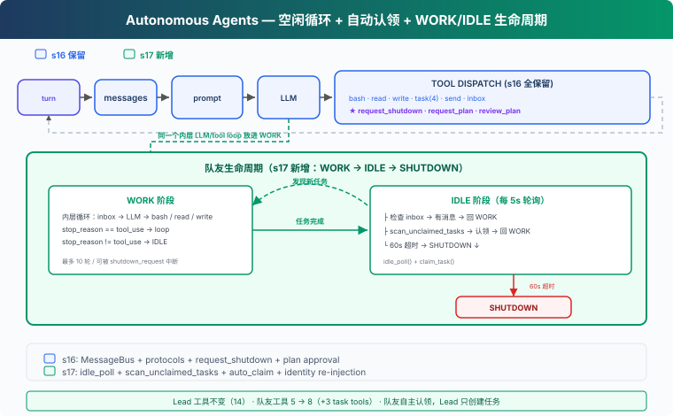

# s17: Autonomous Agents — 自己看板，自己認領

[中文](README.md) · [繁中](README.zh-tw.md) · [English](README.en.md) · [日本語](README.ja.md)

s01 → ... → s15 → s16 → `s17` → [s18](../s18_worktree_isolation/) → s19 → s20

> *"自己看板，自己認領"* — 空閒時輪詢，有活就幹。
>
> **Harness 層**: 自治 — 隊友自組織，不依賴 Lead 分配。

---

## 問題

s16 的隊友能通訊、能握手關機。但每個隊友等 Lead 分配任務——如果任務看板上有 10 個未認領任務，Lead 得手動 assign 10 次。這不能擴充套件。隊友應該自己看任務看板，發現沒人做的任務就認領，做完再找下一個。

---

## 解決方案



沿用 S16 的教學版 MessageBus 和協議工具。本章新增：**idle_poll**（空閒時每 5 秒輪詢一次）、**scan_unclaimed_tasks**（掃描看板上可認領的任務）、**自動認領**（找到任務就 claim，不用 Lead 操心）。

隊友生命週期從兩階段變成三階段：

| 階段 | 行為 | 退出條件 |
|------|------|---------|
| WORK | inbox → LLM → 工具迴圈 | `stop_reason != tool_use` |
| IDLE | 每 5s 輪詢 inbox + 任務板 | 60s 超時 |
| SHUTDOWN | 發 summary，退出 | — |

---

## 工作原理

### idle_poll: 空閒輪詢

隊友完成當前任務後不退出，進入 IDLE 階段——每 5 秒檢查一次有沒有新工作：

```python
IDLE_POLL_INTERVAL = 5   # seconds
IDLE_TIMEOUT = 60         # seconds

def idle_poll(agent_name, messages, name, role) -> str:
    """Return 'work', 'shutdown', or 'timeout'."""
    for _ in range(IDLE_TIMEOUT // IDLE_POLL_INTERVAL):
        time.sleep(IDLE_POLL_INTERVAL)

        # ① 檢查收件箱（優先）
        inbox = BUS.read_inbox(agent_name)
        if inbox:
            # shutdown_request 立即處理
            for msg in inbox:
                if msg.get("type") == "shutdown_request":
                    # ... 回覆 shutdown_response
                    return "shutdown"
            # 普通訊息注入上下文，回到 WORK
            messages.append(...)
            return "work"

        # ② 掃描任務看板
        unclaimed = scan_unclaimed_tasks()
        if unclaimed:
            task = unclaimed[0]
            result = claim_task(task["id"], agent_name)
            if "Claimed" in result:
                messages.append(...)
                return "work"
    return "timeout"
```

inbox 優先（可能包含 shutdown_request 等協議訊息），任務板其次。IDLE 階段收到 shutdown_request 會直接回復並退出，不等到下一輪 WORK。

### scan_unclaimed_tasks: 掃描任務看板

找 pending 狀態、無 owner、所有依賴已完成（`can_start`）的任務：

```python
def scan_unclaimed_tasks() -> list[dict]:
    unclaimed = []
    for f in sorted(TASKS_DIR.glob("task_*.json")):
        task = json.loads(f.read_text())
        if (task.get("status") == "pending"
                and not task.get("owner")
                and can_start(task["id"])):
            unclaimed.append(task)
    return unclaimed
```

三個條件：必須是 pending、沒有 owner、所有 blockedBy 依賴已完成。`can_start` 檢查依賴任務的狀態——有依賴不代表不能做，只有被未完成的任務阻塞才不能做。教學版按檔名排序取第一個；CC 用檔案鎖防止多個隊友同時認領同一個任務。

### claim_task: owner 檢查

自動認領時檢查 claim 結果，不把失敗當成功：

```python
def claim_task(task_id: str, owner: str = "agent") -> str:
    task = load_task(task_id)
    if task.status != "pending":
        return f"Task {task_id} is {task.status}, cannot claim"
    if task.owner:
        return f"Task {task_id} already owned by {task.owner}"
    if not can_start(task_id):
        return f"Blocked by: {deps}"
    task.owner = owner
    task.status = "in_progress"
    save_task(task)
    return f"Claimed {task.id} ({task.subject})"
```

教學版沒有檔案鎖，併發認領可能出現競爭。但至少 `task.owner` 檢查避免了最明顯的"後寫覆蓋"問題。CC 用 `proper-lockfile` 保護任務檔案，`claimTask` 在檔案鎖內完成讀-改-寫（`utils/tasks.ts:541-612`）。

### 隊友生命週期: WORK → IDLE → SHUTDOWN

s16 的隊友做完任務就退出。s17 加了 IDLE 階段，隊友在外層迴圈中反覆 WORK → IDLE：

```python
# Outer loop: WORK → IDLE cycle
while True:
    # WORK phase: 內層迴圈（最多 10 輪 LLM 呼叫）
    for _ in range(10):
        # 檢查 inbox、處理協議訊息、調 LLM、執行工具
        ...
        if response.stop_reason != "tool_use":
            break  # WORK 階段結束

    # IDLE phase
    idle_result = idle_poll(name, messages, name, role)
    if idle_result == "shutdown":
        break
    if idle_result == "timeout":
        break  # 60s 超時 → SHUTDOWN

# SHUTDOWN: 發 summary 給 Lead
BUS.send(name, "lead", summary, "result")
```

關鍵設計：
- **外層 while True**：WORK 和 IDLE 交替進行，直到超時或收到關機請求
- **內層 for 10**：WORK 階段最多 10 輪 LLM 呼叫（防止無限迴圈）
- **IDLE 超時 60 秒**：12 次輪詢 × 5 秒 = 60 秒。超時後傳送 summary 並退出
- **shutdown_request 兩階段都能響應**：WORK 階段透過 `handle_inbox_message` 分發；IDLE 階段 `idle_poll` 直接檢查並回復

### 身份重注入

autoCompact（s08）之後，隊友的 messages 列表可能被壓縮成一段摘要。每次進入新的 WORK 階段時檢查：

```python
if len(messages) <= 3:
    messages.insert(0, {"role": "user",
        "content": f"<identity>You are '{name}', role: {role}. "
                   f"Continue your work.</identity>"})
```

訊息過短說明發生了壓縮，此時重新注入身份資訊。真實 CC 中 context compaction 會保留 system prompt，教學版的簡化實現需要手動處理。

### consume_lead_inbox: 統一 inbox 消費

`check_inbox` 工具和主迴圈末尾都呼叫同一個 `consume_lead_inbox()` 函式：先路由協議 response 更新狀態，再把所有訊息注入 Lead 的對話歷史。隊友發來的 summary/result 不會只打印在終端，Lead 的 LLM 能看到並協調下一步。

### 合起來跑

```
1. Lead: "搭建後端——任務太多，讓隊友自己認領"
2. Lead → create_task("建立資料庫 schema")
3. Lead → create_task("寫 API 路由")
4. Lead → create_task("寫單元測試")
5. Lead → spawn_teammate("alice", "backend", "你是後端開發者")
6. Lead → spawn_teammate("bob", "backend", "你是後端開發者")

7. alice 執行緒啟動 → WORK: 沒有初始 inbox → 空轉 → IDLE
8. bob 執行緒啟動 → WORK: 沒有初始 inbox → 空轉 → IDLE

9. alice IDLE 第 1 次輪詢 → scan_unclaimed → 發現"建立資料庫 schema"
10. alice → claim_task → "建立資料庫 schema" → 回到 WORK
11. bob IDLE 第 1 次輪詢 → scan_unclaimed → 發現"寫 API 路由"
12. bob → claim_task → "寫 API 路由" → 回到 WORK

13. alice WORK: write_file("schema.sql", ...) → complete_task → WORK 結束
14. alice IDLE → scan → "寫單元測試" → claim → WORK
15. alice WORK: write_file("test_api.py", ...) → complete_task → WORK 結束
16. alice IDLE → 60s 無新任務 → SHUTDOWN

17. bob 類似流程 → 做完 → SHUTDOWN
18. Lead consume_lead_inbox → 看到 alice 和 bob 的 summary
```

兩個隊友並行認領、並行工作。Lead 只需要建立任務和啟動隊友，不需要手動分配。

---

## 相對 s16 的變更

| 元件 | 之前 (s16) | 之後 (s17) |
|------|-----------|-----------|
| 任務分配 | Lead 手動 assign | 隊友自動認領（can_start 檢查依賴） |
| 隊友狀態 | WORK 或退出 | WORK → IDLE（輪詢 60s） → SHUTDOWN |
| claim_task | 無 owner 檢查 | 拒絕已有 owner 的任務 |
| IDLE 階段關機 | 不處理 shutdown_request | 直接 dispatch shutdown 並退出 |
| Lead inbox | 只打印，不進上下文 | consume_lead_inbox 統一注入 history |
| 新函式 | — | idle_poll, scan_unclaimed_tasks, consume_lead_inbox |
| 身份保持 | 僅 system prompt | 壓縮後自動重注入 |
| Lead 工具 | 14 (s16) | 14（不變） |
| 隊友工具 | 5 | 8（+ list_tasks, claim_task, complete_task） |
| 隊友退出條件 | 完成任務即退出 | 60s 無新任務才退出 |

---

## 試一下

```sh
cd learn-claude-code
python s17_autonomous_agents/code.py
```

試試這個 prompt：

`Create 3 tasks on the board, then spawn alice and bob. Watch them auto-claim and work.`

觀察重點：隊友是否自動認領了未分配的任務？有 blockedBy 依賴的任務是否在前置完成後被正確認領？空閒超時後是否自動關機？IDLE 階段收到 shutdown_request 是否立即響應？`.tasks/` 目錄下的任務狀態如何變化？

---

## 接下來

隊友自組織了。但 Alice 和 Bob 都在同一個目錄下工作——Alice 改 `config.py`，Bob 也改 `config.py`，互相覆蓋。

s18 Worktree Isolation → 每個任務有自己的工作目錄，互不干擾。

<details>
<summary>深入 CC 原始碼</summary>

> 教學說明：本章的 idle_poll + auto-claim 機制是教學設計，用統一的輪詢函式演示"空閒後找活幹"。CC 的實際實現是多個機制的組合，但目標一致——減少 Lead 的手動分配負擔。

### 一、CC 的空閒機制：組合路徑，不是單一輪詢

教學版用一個 `idle_poll()` 統一處理空閒時的 inbox 檢查和任務認領。CC 的實際實現是四個機制的組合：

**idle_notification**：隊友完成一輪工作後，`sendIdleNotification()`（`inProcessRunner.ts:569-589`）向 Lead 傳送空閒通知。Lead 知道隊友可用了，可以分配新任務或請求關機。

**mailbox 輪詢**：`waitForNextPromptOrShutdown()`（`inProcessRunner.ts:689-868`）是一個 **500ms 輪詢迴圈**，持續檢查三類來源：pending user messages、mailbox 檔案訊息、task list。shutdown_request 被優先處理（`inProcessRunner.ts:768-804`），不會被普通訊息餓死。

**task watcher**：`useTaskListWatcher`（`hooks/useTaskListWatcher.ts:34-189`）用 `fs.watch()` 監聽 `.claude/tasks/` 目錄變化，1 秒 debounce，當新任務建立或依賴解鎖時觸發檢查。依賴判斷（`L197-207`）是"blockedBy 中沒有未完成的任務"，不是"blockedBy 為空"。

**主動 claim**：輪詢迴圈內部也會呼叫 `tryClaimNextTask()`（`inProcessRunner.ts:853-860`）——在等待期間主動從 task list 領取任務。所以"隊友不主動輪詢任務"不準確，CC 同時有被動通知和主動認領。

### 二、任務認領：檔案鎖 + 原子操作

`claimTask()`（`utils/tasks.ts:541-612`）用 `proper-lockfile` 的任務檔案鎖，在鎖內完成讀-檢查-改-寫。檢查項：owner 是否已存在（`L575-576`）、是否已完成（`L580-581`）、blockedBy 中是否有未完成任務（`L585-594`）。`claimTaskWithBusyCheck()`（`utils/tasks.ts:614-692`）用 task-list 級別鎖，把 busy check 和 claim 做成原子操作，避免 TOCTOU。

`findAvailableTask()`（`inProcessRunner.ts:595-604`）的依賴判斷也是"所有 blockedBy 已完成"，用 `task.blockedBy.every(id => !unresolvedTaskIds.has(id))` 實現。`tryClaimNextTask()`（`inProcessRunner.ts:624-657`）在認領後把狀態更新為 `in_progress`，讓 UI 立即反映變化。

### 三、教學版 vs CC 對比

| 維度 | 教學版 (s17) | CC |
|------|-------------|-----|
| 空閒機制 | idle_poll 統一輪詢（5s） | idle_notification + 500ms mailbox 輪詢 + task watcher |
| 任務發現 | scan_unclaimed_tasks（輪詢） | useTaskListWatcher（檔案監聽）+ tryClaimNextTask（主動輪詢） |
| 依賴判斷 | can_start（所有 blockedBy 已完成） | findAvailableTask（同樣語義） |
| 併發安全 | owner 檢查（無檔案鎖） | proper-lockfile 任務鎖 + task-list 鎖 |
| shutdown 處理 | IDLE 直接分發，WORK 透過 handle_inbox_message | 500ms 輪詢中優先處理 shutdown_request |
| 超時退出 | 60s 無新任務 | 無固定超時，Lead 手動 shutdown |
| 身份保持 | messages 長度檢測 | context compaction 保留 system prompt |
| claim 失敗處理 | 檢查返回值，失敗不注入 | 檔案鎖保證原子性 |

教學版的 `idle_poll()` 把 CC 的四個機制合併成一個輪詢函式——簡化合理，因為核心語義（空閒時找活幹、依賴解鎖後可認領、shutdown 優先）是一致的。

</details>

<!-- translation-sync: zh@v1, en@v1, ja@v1 -->
