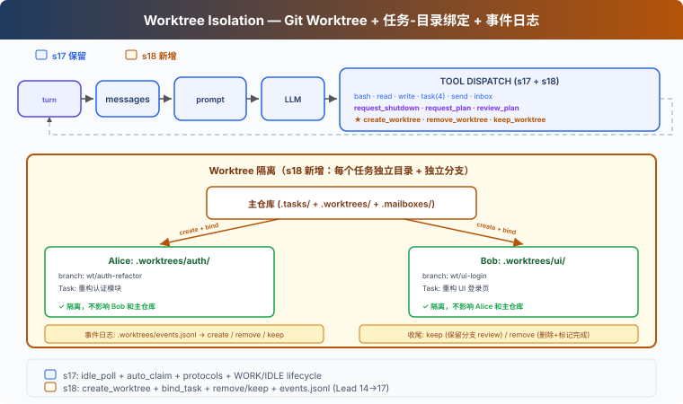

# s18: Worktree Isolation — 各幹各的，互不干擾

[中文](README.md) · [繁中](README.zh-tw.md) · [English](README.en.md) · [日本語](README.ja.md)

s01 → ... → s16 → s17 → `s18` → [s19](../s19_mcp_plugin/) → s20

> *"各幹各的目錄, 互不干擾"* — 任務管目標, worktree 管目錄, 按 ID 繫結。
>
> **Harness 層**: 隔離 — 並行執行的目錄隔離。

---

## 問題

s17 中，Alice 和 Bob 都在同一個目錄下工作。Alice 的任務是"重構認證模組"，Bob 的任務是"重構 UI 登入頁"。

Alice `write_file("config.py", ...)`。Bob 也 `write_file("config.py", ...)`。兩個人改同一個檔案，互相覆蓋。而且無法乾淨地回滾——分不清哪些改動是誰的。

s15-s17 解決了"誰幹什麼"（任務系統）和"怎麼通訊"（訊息匯流排），但沒解決"在哪幹"。

---

## 解決方案



Git worktree 讓你在同一倉庫中建立多個獨立的工作目錄，每個有自己的分支。Alice 在 `.worktrees/auth-refactor/` 下工作，Bob 在 `.worktrees/ui-login/` 下工作——互不干擾。

沿用 S17 的教學版 MessageBus、協議和自治認領機制。本章新增：

| 能力 | 作用 |
|------|------|
| create_worktree | 為任務建立獨立目錄 + 獨立分支 |
| bind_task_to_worktree | 把任務和工作目錄繫結（不改狀態） |
| remove_worktree / keep_worktree | 完成後清理或保留 |
| validate_worktree_name | 拒絕路徑穿越和非法字元 |

---

## 工作原理

### 建立：任務-Worktree 繫結

```python
def create_worktree(name: str, task_id: str = "") -> str:
    validate_worktree_name(name)       # 只允許 [A-Za-z0-9._-]{1,64}
    path = WORKTREES_DIR / name
    ok, result = run_git(["worktree", "add", str(path), "-b", f"wt/{name}", "HEAD"])
    if not ok:
        return f"Git error: {result}"
    if task_id:
        bind_task_to_worktree(task_id, name)
    log_event("create", name, task_id)
    return f"Worktree '{name}' created at {path}"

def bind_task_to_worktree(task_id: str, worktree_name: str):
    task = load_task(task_id)
    task.worktree = worktree_name       # 只寫 worktree 欄位
    save_task(task)                     # 狀態保持 pending，等隊友 claim
```

繫結規則：一個任務繫結一個 worktree。繫結不改任務狀態——任務仍是 `pending`，隊友自動認領時才推進到 `in_progress`。這樣 Lead 可以提前建立任務和 worktree，隊友 idle 時自然認領帶 worktree 的任務。

### 隊友工具的 cwd 切換

教學版給每個隊友維護一個 `wt_ctx` 字典，記錄當前 worktree 路徑。隊友認領帶 worktree 的任務時，`wt_ctx` 自動設定為 worktree 路徑；隊友的 `bash`、`read_file`、`write_file` 在 worktree 目錄下執行：

```python
# 隊友執行緒內部
wt_ctx = {"path": None}

def _run_claim_task(task_id):
    result = claim_task(task_id, owner=name)
    if "Claimed" in result:
        task = load_task(task_id)
        if task.worktree:
            wt_ctx["path"] = str(WORKTREES_DIR / task.worktree)
    return result

def _run_bash(command):
    return run_bash(command, cwd=wt_ctx["path"])  # 在 worktree 下執行
```

這是教學簡化。真實 CC 的 EnterWorktree 用 `process.chdir()` 切換整個程序目錄，AgentTool isolation 用 `cwdOverride` 包住子 agent 執行。

### 收尾：Keep 還是 Remove

任務完成後，兩個選擇：

```python
def remove_worktree(name: str, discard_changes: bool = False) -> str:
    # 安全檢查：有改動時預設拒絕
    if not discard_changes:
        files, commits = _count_worktree_changes(path)
        if files > 0 or commits > 0:
            return "有未提交改動，使用 discard_changes=true 強制刪除，或 keep_worktree 保留"
    ok, _ = run_git(["worktree", "remove", str(path), "--force"])
    if not ok:
        return "刪除失敗"
    run_git(["branch", "-D", f"wt/{name}"])
    log_event("remove", name)

def keep_worktree(name: str) -> str:
    log_event("keep", name)
    return f"Worktree '{name}' kept for review (branch: wt/{name})"
```

Keep = 留著分支，等人工 review 後合併到主分支。Remove = 有改動時預設拒絕，需要 `discard_changes=true` 確認。不自動 complete task——任務完成由隊友的 `complete_task` 顯式觸發。

### 事件流：可審計

每次生命週期操作寫入日誌，方便排查：

```python
def log_event(event_type: str, worktree_name: str, task_id: str = ""):
    event = {"type": event_type, "worktree": worktree_name,
             "task_id": task_id, "ts": time.time()}
    # append to .worktrees/events.jsonl
```

事件型別：`create`（建立）、`remove`（刪除）、`keep`（保留）。教學版只記錄事件用於人工排查；完整恢復還需要 index 或 `git worktree list` 掃描。

### run_git：返回成功/失敗

```python
def run_git(args: list[str]) -> tuple[bool, str]:
    r = subprocess.run(["git"] + args, cwd=WORKDIR, ...)
    return r.returncode == 0, output
```

`create_worktree` 和 `remove_worktree` 只在 git 命令成功後才寫事件日誌，保證日誌反映真實狀態。

---

## 相對 s17 的變更

| 元件 | 之前 (s17) | 之後 (s18) |
|------|-----------|-----------|
| 工作目錄 | 所有 Agent 共享 WORKDIR | 每個任務可繫結獨立 git worktree |
| Task 資料 | id/subject/status/owner/blockedBy | + worktree 欄位 |
| 隊友工具 cwd | 始終 WORKDIR | 認領帶 worktree 的任務時自動切換 |
| 新函式 | — | create_worktree, bind_task_to_worktree, remove_worktree, keep_worktree, validate_worktree_name |
| worktree 安全 | 無 | name 校驗 + 有改動時拒絕刪除 |
| 事件日誌 | 無 | events.jsonl 生命週期審計 |
| Lead 工具 | 14 (s17) | + create_worktree, remove_worktree, keep_worktree (17) |
| 隊友工具 | 8 (s17) | 8（bash/read/write 在 worktree cwd 執行） |

---

## 試一下

```sh
cd learn-claude-code
python s18_worktree_isolation/code.py
```

試試這個 prompt：

`Create two tasks, then create worktrees for each (bind with task_id). Spawn alice and bob. Watch them auto-claim and work in isolated directories.`

觀察重點：兩個 worktree 的 `git status` 輸出是否顯示不同的分支？隊友認領帶 worktree 的任務後，bash 命令是否在 worktree 目錄下執行？`remove_worktree` 對有改動的 worktree 是否拒絕？`.tasks/` 中的任務在繫結後狀態是否仍為 `pending`？

---

## 接下來

Agent 團隊能在隔離的工作空間中自組織了。但 Agent 的能力受限於我們給它寫的工具——bash、read、write、task...

如果使用者已經有了自己的工具怎麼辦？比如一個公司內部的 Jira API、一個自建的部署系統？

s19 MCP Plugin → 給 Agent 裝一個外掛系統。外部工具透過標準協議接入，Agent 不需要知道它們是誰寫的。

<details>
<summary>深入 CC 原始碼</summary>

CC 的 worktree 系統有兩條路徑：**EnterWorktree**（當前會話切入）和 **AgentTool isolation**（子 agent 隔離）。

### EnterWorktree：當前會話切換

`EnterWorktreeTool.ts:92-97` 建立 worktree 後立即 `process.chdir(worktreePath)`、`setCwd()`、`setOriginalCwd()`、`saveWorktreeState()`。當前會話的工作目錄直接切換到 worktree——不是 prompt 提醒，而是程序級目錄變更。

`ExitWorktreeTool.ts:261-320` 的 keep/remove 都會 `restoreSessionToOriginalCwd()` 恢復原目錄。Remove 時檢查未提交改動（`ExitWorktreeTool.ts:190-220`），沒有 `discard_changes: true` 就拒絕刪除。

### AgentTool isolation：子 agent 隔離

`AgentTool.tsx:590-641` 在 `isolation: "worktree"` 時呼叫 `createAgentWorktree()` 建立 worktree，用 `cwdOverridePath` 包住子 agent 執行。子 agent 的所有操作自動在 worktree 目錄下進行。`AgentTool/prompt.ts:272` 告訴模型：這是臨時 worktree，無改動自動清理，有改動返回路徑和分支。

`worktree.ts:902-951` 的 `createAgentWorktree()` 不修改全域性 session cwd，只給子 agent 用。`worktree.ts:961-1020` 的 `removeAgentWorktree()` 從主 repo root 刪除。

### name 校驗

`worktree.ts:76-84` 校驗 slug：拒絕 `.`/`..`，允許 `[a-zA-Z0-9._-]`。`worktree.ts:48` 定義 `VALID_WORKTREE_SLUG_SEGMENT`。教學版的 `validate_worktree_name` 用同樣的規則。

### 路徑和分支命名

真實路徑是 `.claude/worktrees/`，分支名 `worktree-{slug}`（`worktree.ts:204-227`，斜槓用 `+` 替代）。教學版用 `.worktrees/` 和 `wt/{name}` 簡化。

建立時用 `git worktree add -B`（`worktree.ts:326-328`），優先基於 `origin/<defaultBranch>` 而非當前 HEAD。

### 狀態管理

CC 沒有 task-worktree 繫結。Worktree 狀態透過 `PersistedWorktreeSession`（`worktree.ts:756-768`）管理，欄位包括 `originalCwd`、`worktreePath`、`worktreeName`、`worktreeBranch`、`originalBranch`、`originalHeadCommit`、`sessionId` 等——沒有 taskId。`saveWorktreeState()`（`sessionStorage.ts:2883-2920`）以 `type: 'worktree-state'` 寫入 session transcript。

教學版用 task 的 `worktree` 欄位做繫結，是教學簡化。CC 把 worktree 和 task 作為兩個獨立系統，透過 Agent 理解上下文來關聯。

</details>

<!-- translation-sync: zh@v1, en@v0, ja@v0 -->
