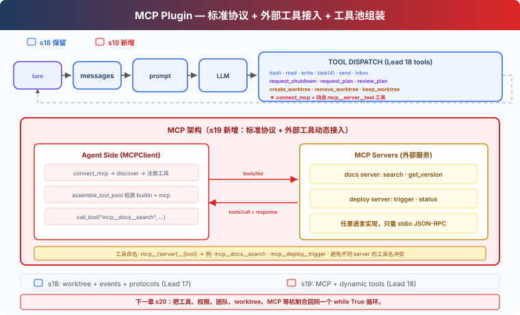

# s19: MCP Tools — 外接工具，標準協議

[中文](README.md) · [繁中](README.zh-tw.md) · [English](README.en.md) · [日本語](README.ja.md)

s01 → ... → s17 → s18 → `s19` → [s20](../s20_comprehensive/)

> *"外接工具, 標準協議"* — 發現、組裝、呼叫，Agent 不需要知道工具是誰寫的。
>
> **Harness 層**: 外掛 — 外部能力透過標準協議接入。

---

## 問題

s01 到 s18，Agent 的所有工具都是手寫的——bash、read、write、task、worktree。每個工具的輸入驗證、執行邏輯、錯誤處理，都是你一行行寫的。

現在你有 3 個外部服務想接入：公司的 Jira API（查 issue、建 ticket）、自建的部署系統（觸發 deploy、看日誌）、團隊的 Notion 知識庫（搜文件、建頁面）。你不想為每個服務重寫一套工具程式碼。

你需要一個標準協議——外部服務只要實現它，Agent 就能直接呼叫，不管服務用什麼語言寫的。

---

## 解決方案



MCP（Model Context Protocol）定義了 Agent 如何發現和呼叫外部工具。核心概念：

| 概念 | 作用 |
|------|------|
| MCPClient | Agent 端的客戶端，連線 server、發現工具、呼叫工具 |
| MCP Server | 外部服務，實現 `tools/list` + `tools/call` |
| assemble_tool_pool | 把內建工具和 MCP 工具組裝成一個工具池 |
| mcp\_\_server\_\_tool 命名 | 避免不同 server 的工具名衝突 |

沿用 s18 的教學版 worktree 隔離、自主認領、空閒輪詢、協議系統。本章新增：`connect_mcp` 工具——連線外部服務，發現工具，加入工具池。

教學版用 mock handler 模擬外部 server。真實版會啟動子程序，透過 stdin/stdout 傳送 JSON-RPC 請求。mock 的好處是不依賴外部服務就能跑完整流程；代價是你看不到真正的網路通訊和程序管理。

---

## 工作原理

### MCPClient：發現 + 呼叫

```python
class MCPClient:
    def __init__(self, name: str):
        self.name = name
        self.tools: list[dict] = []
        self._handlers: dict[str, callable] = {}

    def register(self, tool_defs, handlers):
        """Simulates tools/list discovery."""
        self.tools = tool_defs
        self._handlers = handlers

    def call_tool(self, tool_name: str, args: dict) -> str:
        """Simulates tools/call."""
        handler = self._handlers.get(tool_name)
        if not handler:
            return f"MCP error: unknown tool '{tool_name}'"
        return handler(**args)
```

教學版用 Python 函式模擬 server 的工具實現。真實版透過 stdio JSON-RPC 與子程序通訊。

### connect_mcp：連線 + 發現

```python
def connect_mcp(name: str) -> str:
    if name in mcp_clients:
        return f"MCP server '{name}' already connected"
    factory = MOCK_SERVERS.get(name)
    if not factory:
        return f"Unknown server '{name}'. Available: ..."
    mcp_client = factory()
    mcp_clients[name] = mcp_client
    return f"Connected to '{name}'. Discovered: ..."
```

連線後，server 提供的工具立即可用。

### normalize_mcp_name：名稱規範化

```python
_DISALLOWED_CHARS = re.compile(r'[^a-zA-Z0-9_-]')

def normalize_mcp_name(name: str) -> str:
    return _DISALLOWED_CHARS.sub('_', name)
```

所有非 `[a-zA-Z0-9_-]` 的字元替換為 `_`。防止 server 名或工具名中包含特殊字元導致命名衝突或注入問題。

### assemble_tool_pool：組裝工具池

```python
def assemble_tool_pool() -> tuple[list[dict], dict]:
    tools = list(BUILTIN_TOOLS)
    handlers = dict(BUILTIN_HANDLERS)
    for server_name, mcp_client in mcp_clients.items():
        safe_server = normalize_mcp_name(server_name)
        for tool_def in mcp_client.tools:
            safe_tool = normalize_mcp_name(tool_def["name"])
            prefixed = f"mcp__{safe_server}__{safe_tool}"
            tools.append(...)
            handlers[prefixed] = (
                lambda *, c=mcp_client, t=tool_def["name"], **kw:
                    c.call_tool(t, kw))
    return tools, handlers
```

字首 `mcp__{server}__{tool}` 避免不同 server 的工具名衝突。名稱經過 `normalize_mcp_name` 規範化。

MCP 工具的 description 帶 `(readOnly)` 或 `(destructive)` 標註——教學版用文字標註，真實 CC 用 tool annotations 結構體讓許可權系統判斷。

### 無快取：工具池變了，prompt 也變

s10-s18 的 agent_loop 用 prompt cache 避免重複序列化。s19 去掉了快取：

```python
def agent_loop(messages, context):
    tools, handlers = assemble_tool_pool()     # 每次重新構建
    system = assemble_system_prompt(context)    # 每次重新生成
    ...
    if any(b.name == "connect_mcp" ...):
        tools, handlers = assemble_tool_pool()  # 連線後重建
        system = assemble_system_prompt(context)
```

原因：`connect_mcp` 之後工具池變化了——新增了 `mcp__docs__search` 等工具。快取中的工具列表是舊的，繼續用會導致模型呼叫不到新工具。教學版直接去掉快取，代價是多花一點序列化時間。

### MCP 工具只有 Lead 可用

教學版中，`connect_mcp` 是 Lead 工具，`assemble_tool_pool` 也只服務於 Lead 的 agent_loop。Teammate 仍使用固定的 8 個子集工具（bash、read_file、write_file、send_message、submit_plan、list_tasks、claim_task、complete_task）。

這是教學簡化。真實 CC 中，MCP 工具對主 agent 和子 agent 都可用——子 agent 繼承父級的 MCP 配置。

---

## 相對 s18 的變更

| 元件 | 之前 (s18) | 之後 (s19) |
|------|-----------|-----------|
| 工具來源 | 全部手寫 builtin | 手寫 + MCP 外部工具動態發現 |
| 工具池 | 固定 BUILTIN_TOOLS | assemble_tool_pool 動態組裝 mcp\_\_ 字首工具 |
| 名稱安全 | 無 | normalize_mcp_name 規範化 |
| 新型別 | — | MCPClient 類（模擬 tools/list + tools/call） |
| 名稱空間 | — | mcp\_\_server\_\_tool 避免衝突 |
| 工具描述 | 無標註 | (readOnly)/(destructive) 標註 |
| prompt 快取 | 有（s10 起） | 去掉——工具池動態變化後快取失效 |
| Lead 工具 | 17 (s18) | 18 (+connect_mcp) |
| Teammate 工具 | 8 (s18) | 8（不變，MCP 工具僅 Lead 可用） |
| 擴充套件方式 | 寫程式碼加工具 | 標準協議，任意語言實現 server |

---

## 試一下

```sh
cd learn-claude-code
python s19_mcp_plugin/code.py
```

試試這些 prompt：

1. `Connect to the docs MCP server and search for something`
2. `Connect to the deploy server and trigger a deployment`
3. `Connect both servers — what tools are now available?`

觀察重點：連線 MCP server 後，工具名是否帶 `mcp__docs__` 或 `mcp__deploy__` 字首？兩個 server 的工具是否同時可用？MCP 工具的 description 是否帶 (readOnly)/(destructive) 標註？

---

## 接下來

現在 Agent 可以透過標準協議接入外部工具了。但前面 19 章每章都只加一個機制，真實 Agent 不會這樣拆開執行。

工具、許可權、hooks、todo、任務圖、記憶、壓縮、後臺、cron、團隊、worktree、MCP 這些機制應該掛在同一個迴圈上，而不是散在 19 個 demo 裡。

s20 Comprehensive Agent → 把前 19 章的機制合回一個完整 harness。機制很多，迴圈一個。

<details>
<summary>深入 CC 原始碼</summary>

> 以下基於 CC 原始碼 `services/mcp/client.ts`、`auth.ts`、`config.ts`、`channelNotification.ts` 的分析。

### 一、6 種 Transport 型別

教學版只展示了 stdio mock。CC 支援 6 種傳輸（`types.ts:23-25`）：

| Transport | 通訊方式 |
|-----------|---------|
| `stdio` | 子程序 stdin/stdout（跨平臺預設） |
| `sse` | HTTP Server-Sent Events |
| `http` | Streamable HTTP（POST/SSE 雙向） |
| `ws` | WebSocket |
| `sse-ide` | IDE 內嵌 SSE 傳輸 |
| `sdk` | 程序內 SDK 傳輸 |

連線時本地（stdio）和遠端（http/sse/ws）伺服器分批併發：本地批次 3 個，遠端批次 20 個。

### 二、工具池組裝演算法

`assembleToolPool()`（`tools.ts:345-364`）：

```typescript
// 去重時優先保留內建工具（name 相同時內建在前）
return uniqBy(
  [...builtInTools.sort(byName), ...filteredMcpTools.sort(byName)],
  'name',
)
```

內建工具和 MCP 工具分開排序，不是合起來排。原因是 CC 的 `claude_code_system_cache_policy` 在最後一個內建工具之後的某個位置放全域性快取斷點——混排會破壞這個設計。

### 三、命名規則：`mcp__server__tool`

`buildMcpToolName()`（`mcpStringUtils.ts:50-52`）：

```
mcp__<normalizedServerName>__<normalizedToolName>
```

所有非 `[a-zA-Z0-9_-]` 字元替換為 `_`（`normalization.ts:17-23`）。教學版的 `normalize_mcp_name` 用同樣的規則。

### 四、許可權檢查

CC 對 MCP 工具有獨立的許可權系統。`checkPermissions()` 對 MCP 工具的檢查邏輯不同於內建工具——MCP 工具可以宣告自己的許可權需求（readOnly、destructive 等），CC 根據宣告決定是否需要使用者確認。教學版只在 description 中用文字標註 `(readOnly)` / `(destructive)`，不做許可權攔截。

### 五、配置來源與優先順序

MCP 伺服器配置來自多個來源。CC 的配置優先順序從低到高：

```
claude.ai 聯結器 < plugin < user settings.json < approved project .mcp.json < local settings.local.json
```

`claude.ai` 聯結器單獨拉取、按內容簽名去重，以最低優先順序合併（`config.ts:1267-1289`）。企業 `managed-mcp.json` 存在時完全排除其他配置。

教學版直接傳 server name 給 `MOCK_SERVERS` 字典，不做配置合併。

### 六、Channel 通知：伺服器反向推訊息

教學版只講了 Agent → MCP Server 的單向呼叫。CC 還支援反向通知（`channelNotification.ts`）：

1. Server 宣告 `capabilities.experimental['claude/channel']`
2. Server 透過 MCP 通知 `notifications/claude/channel` 給 Agent 發訊息
3. 訊息包裝在 `<channel source="serverName">...</channel>` XML 標籤中
4. Agent 被 SleepTool 喚醒（1 秒內）

Server 還可以請求許可權：`notifications/claude/channel/permission_request` → Agent 回覆 `notifications/claude/channel/permission`。使用者透過 5 字母短 ID 確認/拒絕。

### 七、OAuth 認證流程

CC 的 MCP 認證（`auth.ts`）支援完整的 OAuth 2.0 + PKCE 流程：
- 透過公鑰客戶端 + PKCE 發現 OAuth 後設資料（RFC 8414 / RFC 9728）
- 本地回撥伺服器接收授權碼
- 令牌透過 `getSecureStorage()` 持久化（macOS Keychain / Linux 加密檔案 / Windows 憑據管理器）
- 過期前 5 分鐘自動重新整理
- 支援跨應用訪問（XAA）：瀏覽器獲取 id_token → RFC 8693 + RFC 7523 交換 → 無需反覆彈瀏覽器

### 八、連線生命週期的錯誤處理

CC 對 MCP 連線有精細的錯誤分類和重試（`client.ts:1266-1402`）：
- 終局性錯誤（ECONNRESET、ETIMEDOUT、EPIPE 等）：連續 3 次 → 關閉 + 重連
- 工具呼叫 401：令牌過期 → 丟擲 `McpAuthError` → 觸發重認證
- 工具呼叫超時：`Promise.race` 超時（可配置，預設約 28 小時）
- Stdio 斷連：按 SIGINT → SIGTERM → SIGKILL 順序殺程序

### 教學版的簡化

- 6 種 transport → 1 種（mock stdio）：概念量可控
- Channel 反向通知 → 省略：教學版 Agent 是主動方
- OAuth 流程 → 省略：教學版假設 server 不需要認證
- 多層配置優先順序 → 省略：教學版直接傳 server name
- 複雜的錯誤分類 → 省略：教學版用 try/except 兜底
- MCP 工具只給 Lead → 省略子 agent 繼承：簡化程式碼結構

</details>

<!-- translation-sync: zh@v2, en@v0, ja@v0 -->
