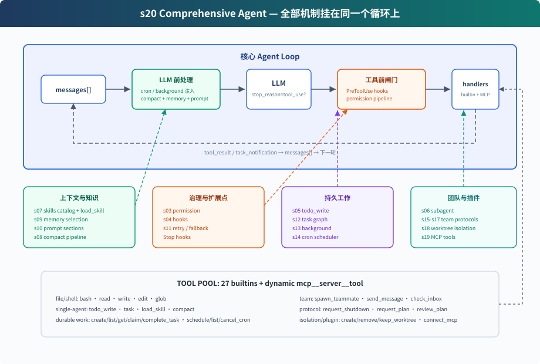

# s20: Comprehensive Agent — 全部機制，歸到一個迴圈

[中文](README.md) · [繁中](README.zh-tw.md) · [English](README.en.md) · [日本語](README.ja.md)

s01 → ... → s18 → s19 → `s20`

> *"機制很多，迴圈一個"* — 工具、許可權、記憶、任務、團隊、外掛都掛在同一個 while True 上。
>
> **Harness 層**: 綜合 — 把前 19 章的機制放回同一個可執行系統。

---

## 問題

前 19 章每章只加一個機制。這樣適合學習，但真實 Agent 不會只帶一個機制執行。

一個能長期工作的 coding agent 需要同時擁有：

- 工具分發和許可權邊界
- hooks 擴充套件點
- todo 計劃和任務圖
- 技能、記憶、系統 prompt 組裝
- 壓縮和錯誤恢復
- 後臺任務和 cron 排程
- 團隊、協議、自治認領
- worktree 隔離
- MCP 外部工具接入

難點不是把功能堆起來，而是看清楚它們都掛在迴圈的哪個位置。S20 就是終點章：把所有元件歸位。

---

## 解決方案



S20 不是再發明一個新機制，而是把前面的教學元件合成一個完整 harness：

```text
使用者輸入
  → UserPromptSubmit hooks
  → cron/background 通知注入
  → context compact
  → memory + skills + MCP 狀態組裝 system prompt
  → LLM
  → has tool_use block?
      否 → Stop hooks → 返回
      是 → PreToolUse hooks + permission
          → TOOL_HANDLERS / MCP handlers / background dispatch
          → PostToolUse hooks
          → tool_result / task_notification 回 messages
          → 下一輪
```

迴圈本身仍然是同一個結構：呼叫模型，檢查響應裡是否出現 `tool_use` block，執行工具，把結果追加回 `messages`。CC 原始碼裡也不直接信任 `stop_reason == "tool_use"`，而是以實際出現的 tool_use block 作為是否繼續工具輪的訊號。變化的是迴圈周圍的 harness 變完整了。

---

## 元件在迴圈中的位置

| 位置 | 元件 | 作用 |
|------|------|------|
| 使用者輸入前後 | `UserPromptSubmit` hooks | 記錄、注入、審計使用者輸入 |
| LLM 前 | cron queue | 把定時觸發的 prompt 注入 `messages` |
| LLM 前 | background notifications | 後臺任務完成後以 `<task_notification>` 注入 |
| LLM 前 | compaction pipeline | 先壓大輸出，再裁歷史，再壓舊 tool_result，必要時摘要 |
| LLM 前 | memory / skills / MCP state | 組裝 system prompt，讓模型看到當前能力和長期上下文 |
| LLM 呼叫 | error recovery | 429/529 重試，`max_tokens` 升級，prompt too long 觸發 reactive compact |
| 工具執行前 | `PreToolUse` hooks + permission | 攔截危險命令、寫越界、破壞性 MCP 工具 |
| 工具分發 | `assemble_tool_pool` | 組裝內建工具和 MCP 動態工具 |
| 工具執行時 | background dispatch | 慢 bash 操作放 daemon thread，主迴圈先返回佔位結果 |
| 工具執行後 | `PostToolUse` hooks | 大輸出告警、日誌等後處理 |
| 返回迴圈 | tool_result | 每個 `tool_use` 對應一個 `tool_result`，再回到下一輪 |
| 本輪沒有 tool_use / 停止時 | `Stop` hooks | 統計、清理、審計 |

---

## code.py 包含什麼

### 工具與分發

內建工具池包含 27 個工具：

```text
bash, read_file, write_file, edit_file, glob
todo_write, task, load_skill, compact
create_task, list_tasks, get_task, claim_task, complete_task
schedule_cron, list_crons, cancel_cron
spawn_teammate, send_message, check_inbox
request_shutdown, request_plan, review_plan
create_worktree, remove_worktree, keep_worktree
connect_mcp
```

`assemble_tool_pool()` 每輪組裝：

```text
BUILTIN_TOOLS + connected MCP tools
BUILTIN_HANDLERS + mcp__server__tool handlers
```

所以 `connect_mcp("docs")` 後，下一輪工具池裡會出現 `mcp__docs__search`。

### 許可權和 hooks

許可權不寫死在工具執行行裡，而是作為 `PreToolUse` hook：

```python
blocked = trigger_hooks("PreToolUse", block)
if blocked:
    results.append(tool_result(block.id, blocked))
    continue
```

這樣 permission、log、審計都可以掛在同一個 hook 點上。執行後再觸發 `PostToolUse`。

### 計劃與任務

S20 同時保留兩層計劃：

- `todo_write`：當前會話內的輕量計劃，寫入 `.tasks/current_todos.json`
- task graph：跨會話、可依賴、可認領的任務檔案，寫入 `.tasks/task_*.json`

前者幫助單個 Agent 不漂移；後者支撐團隊協作。

### 子 agent 與團隊

S20 有兩種 delegation：

- `task`：一次性 subagent。獨立 `messages[]`，中間過程丟棄，只返回最終摘要。
- `spawn_teammate`：持久隊友執行緒。透過 MessageBus 收發訊息，能 idle 輪詢任務板並自動認領。

一次性 subagent 解決“上下文隔離”；持久隊友解決“長期並行協作”。

### 記憶、技能和 prompt

`assemble_system_prompt(context)` 每輪組裝：

- 身份和工具說明
- workspace
- skills catalog
- `.memory/MEMORY.md`
- 已連線 MCP server

技能只在 system prompt 裡放目錄。完整內容透過 `load_skill(name)` 按需載入。

### 壓縮和恢復

LLM 前先跑壓縮管線：

```text
tool_result_budget → snip_compact → micro_compact → compact_history
```

呼叫模型時再包一層恢復：

- 429：指數退避重試
- 529：指數退避，連續失敗可切 fallback model
- `max_tokens`：先提高 max_tokens，再要求 continuation
- prompt too long：reactive compact 後重試

### 後臺和 cron

慢 bash 操作不會阻塞主迴圈：

```text
should_run_background → start_background_task → placeholder tool_result
後臺完成 → task_notification → 下一輪注入 messages
```

cron 排程器獨立 daemon thread 每秒檢查一次。CLI 會監聽 `cron_queue`，命中後主動把 `[Scheduled] ...` 注入並執行一輪 Agent。

### worktree 與 MCP

worktree 負責隔離目錄：

- `create_worktree(name, task_id)` 建立獨立分支和目錄
- task 的 `worktree` 欄位繫結目錄
- 隊友 claim 到帶 worktree 的 task 後，bash/read/write 自動在對應目錄下執行

MCP 負責外部能力：

- `connect_mcp(name)` 連線 mock server
- `assemble_tool_pool()` 把 MCP 工具組裝進工具池
- 工具名統一為 `mcp__server__tool`

---

## 相對 s19 的變化

| 元件 | s19 | s20 |
|------|-----|-----|
| 工具池 | 內建 + MCP | 內建 + MCP，補齊 s01-s18 的工具 |
| 許可權 | 教學主體省略 | `PreToolUse` hook 中執行 |
| hooks | 省略 | UserPromptSubmit / PreToolUse / PostToolUse / Stop |
| todo | 省略 | `todo_write` + reminder |
| skill | 省略 | catalog in system prompt + `load_skill` |
| compact | 省略 | LLM 前壓縮 + `compact` 工具 + reactive compact |
| error recovery | 簡化 try/except | retry / max_tokens / prompt too long |
| background | 省略 | 慢操作後臺執行緒 + task notification |
| cron | 省略 | daemon scheduler + durable jobs |
| multi-agent | 保留 | 保留；隊友使用隔離目錄下的基礎工具 |
| worktree | 保留 | 保留 |
| MCP | 新增 | 保留，作為最終工具池的一部分 |

---

## 試一下

```sh
cd learn-claude-code
python s20_comprehensive/code.py
```

可以試：

1. `Create a todo list for inspecting this repo, then list Python files`
2. `Connect to the docs MCP server and search for agent loop`
3. `Create two tasks, create worktrees for them, then spawn alice and bob. Ask them to submit plans before claiming tasks.`
4. `remind me of the meeting in 3 minutes.`
5. `Run npm install in the background and continue reading README.md`

觀察重點：

- 工具呼叫前是否經過 hooks/permission
- `connect_mcp` 後下一輪是否出現 MCP 工具
- 慢操作是否返回 background placeholder
- 到點是不是自動提醒開會
- 隊友是否提交 plan，並在 approval 前暫停
- plan 批准後，隊友是否能認領任務
- worktree 繫結後，隊友是否切到對應目錄

---

## 結束亦是開始

從 s01 到 s20，程式碼表面越來越複雜，但核心始終沒變：

```python
while True:
    response = LLM(messages, tools)
    if not has_tool_use(response.content):
        return
    results = execute_tools(response.content)
    messages.append(tool_results)
```

Claude Code 的複雜性不是“另一個 agent 大腦”，而是一個成熟 harness 的複雜性。模型負責判斷和行動選擇；harness 負責把環境、工具、許可權、記憶、團隊和外部能力組織好。

這就是全書的終點：機制很多，迴圈一個。
