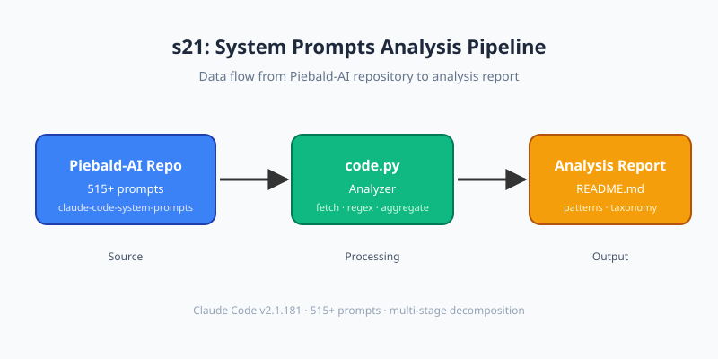

# s21: System Prompts Analysis — Understanding Claude Code's Prompt Design

[中文](README.md) · [English](README.en.md)

s01 → ... → s10 → s11 → ... → s20 → `s21`
> *"Read others' prompts before writing your own"* — Extracting design patterns from 515+ real prompts.
>
> **Harness Layer**: Prompt — analyze, understand, extract, never copy blindly.

---

## The Problem

s10 taught us how to **build** system prompts — sections, on-demand assembly, caching. But s10's prompts were our own creation: 4 sections, under 200 words total.

What about the real Claude Code? How many system prompts does it have? What do they look like? What design patterns can we learn?

Three key questions:

1. **How many prompts does Claude Code actually have?** One string or 500+?
2. **How are they organized?** Why don't 515 prompts collapse into chaos?
3. **What patterns can we reuse?** How do we apply these patterns to our own projects?

---

## The Solution



s21 directly analyzes the [Piebald-AI/claude-code-system-prompts](https://github.com/Piebald-AI/claude-code-system-prompts) repository (based on Claude Code v2.1.181, 11.3k stars, 515+ prompts). Instead of a static document, `code.py` dynamically fetches, categorizes, and analyzes the data.

Core idea: **the tutorial is itself an analyzer**. Run `code.py` once and get an analysis report based on the **latest data**, not the date the tutorial was written.

```
Piebald-AI repo (GitHub)           code.py analyzer               Learning outcome
+----------------------------+     +------------------+     +------------------+
| system-prompts/ (515+ .md) | --> | Fetch README.md  | --> | Category stats   |
| tools/ (20+ .md)           |     | Parse entries    |     | Design patterns  |
| README.md (index)          |     | Categorize + agg |     | Reusable principles
+----------------------------+     +------------------+     +------------------+
```

---

## How It Works

### 1. Data Source: Piebald-AI Repository

The Piebald-AI team updates this repository **within minutes** of each Claude Code release, extracting system prompts from the compiled JS bundle. The data is trustworthy and continuously updated.

Repository structure (simplified):

```
claude-code-system-prompts/
├── system-prompts/          ← 515+ prompt files (flat directory)
│   ├── agent-prompt-explore.md
│   ├── agent-prompt-plan-mode-enhanced.md
│   ├── agent-prompt-code-review-part-1-*.md
│   ├── tool-description-bash.md
│   ├── tool-description-write.md
│   ├── data-anthropic-cli.md
│   ├── system-prompt-main.md
│   └── ... (500+ more)
├── tools/                   ← Tool descriptions (separate directory)
│   ├── bash.md
│   ├── write.md
│   └── ...
├── README.md                ← Category index (with token counts)
└── CHANGELOG.md             ← Changelog across 213 versions
```

**Key finding (correction)**: The actual directory structure is `system-prompts/` + `tools/` — two flat directories. The categorization (Agent, Data, Tool, Main) exists in README.md, not in the directory structure.

### 2. code.py Parsing Pipeline

```python
# 1. Fetch README.md from GitHub
text = fetch_readme()

# 2. Parse all entries (name, token count, category)
prompts = parse_prompts_from_readme(text)
# → [PromptFile(name="Agent Prompt: Explore", tokens=575, category="sub_agent"), ...]

# 3. Aggregate analysis
analysis = analyze(prompts)
# → Category stats, Top 10, design pattern detection

# 4. Generate report
print(generate_report(analysis))
```

### 3. Category System

Auto-categorized based on README.md heading structure:

| Category | Sub-category | Example | Description |
|----------|-------------|---------|-------------|
| main | — | Core identity prompt | Single entry |
| sub_agent | Explore, Plan | Sub-agent prompts | Independent agents |
| slash_command | /code-review, /security-review | Slash command prompts | User-triggered commands |
| creation_assistant | CLAUDE.md, Status line | Creation assistants | Config/doc generators |
| utility | summarization, memory | Utility prompts | Internal functions |
| data | API refs, CLI docs | Reference data | Knowledge injection |
| tool | Bash, Write, TodoWrite | Tool descriptions | Tool usage instructions |

### 4. Design Pattern Detection

`code.py` auto-detects 5 categories of design patterns:

| Pattern | Detection Method | Example |
|---------|-----------------|---------|
| Multi-phase decomposition | Filename contains `part N` | /code-review split into 9 phases |
| Conditional assembly | Filename contains `condition`/`mode`/`override` | Different modes load different prompts |
| Security constraints | Filename contains `security`/`safety`/`guard` | Security monitor agent (7,397+8,328 tokens) |
| Memory management | Filename contains `memory`/`summariz`/`context` | Memory consolidation, session compaction |
| Schema-driven output | Filename contains `structured`/`json`/`classifier` | Structured output, state classifiers |

---

## What Changed From s10

| Aspect | s10 | s21 |
|--------|-----|-----|
| Perspective | Builder (build) | Analyst (read & learn) |
| Data source | 4 hand-written sections | 515+ real prompts from Piebald-AI |
| Prompt count | 4 | 515+ |
| Design patterns | Conditional assembly + caching | 5 categories of design patterns |
| Runnable | Requires API key | Only needs internet, no API key |
| Data freshness | Static | Dynamic (fetches latest on each run) |

---

## Try It

```sh
cd learn-claude-code
python s21_system_prompts_analysis/code.py
```

What to watch for:

1. First line shows live fetch status (`Fetching...`)
2. Category breakdown table shows token distribution
3. Top 10 shows the heaviest prompts
4. Design patterns section shows 5 detected categories
5. Key Insights summarizes the most important numbers

Try these experiments:

1. `python s21_system_prompts_analysis/code.py` — Full analysis report
2. `python s21_system_prompts_analysis/code.py --json` — JSON output
3. `python s21_system_prompts_analysis/code.py --raw` — Raw parsed data
4. Run again in a few weeks — observe changes after Piebald-AI updates

---

## Design Principles Extracted

6 core principles extracted from 515+ real prompts:

### 1. Specific Constraints > Vague Guidelines

Claude Code's prompts **don't say** "Be careful with commands." They go **command-level specific**:

> "Never execute commands that escape the working directory."
> "Never delete files outside the workspace."

### 2. Multi-Phase Decomposition

/code-review is not one prompt — it's 9 (part 1-9), each handling one phase:
- part 1: Base finder angles
- part 2: Low-effort mode
- part 3: Extra-high and maximum effort modes
- ...
- part 9: Fix application

**Principle**: One prompt, one job. Complex tasks become pipelines.

### 3. Schema-Driven Structured Output

TodoWrite uses JSON Schema to define 4 states (pending/in_progress/completed) with explicit meaning and transition rules. Not "manage your tasks" in natural language.

**Principle**: Use Schema instead of natural language to reduce ambiguity.

### 4. Conditional Assembly > Full Load

Claude Code doesn't load all 515 prompts in every scenario. It selectively loads based on environment, mode, and configuration:
- `is_headless` → toggles prompt sections
- `mcp_servers` → injects MCP tool descriptions
- `sub_agent_type` → switches entire agent prompts

**Principle**: Prompts should be lazy-loaded — load only what's needed.

### 5. Security Constraints Are Always Present

The security monitor agent (7,397 + 8,328 = 15,725 tokens) is the **largest token combination** in Claude Code. Security is not an "add-on feature" — it's the **first priority** in prompt design.

**Principle**: Security constraints aren't a "security module" — they permeate every tool description.

### 6. Memory Is an Independent Prompt System

Memory consolidation, pruning, synthesis, file attachment — memory is not a block of text, but an **independent sub-agent system** with its own prompts, tools, and workflows.

**Principle**: Treat "memory" as an independent agent, not a feature.

---

## What's Next

Now that you understand Claude Code's prompt design, the next step is: **modify it**.

Piebald-AI provides [tweakcc](https://github.com/Piebald-AI/tweakcc) — a tool that lets you modify any prompt fragment in Claude Code and inject it into your local installation. This closes the loop: read → modify → verify.

<details>
<summary>Deep Dive into Piebald-AI Repository</summary>

### Extraction Method

Piebald-AI uses a script to extract prompts from Claude Code's npm package. Prompts are stored in compiled JS files, extracted via regex matching and string extraction. The extracted prompts are **identical** to what Claude Code actually uses.

### Version Tracking

The repository maintains a CHANGELOG across 213 versions (v2.0.14 to v2.1.181), recording prompt changes in each release:
- Prompts added/removed
- Token count changes (+/- N tokens)
- Content modification summaries

### Data Growth

- Initial release (2025.12): ~350 prompts
- v2.1.181 (2026.06): ~515 prompts (+165)
- Average: ~25 new prompts per month

### Prompt Interpolation

Many prompts contain runtime interpolation variables like `{tool_list}`, `{sub_agent_list}`, `{cwd}`. Token counts in the Piebald-AI repo are based on the **pre-interpolation template**; actual runtime token counts may vary by ±20.

</details>

<!-- translation-sync: zh@v1, en@v1 -->